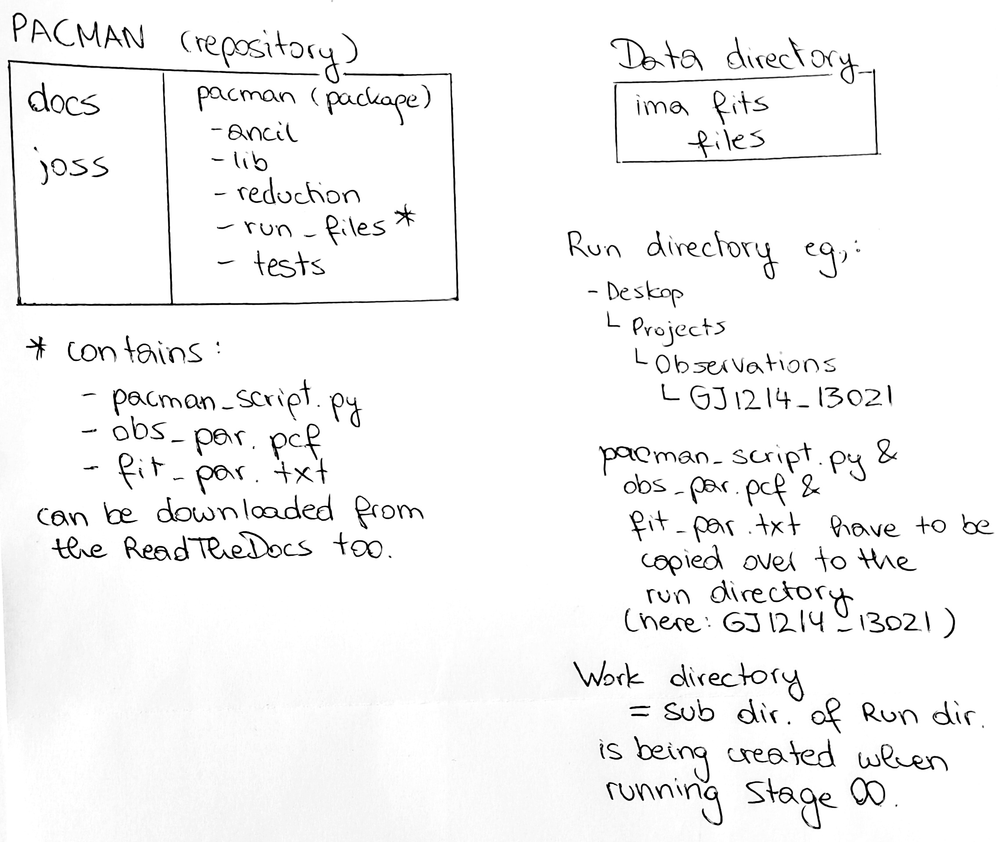

.. _directories:

Repository Structure
========================

In the package
''''''''''''''''''''''''''''''

* **PACMAN/src/pacman**

  All code PACMAN needs to run and templates for the pcf and fit_par files are stored here.

  - **PACMAN/src/pacman/data**

    + **PACMAN/src/pacman/data/bandpass**

    This directory contains the throughput for the G102 and the G141 grisms.
    These files will be used in Stage 03 to create the reference spectrum.

    + **PACMAN/src/pacman/data/flats**

    The flats (for the G102 and G141 grisms) are used to find the locations of bad pixels.

    + **PACMAN/src/pacman/data/stellar_models**

    This directory tells PACMAN which stellar models are available to download.
    PACMAN can download three different stellar models: Kurucz stellar models 1993, Castelli and Kurucz stellar models 2004 and Phoenix models by Allard and collaborators.
    These models will be used in Stage 03 to create the reference spectrum.
    More on this at the walkthrough of `Stage 03 <https://pacmandocs.readthedocs.io/en/latest/quickstart.html#stage-03>`_ using GJ1214 data as an example.

  - **PACMAN/src/pacman/data/run_files**

    + **PACMAN/src/pacman/data/run_files/pacman_script.py**

    This python script runs PACMAN. If the user did not install pacman properly as explained in :ref:`the installation walkthrough <installation>` (not recommended) he or she might have to add a path to the sys.path.append pointing to the PACMAN directory:

    .. code-block:: python

  	  sys.path.append('/home/zieba/Desktop/Projects/Open_source/PACMAN/')

    The path in ``sys.path.append`` has to be changed to the location of PACMAN on the user's device.

    .. note:: The path should point to ``/PACMAN/`` and not to ``/PACMAN/src/pacman/``.

    The user can now run any stage by adding it as an argument in the terminal. E.g., for running Stage 00:

    .. code-block:: console

  	  python pacman_script.py --s00 --eventlabel='GJ1214_Hubble13021'

    To get more information, type:

    .. code-block:: console

  	  python pacman_script.py --help

    + **PACMAN/src/pacman/data/run_files/fit_par.txt**

    The fit_par file is used in Stage 30 to fit the light curve. The user defines here which fit parameters should be fixed, shared across visits, and sets other information like priors.

    + **PACMAN/src/pacman/data/run_files/obs_par.pcf**

    The PACMAN control file (pcf): the user sets here which plots should be saved, the path to the data and many other parameters.
    A thorough explanation of all the parameters in the pcf can be found on Read The Docs: :ref:`pcf`.

  - **PACMAN/src/pacman/lib**

  This directory contains auxiliary scripts for the stages.
  E.g., ``PACMAN/src/pacman/lib/plots.py`` creates and saves plots.

  - **PACMAN/src/pacman**

  This directory contains the main scripts for the individual stages.
  The scripts here use other python code from ``PACMAN/src/pacman/lib``.

Nomenclature
''''''''''''''''''''''''''''''

* **run directory**:

  Example: ``/home/zieba/Desktop/Projects/Observations/Hubble/GJ1214_13021``.

  Contents:

   - pacman_script.py

   - obs_par.pcf

   - fit_par

   If you pip-installed, downloaded or cloned the GitHub repository it includes the run_files directory with templates for these three files in ``PACMAN/src/pacman/data/run_files``.
   They can also be downloaded under this link: `Download here <https://downgit.github.io/#/home?url=https://github.com/sebastian-zieba/PACMAN/tree/master/src/pacman/data/run_files>`_.
   You have to copy these files into your run directory.

    .. note:: | The pcf file in the run directory is ONLY used in Stage 00.
              | It will be copied over to the work directory.
              | The copied pcf file in the work directory will then be the pcf file for all following stages.
              | The same is true for the fit_par.txt file.
              | So, after running Stage 00, PACMAN does not care anymore about the changes made to the pcf file and the fit_par file in the run directory.

* **work directory**:

  Example: ``/home/zieba/Desktop/Projects/Observations/Hubble/GJ1214_13021/run_2022-03-04_15-10-29_GJ1214_Hubble13021``.

  This directory will be created in Stage 00.
  All the results of the following stages will be stored here.

  It has the following form:

  .. code-block:: python

      datetime = time.strftime('%Y-%m-%d_%H-%M-%S')
      meta.workdir = 'run_' + datetime + '_' + meta.eventlabel

* **data directory**:

  Example: ``/home/zieba/Desktop/Data/GJ1214_Hubble13021``.

  This directory should contain the .fits files which will be reduced and analyzed.

* **pipeline directory**:

  Example: ``/home/zieba/Desktop/Projects/Open_source/PACMAN/src``

  This is the heart of PACMAN containing all the code and data to run the different stages.
