.. _pcf:

PACMAN Control File (.pcf)
============================

To run the different stages of ``PACMAN``,
the pipeline requires a so-called PACMAN control file (.pcf)
where stage-specific parameters are defined (e.g. aperture size, path to the data, etc.).

In the following, we look at the contents of the pcf and include an example entry.

.. include:: media/obs_par.pcf
   :literal:

Stage 00
---------------------------------------------------------

rundir
''''''''''''''''''''''''''''''''''''''''''''
| Example: ``rundir   /home/zieba/Desktop/Projects/Observations/Hubble/GJ1214_13021``

The directory where you want PACMAN to run and save data to.
If you downloaded or cloned the GitHub repository it includes a run_files directory.
These three files can also be downloaded under this link: `Download here <https://downgit.github.io/#/home?url=https://github.com/sebastian-zieba/PACMAN/tree/master/pacman/run_files>`_.
You have to copy these files into your run directory.
It should include three files:
 - pacman_script.py: The run script
 - obs_par.pcf: The pcf file
 - fit_par.txt: The fit_par file with the fit parameters (only used for Stage 30) 

.. warning::

	Your path is not allowed to have any spaces in it. E.g., ``/home/USER/run 1`` is not a valid path.

datadir
''''''''''''''''''''''''''''''''''''''''''''
| Example: ``datadir   /home/zieba/Desktop/Data/GJ1214_Hubble13021``

This path should be correspond to the location of your data.

.. warning::

	Your path is not allowed to have any spaces in it. E.g., ``/home/USER/data GJ1214`` is not a valid path.

suffix
''''''''''''''''''''''''''''''''''''''''''''
| Example: ``suffix   ima``

The only extension which is supported currently: ``ima``.
From the `WFC3 data handbook (Types of WFC3 Files) <https://hst-docs.stsci.edu/wfc3dhb/chapter-2-wfc3-data-structure/2-1-types-of-wfc3-files>`_: "For the IR detector, an intermediate MultiAccum (ima) file is the result after all calibrations are applied (dark subtraction, linearity correction, flat fielding, etc.) to all of the individual readouts of the IR exposure."

which_visits
''''''''''''''''''''''''''''''''''''''''''''
| Example: ``which_visits   [0,2]``
| Example: ``which_visits   everything``

If your ``datadir`` contains several HST observations (called visits), you can select which ones to analyze. 
If you are interested in all visits in ``datadir``, use ``everything`` here.

``PACMAN`` automatically numbers the visits the ``datadir`` in chronological order, starting with zero.
For example, HST GO 13021 has 15 visits in total.
If you have all 15 visits in your ``datadir`` but only want to analyze the last two visits for now,
you would enter ``[13,14]`` here.
If your ``datadir`` only contained these two visits (and not the previous 13 visits before it),
you can either write ``everything`` or ``[0,1]``.

save_obs_times_plot/show_obs_times_plot
''''''''''''''''''''''''''''''''''''''''''''
Example: ``True``
This plot consists of one table and two subplots.

- The table lists the number of orbits in each individual visit and the start time of the visit.

- The left subplot shows when the visit was observed.

- The right subplot shows when observations where taken during an visit as a function of time elapsed since the first exposure in the visit.

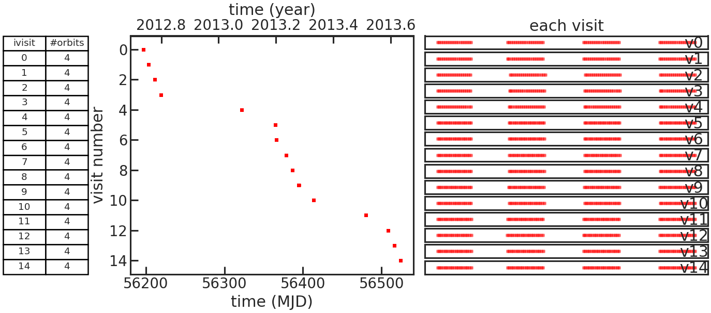

If the user didn't set ``which_visits   everything``, two figures like this will be generated.
One with all visits and the other with only the ones set with ``which_visits``.

Stage 02
---------------------------------------------------------

save_barycorr_plot/show_barycorr_plot
''''''''''''''''''''''''''''''''''''''''''''
Example: ``True``

Saves or shows a plot with the downloaded X,Y,Z positions of HST from
the `HORIZONS system <https://ssd.jpl.nasa.gov/horizons/>`_ by JPL during the observations.

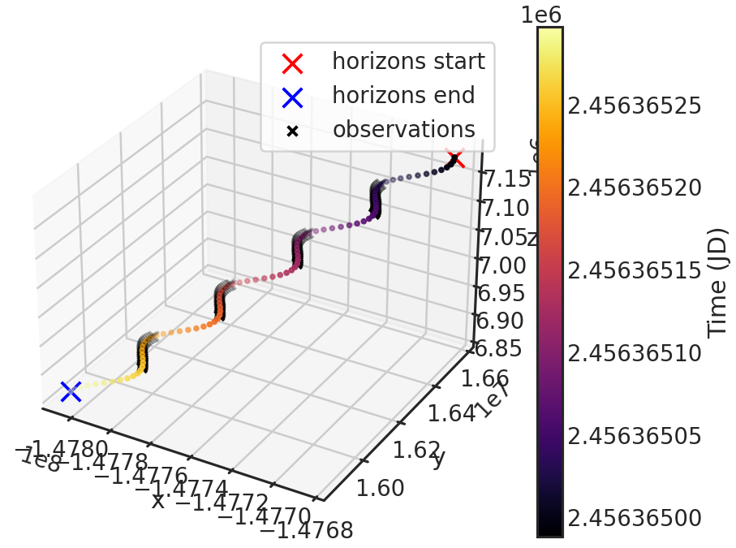

Stage 03
---------------------------------------------------------

Teff, logg, MH
''''''''''''''''''''''''''''''''''''''''''''
| Example: ``Teff  3250``
| Example: ``logg  5.026``
| Example: ``MH    0.29``

effective Temperature (Teff), surface gravity (logg) and metallicity (MH) of the star.

Used to generate the stellar model.
If the user only wants to use a blackbody spectrum, the code ignores logg and metallicity. 

sm
''''''''''''''''''''''''''''''''''''''''''''
Example: ``phoenix``

The stellar model one wants to use.
It will be then multiplied with the grism throughput (either G102 or G141) to create a reference spectrum
for the wavelength calibration of the spectra.

Options:

| PACMAN currently offers the following stellar models:
| - ``k93models``: THE 1993 KURUCZ STELLAR ATMOSPHERES ATLAS
| - ``ck04models``: THE STELLAR ATMOSPHERE MODELS BY CASTELLI AND KURUCZ 2004
| - ``phoenix``: THE PHOENIX MODELS BY FRANCE ALLARD AND COLLABORATORS
| - ``blackbody``: A blackbody spectrum using Planck's law

The stellar models (exluding the blackbody) are retrieved from https://archive.stsci.edu/hlsps/reference-atlases/cdbs/grid/

smooth/smooth_sigma
''''''''''''''''''''''''''''''''''''''''''''
| Example: ``smooth        True``
| Example: ``smooth_sigma  50``

If ``smooth`` is ``True``, applies a Gaussian kernel smoothing to the stellar spectrum. This is recommended since the Kurucz and Phoenix stellar models have a higher resolution than the WFC3 grisms, which have native resolution of:

- G141: 46.9 Angstrom/pixel dispersion

- G102: 24.6 Angstrom/pixel dispersion

Gaussian smoothing the reference spectrum is discussed in detail in `Deming et al. 2013 <https://ui.adsabs.harvard.edu/abs/2013ApJ...774...95D/abstract>`_. To follow their example and convolve the reference spectrum with a Gaussian with full-width at half maximum (FWHM) of 4 pixels, we use the relation FWHM = 2.35 * sigma. The value for the G141 grism is then 2.35 * 4 * 46.9 = 441

save_smooth_plot/show_smooth_plot
''''''''''''''''''''''''''''''''''''''''''''
Example: ``True``

Shows how the stellar spectrum was smoothed.

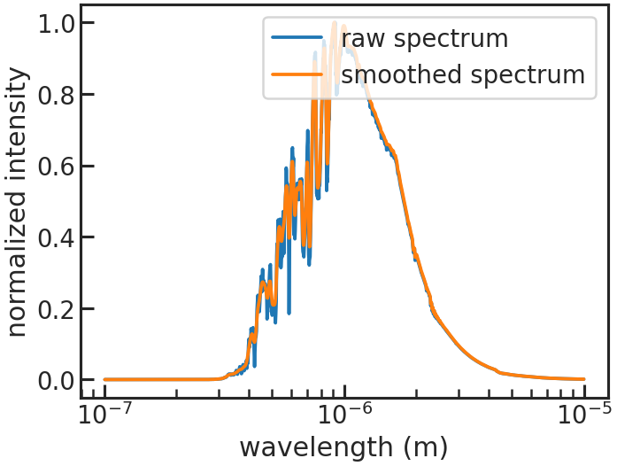

save_refspec_plot/show_refspec_plot
''''''''''''''''''''''''''''''''''''''''''''
Example: ``True``

Saves or shows a plot of the reference spectrum (stellar spectrum * bandpass).

.. image:: media/s03/refspec.png

Stage 10
---------------------------------------------------------

di_rmin, di_rmax, di_cmin, di_cmax
''''''''''''''''''''''''''''''''''''''''''''
| Example: ``di_rmin  120``
| Example: ``di_rmax  160``
| Example: ``di_cmin  5``
| Example: ``di_cmax  50``

These values specify a cutout around the target star.
Below you will find an example:

.. image:: media/s10/quick_di0.png

You can see that the cutout (red box in the plot) includes the star, so the centroid can be determined. 

save_image_plot/show_image_plot
''''''''''''''''''''''''''''''''''''''''''''
Example: ``True``

Saves two plots for every direct image.
The first one just shows the image with the location of the direct image cutout.
The second plot shows the cutout on the left and the result of the 2D gaussian fit on the right. The gaussian fit only considers the cutout for the fit.

.. image:: media/s10/quick_di0.png
.. image:: media/s10/di_0.png

di_multi
''''''''''''''''''''''''''''''''''''''''''''
| Example: ``di_multi  median``
| Example: ``di_multi  latest``

Some observations have more than one direct image per orbit which were taken at the start of the orbit.
In these cases the user can decide if they want to only use the most recent DI or a median of the DI positions in the orbit.

Stage 20
---------------------------------------------------------

s20_testing/n_testing
''''''''''''''''''''''''''''''''''''''''''''
| Example: ``s20_testing  True``
| Example: ``n_testing    1``

Runs s20 in testing mode. Only the first n_testing files will be analyzed then.
E.g. if n_testing = 1, only the first file will be analyzed.

rmin/rmax
''''''''''''''''''''''''''''''''''''''''''''
| Example: ``rmin  5``
| Example: ``rmax  261``

Can be set to remove rows from the top and bottom of the 2D array.
E.g. If the frame have the size of 266x266 and the user wants to cut off the
upper and lower 5 pixels they can use the same settings as in the example above.

window
''''''''''''''''''''''''''''''''''''''''''''
| Example: ``window  10``

Sets the size of the extraction window.  ``PACMAN`` adaptively determines the best aperture in two steps:

 1. identify the rows with the largest gradient in count rate

 2. add ``window`` additional rows above and below the rows identified in step 1 

For example, if the biggest flux gradient occurs in row 35 and 55, and the user set ``window  10``,
the extraction aperture will be between rows 25 and 65. 

background_thld
''''''''''''''''''''''''''''''''''''''''''''
| Example: ``background_thld  1000``

Sets a threshold for the background calculation. Pixels with a flux lower than background_thld electrons/second will be considered background.
The background flux is then determined by taking the median flux of the pixels below this threshold.

opt_extract
''''''''''''''''''''''''''''''''''''''''''''
| Example: ``opt_extract  True``

Extracts the spectrum using the optimal extraction routine from `Horne et al. 1986 <https://ui.adsabs.harvard.edu/abs/1986PASP...98..609H>`_.
If set to false, ``PACMAN`` performs a quick box extraction (simply adding up all the counts in the aperture). This gives a quick look at the spectra, but the following stages will break if ``opt_extract`` is false. 

sig_cut, nsmooth
''''''''''''''''''''''''''''''''''''''''''''
| Example: ``sig_cut  15``
| Example: ``nsmooth  9``

sig_cut: Specifies the outlier threshold for the optimal extraction. Outliers greater than ``sig_cut`` are masked.

If you have a lot of nans in your light curve you might want to increase the sig_cut value.

smooth: Number of pixels used for median-smoothing to create the spatial profile.

save_optextr_plot
''''''''''''''''''''''''''''''''''''''''''''
Save plot showing some diagnostics from the optimal extraction.

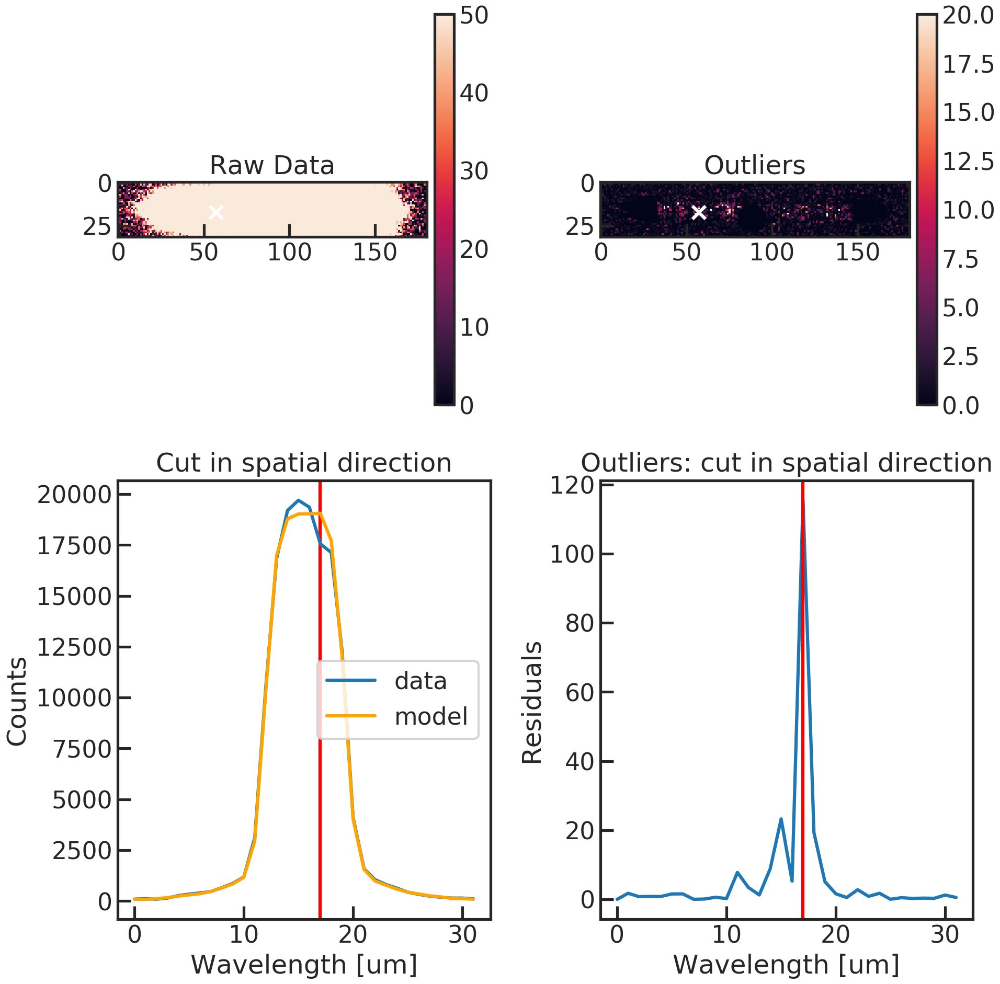

correct_wave_shift
''''''''''''''''''''''''''''''''''''''''''''
| Example: ``correct_wave_shift  True``

Interpolates each spectrum to the wavelength scale of the reference spectrum, to account for spectral drift over the observation.

correct_wave_shift_refspec
''''''''''''''''''''''''''''''''''''''''''''
uses the created reference spectrum during Stage 03 for the wavelength calibration.

output
''''''''''''''''''''''''''''''''''''''''''''
| Example: ``output  True``

Saves the flux as a function of time and wavelength. 

background_box & bg_rmin etc.
''''''''''''''''''''''''''''''''''''''''''''
Do you want to calculate the median flux in a box to use as an estimate of the background flux?

| Example: ``background_box               False``
| Example: ``bg_rmin                      100``
| Example: ``bg_rmax                      400``
| Example: ``bg_cmin                      40``
| Example: ``bg_cmax                      100``

save_sp2d_plot/show_sp2d_plot
''''''''''''''''''''''''''''''''''''''''''''
2D spectrum of the target with a low vmax value to see the background better.

.. image:: media/s20/sp2d_0.png

save_trace_plot/show_trace_plot
''''''''''''''''''''''''''''''''''''''''''''
2D spectrum with the expected position of the trace based on the direct image.

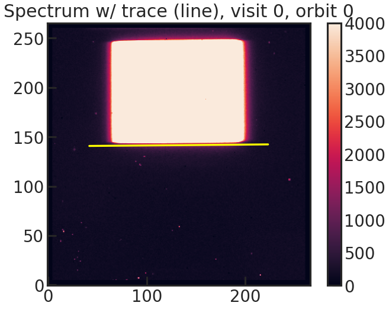

save_bkg_hist_plot/show_bkg_hist_plot
''''''''''''''''''''''''''''''''''''''''''''
Shows a histogram of the flux based on the difference of two consecutive up-the-ramp samples.
This is why the user might see also negative fluxes.

.. image:: media/s20/bkg_hist0-0.png

save_utr_plot/show_utr_plot
''''''''''''''''''''''''''''''''''''''''''''
Shows an up-the-ramp sample with the determined highest flux changes between two rows.

.. image:: media/s20/utr0-0.png

save_sp1d_plot/show_sp1d_plot
''''''''''''''''''''''''''''''''''''''''''''
The 1D spectrum. The optimal extraction is shown in black, and the box extraction is shown in red. 

.. image:: media/s20/sp1d_0.png

save_bkg_evo_plot/show_bkg_evo_plot
''''''''''''''''''''''''''''''''''''''''''''
The determined background flux versus time.

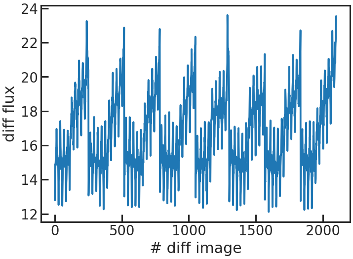

save_sp1d_diff_plot/show_sp1d_diff_plot
''''''''''''''''''''''''''''''''''''''''''''
The difference between two consecutive 1D spectra.

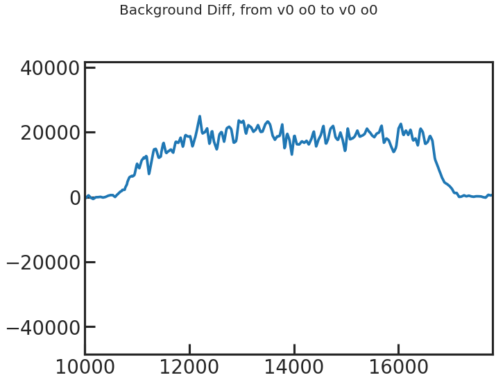

save_utr_aper_evo_plot/show_utr_aper_evo_plot
'''''''''''''''''''''''''''''''''''''''''''''''''
The determined aperture size over time.
In this case the rows with the highest change in flux were either 7 or 8 pixels apart.

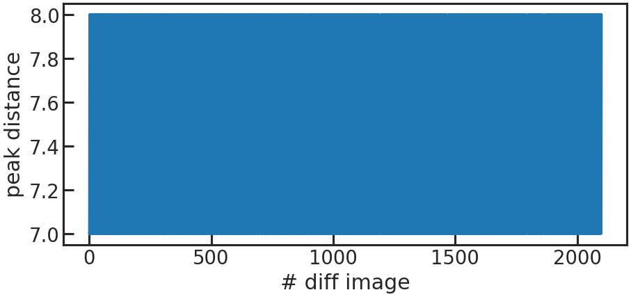

save_refspec_fit_plot/show_refspec_fit_plot
''''''''''''''''''''''''''''''''''''''''''''
The fit of the 1D spectrum compared to the reference spectrum.
In the first exposure in a visit, this referecnce spectrum is the product of the stellar spectrum with the grism throughput.

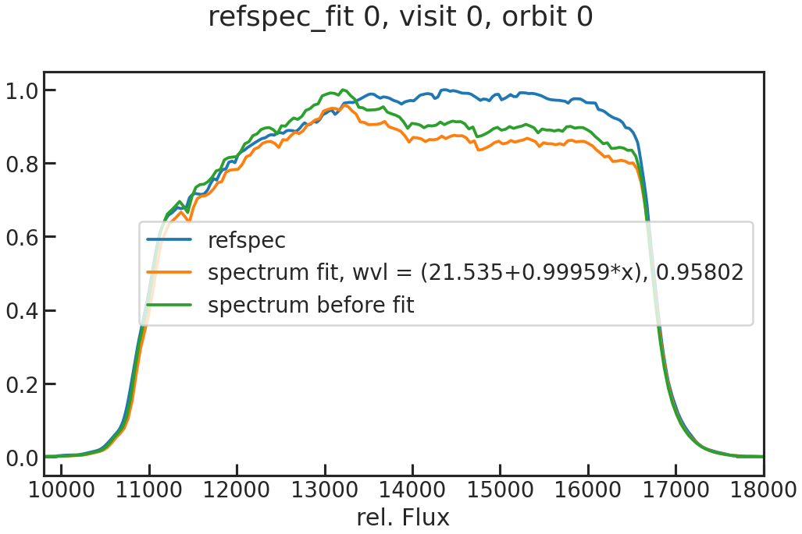

In the other exposures, the reference spectrum is the wavelength-calibrated first exposure in a visit.

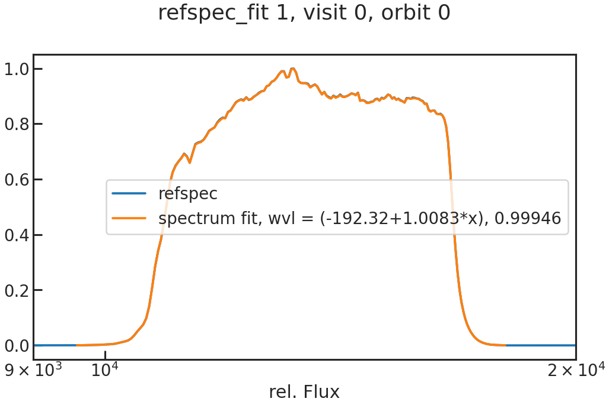

save_drift_plot/show_drift_plot
''''''''''''''''''''''''''''''''''''''''''''
The fitted wavelength calibration parameters over time.
We do a linear fit (a + b * wavelength) to the reference spectrum (which can be either a stellar model * instrument throughput or the first exposure in a visit depending on what the user chose in correct_wave_shift_refspec) and fit for the height.
If a reference spectrum was a stellar model * the throughput, the first fit parameters of the fit of the 1d to the sm*throughput wont be shown in that plot.

 First panel: a
 Second panel: b
 Third panel: height

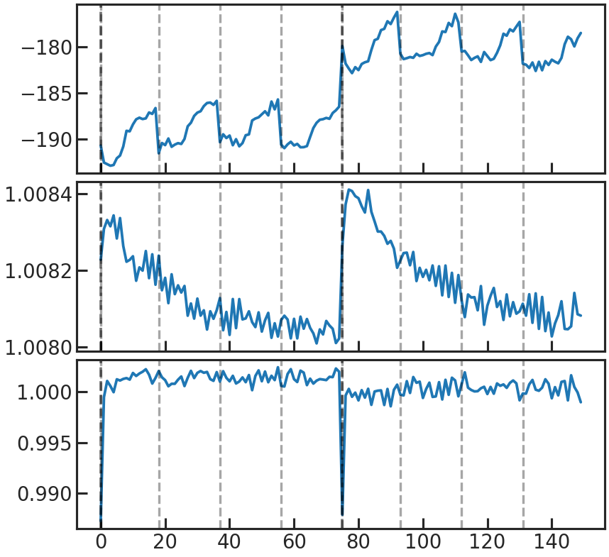

Stage 21
---------------------------------------------------------

s21_most_recent_s20/s21_spec_dir_path_s20
''''''''''''''''''''''''''''''''''''''''''''
| Example: ``s21_most_recent_s20    True``
| Example: ``s21_spec_dir_path_s20  None``

If ``s21_most_recent_s20`` is set to ``True`` the most recent s20 run will be used.
If ``s21_most_recent_s20`` is set to False, the user can set a path with the extracted data after s20:

| Example: ``s21_most_recent_s20    False ``
| Example: ``s21_spec_dir_path_s20  /home/zieba/Desktop/Projects/Open_source/PACMAN/run/run_2022-01-25_19-12-59_GJ1214_Hubble13021/extracted_lc/2022-02-11_17-44-56``

wvl_min/wvl_max/wvl_bins
''''''''''''''''''''''''''''''''''''''''''''
| Example: ``wvl_min   1.125``
| Example: ``wvl_max   1.65``
| Example: ``wvl_bins  12``

Start and end wavelengths for the spectroscopic light curves (microns).
The `wvl_bins` parameter sets the number of wavelength channels. 

use_wvl_list/wvl_edge_list
''''''''''''''''''''''''''''''''''''''''''''
| Example: ``use_wvl_list   True``
| Example: ``wvl_edge_list  [1.1, 1.3, 1.5, 1.7]``

If the user wants to use a custom wavelength list for the binning,  set ``use_wvl_list`` to ``True``.

Stage 30
---------------------------------------------------------

s30_myfuncs
''''''''''''''''''''''''''''''''''''''''''''
Choose the functions to fit the data. The available functions are listed in `models <https://pacmandocs.readthedocs.io/en/latest/models.html#id1>`_.

s30_fit_white
''''''''''''''''''''''''''''''''''''''''''''
Fit the white light curve created in Stage 20.

s30_most_recent_s20
''''''''''''''''''''''''''''''''''''''''''''
Use the most recent Stage 20 run for the white light curve fit.

s30_white_file_path
''''''''''''''''''''''''''''''''''''''''''''
If s30_most_recent_s20 was set to False, the user can put a path to the white light curve file here.

s30_fit_spec
''''''''''''''''''''''''''''''''''''''''''''
Fit the spectroscopic light curves created in Stage 21.

s30_most_recent_s21
''''''''''''''''''''''''''''''''''''''''''''
Use the most recent Stage 21 run for the spectroscopic light curve fit.

s30_spec_dir_path
''''''''''''''''''''''''''''''''''''''''''''
If s30_most_recent_s21 was set to False, the user can put a path here.

remove_first_exp
''''''''''''''''''''''''''''''''''''''''''''
Removes the first exposure from every orbit.

remove_first_orb
''''''''''''''''''''''''''''''''''''''''''''
Removes the first orbit from every visit.

remove_which_orb
''''''''''''''''''''''''''''''''''''''''''''
Which orbits do you want to remove?
E.g., if only the first choose [0]. If the first two, use [0,1].

rescale_uncert
''''''''''''''''''''''''''''''''''''''''''''
Rescales the uncertainties for the sampler (MCMC or nested sampling), so that the reduced chi2red = 1.
Note: This only happens if chi2red < 1 after least squared fit.

An alternative is to use uncmulti as a model in your fit. This will rescale the errorbars at every step of the sampler. The uncmulti value which the user will get after the sampling should be approximately the square root of the reduced chi square of the fit (i.e., uncmulti ~ sqrt(chi2_red)).

run_clipiters
''''''''''''''''''''''''''''''''''''''''''''
NOT TESTED

run_clipsigma
''''''''''''''''''''''''''''''''''''''''''''
NOT TESTED

white_sys_path
''''''''''''''''''''''''''''''''''''''''''''
Location of the white_systematics.txt file.
Only needed if the user wants to use 'divide_white' as a model.

ld_model
''''''''''''''''''''''''''''''''''''''''''''
| Example: ``ld_model  1``

1 = "linear" limb darkening 
2 = "quadratic" limb darkening 

fix_ld
''''''''''''''''''''''''''''''''''''''''''''
If true, PACMAN will use `ExoTiC-LD <https://github.com/Exo-TiC/ExoTiC-LD>`_ to calculate limb darkening parameters and fix them during the fits.

ld_file
''''''''''''''''''''''''''''''''''''''''''''
NOT TESTED but should give the possibility to use your own limb darkening file.

toffset
''''''''''''''''''''''''''''''''''''''''''''
Subtracts an offset from the time stamps so that there is no problem with floating precision due to the size of dates in BJD.

run_verbose
''''''''''''''''''''''''''''''''''''''''''''
If set to True, additional information is being outputted when running.

save_allan_plot
''''''''''''''''''''''''''''''''''''''''''''
The Allan deviation plot.

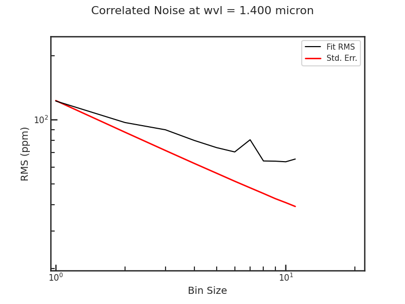

save_raw_lc_plot
''''''''''''''''''''''''''''''''''''''''''''
Raw light curve plot

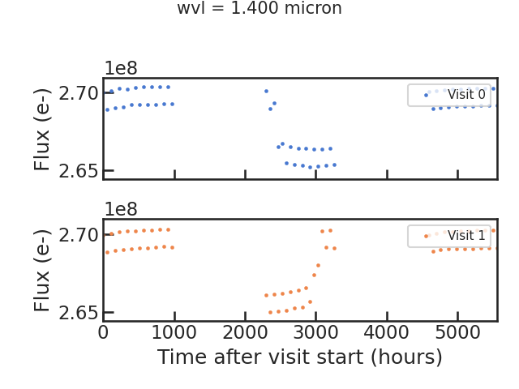

save_fit_lc_plot
''''''''''''''''''''''''''''''''''''''''''''
Plots the light curve fit without the instrumental systematics and only the astrophysical signal.

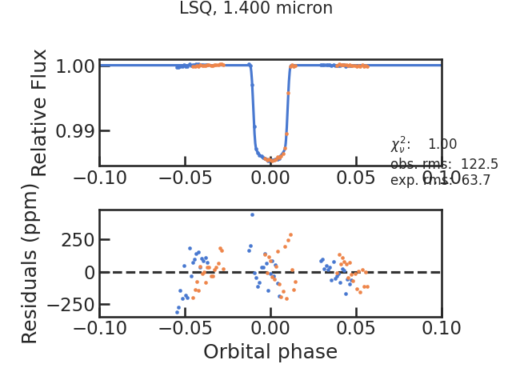

run_lsq
''''''''''''''''''''''''''''''''''''''''''''
Runs the least square routine.
Has to be True currently.

run_mcmc
''''''''''''''''''''''''''''''''''''''''''''
Runs an MCMC using the emcee package.

run_nested
''''''''''''''''''''''''''''''''''''''''''''
Runs nested sampling using the dynesty package.

ncpu
''''''''''''''''''''''''''''''''''''''''''''
Number of cores used by emcee or dynesty. Use ncpu = 1, if you don't want to use parallelization.

run_nsteps/run_nwalkers/run_nburn
''''''''''''''''''''''''''''''''''''''''''''
Parameters for emcee.

nwalkers is explained here in the `emcee API <https://emcee.readthedocs.io/en/stable/user/sampler/#the-ensemble-sampler>`_ and run_nsteps `here <https://emcee.readthedocs.io/en/stable/user/sampler/#emcee.EnsembleSampler.run_mcmc>`_.

run_dlogz/run_nlive etc
''''''''''''''''''''''''''''''''''''''''''''
| Example: ``run_dlogz                    0.01``
| Example: ``run_nlive                    400``
| Example: ``run_dynamic                  False``
| Example: ``run_dlogz_init               0.01``
| Example: ``run_nlive_init               80``
| Example: ``run_nlive_batch              100``
| Example: ``run_maxbatch                 20``
| Example: ``run_bound                    multi``
| Example: ``run_sample                   auto``

Parameters for dynesty.

If run_dynamic = False, then dynesty's static mode will be used.
The dynamic parameters (run_dlogz_init, run_nlive_init, run_nlive_batch, run_maxbatch, run_bound, run_sample) are well-explained in the `dynesty API <https://dynesty.readthedocs.io/en/stable/api.html#dynesty.dynamicsampler.DynamicSampler.run_nested>`_ and `in this tutorial <https://dynesty.readthedocs.io/en/stable/dynamic.html#initializing-the-dynamicsampler>`_
The static parameters (run_dlogz, run_nlive, run_bound, run_sample) are expained in the `dynesty API <https://dynesty.readthedocs.io/en/stable/api.html#dynesty.sampler.Sampler.run_nested>`_ too. 

The bound and sample parameters which are used by both the static and the dynamic mode are explained `here <https://dynesty.readthedocs.io/en/stable/api.html#dynesty.dynesty.DynamicNestedSampler>`_.

lc_type
''''''''''''''''''''''''''''''''''''''''''''
Currently not used.
