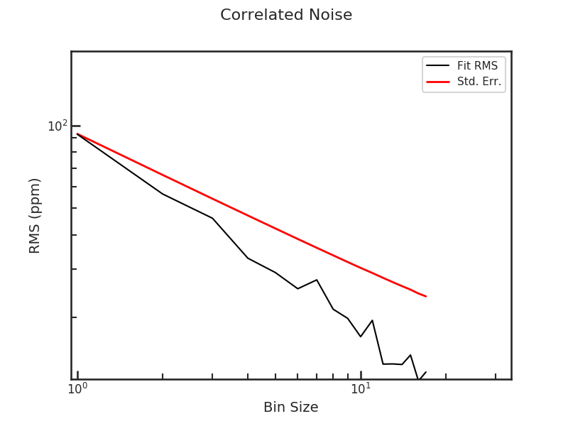
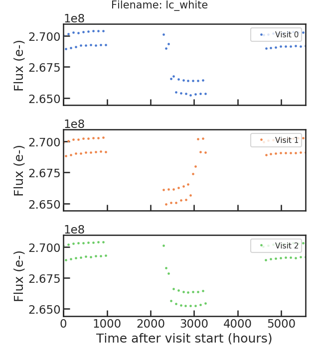
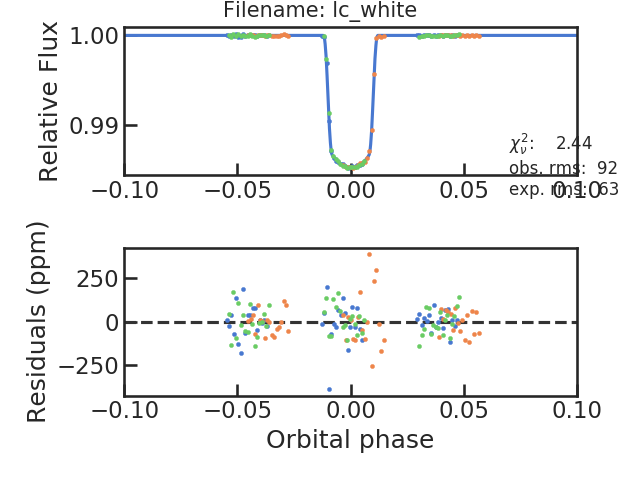

.. _pcf:

PACMAN Control File (.pcf)
============================

To run the different Stages of ``PACMAN``, the pipeline requires control files (.pcf) where Stage-specific parameters are defined (e.g. aperture size, path of the data, etc.).

In the following, we look at the contents of the pcf.

.. include:: media/obs_par.pcf
   :literal:

Stage 00
---------------------------------------------------------

rundir
''''''''''''''''''''''''''''''''''''''''''''
Example: ``/home/zieba/Desktop/Projects/Observations/Hubble/GJ1214_13021``

The directory where you want PACMAN to run and save data to.
If you downloaded or cloned the GitHub repository it includes a run_files directory.
These three files can also be downloaded under this link: `Download here <https://downgit.github.io/#/home?url=https://github.com/sebastian-zieba/PACMAN/tree/master/pacman/run_files>`_.
You have to copy these files into your run directory.
It has to include three files:
 - run_pacman.py: The run script
 - obs_par.pcf: The pcf file
 - fit_par.txt: The fit_par file with the fit parameters (if you don't want to fit the data (= Stage 30) you dont have to care about the contents of this file)

.. warning::

	Your path is not allowed to have any spaces in it. E.g., ``/home/USER/run 1`` is not a valid path.

datadir
''''''''''''''''''''''''''''''''''''''''''''
Example: ``/home/zieba/Desktop/Data/GJ1214_Hubble13021``

This path should be correspond to the location of your data.

.. warning::

	Your path is not allowed to have any spaces in it. E.g., ``/home/USER/data GJ1214`` is not a valid path.

suffix
''''''''''''''''''''''''''''''''''''''''''''
Only possible extended supported currently: ``ima``
From the `WFC3 data handbook (Types of WFC3 Files) <https://hst-docs.stsci.edu/wfc3dhb/chapter-2-wfc3-data-structure/2-1-types-of-wfc3-files>`_: "For the IR detector, an intermediate MultiAccum (ima) file is the result after all calibrations are applied (dark subtraction, linearity correction, flat fielding, etc.) to all of the individual readouts of the IR exposure."

which_visits
''''''''''''''''''''''''''''''''''''''''''''
| Example: ``[0,2]``
| Example: ``everything``

If your ``datadir`` contains several visits, you can select which ones you want to analyse.
If you are interested in all visits in ``datadir`` use ``everything`` here.

E.g., HST GO 13021 contains 15 visits. If you have all 15 visits in your ``datadir`` but only want to analyse the last two visits for now, you would enter ``[13,14]`` here.
If your ``datadir`` only contained these two visits (and not the previous 13 visits before it), you can either write ``everything`` or ``[0,1]``.

save_obs_times_plot/show_obs_times_plot
''''''''''''''''''''''''''''''''''''''''''''
Example: ``True``
This plot consists out of one table and two subplots.

- The table lists the number of orbits in each individual visit.

- The left subplot shows when the visit was observed.

- The right subplot shows when observations where taken during an visit as a function of time elapsed since the first exposure in the visit.

.. image:: media/s00/obs_dates_all.png

Stage 02
---------------------------------------------------------

save_barycorr_plot/show_barycorr_plot
''''''''''''''''''''''''''''''''''''''''''''
Example: ``True``

Saves or shows a plot with the downloaded X,Y,Z positions of HST from the `HORIZONS system <https://ssd.jpl.nasa.gov/horizons/>`_ by JPL during the observations.

.. image:: media/s02/bjdcorr_horizons_results_v1.png

Stage 03
---------------------------------------------------------

Teff, logg, MH
''''''''''''''''''''''''''''''''''''''''''''
| Example: ``Teff  3250``
| Example: ``logg  5.026``
| Example: ``MH    0.29``

effective Temperature (Teff), surface gravity (logg) and metallicity (MH) of the star.

sm
''''''''''''''''''''''''''''''''''''''''''''
Example: ``phoenix``

The stellar model one wants to use. It will be then multiplied with the bandpass (G102 or G141) to create a reference spectrum for the wavelength calibration of the spectra.

Options:

| PACMAN currently offers the following stellar models:
| - ``k93models``: THE 1993 KURUCZ STELLAR ATMOSPHERES ATLAS
| - ``ck04models``: THE STELLAR ATMOSPHERE MODELS BY CASTELLI AND KURUCZ 2004
| - ``phoenix``: THE PHOENIX MODELS BY FRANCE ALLARD AND COLLABORATORS
| - ``blackbody``: A blackbody spectrum usings Planck's law

The stellar models (exluding the blackbody one) are retrieved from https://archive.stsci.edu/hlsps/reference-atlases/cdbs/grid/

smooth/smooth_sigma
''''''''''''''''''''''''''''''''''''''''''''
Example:
| ``smooth        True``
| ``smooth_sigma  50``

Sets if the user wants to apply a gaussian kernel smoothing to the stellar spectrum. This is generally recommened as the Kurucz or Phoenix stellar models have a higher resolution as the resulting G102 or G141 spectra.

TODO: Add information on smooth_sigma and double check the information here...

G141 46.9 Angstrom/pixel dispersion

G102 24.6 Angstrom/pixel dispersion

More on gaussian smoothing for the reference spectrum: `Deming et al. 2013 <https://ui.adsabs.harvard.edu/abs/2013ApJ...774...95D/abstract>`_

They 'we convolve each 1-D spectrum with a Gaussian kernel having FWHM = 4 pixels.'

As FWHM = 2.35 * sigma, the recommended value for G141 is smooth_sigma = 2.35 * 4 * 46.9 = 441

save_smooth_plot/show_smooth_plot
''''''''''''''''''''''''''''''''''''''''''''
Example: ``True``

Shows how the stellar spectrum was smoothed.

save_refspec_plot/show_refspec_plot
''''''''''''''''''''''''''''''''''''''''''''
Example: ``True``

Saves or shows a plot of the reference spectrum (stellar spectrum * bandpass).

.. image:: media/s03/refspec.png

Stage 10
---------------------------------------------------------

di_rmin, di_rmax, di_cmin, di_cmax
''''''''''''''''''''''''''''''''''''''''''''
| Example: ``di_rmin  120``
| Example: ``di_rmax  160``
| Example: ``di_cmin  5``
| Example: ``di_cmax  50``

These values have the goal of cutting out stamp around the target star.
Below you will find an example:

.. image:: media/s10/quick_di0.png

You can see that the cutout (the red box in the plot) is well chosen which is needed to determine the star position.

save_image_plot/show_image_plot
''''''''''''''''''''''''''''''''''''''''''''
Example: ``True``

Saves two plots for every direct image.
The first one just shows the image with the location of the direct image cutout.
The second plot shows the cutout on the left and the result of the 2D gaussian fit on the right. The gaussian fit only considers the cutout for the fit.

.. image:: media/s10/quick_di0.png
.. image:: media/s10/di_0.png

di_multi
''''''''''''''''''''''''''''''''''''''''''''
Some observations have more than one direct image per orbit which were taken at the start of the orbit.
In these cases the user can decide if they want to only use the most recent DI or a median of the DI positions in the orbit.

Stage 20
---------------------------------------------------------

s20_testing/n_testing
''''''''''''''''''''''''''''''''''''''''''''
| Example: ``s20_testing  True``
| Example: ``n_testing    1``

Runs s20 in testing mode. Only the first n_testing files will be analysed then.
E.g. if n_testing = 1, only the first file will be analysed

rmin/rmax
''''''''''''''''''''''''''''''''''''''''''''
| Example: ``rmin  5``
| Example: ``rmax  261``

Can be set to remove rows from the top and bottom of the 2D array.
E.g. If the frame have the size of 266x266 and the user wants to cut off the upper and lower 5 pixels they can use the same settings as in the example above.

window
''''''''''''''''''''''''''''''''''''''''''''
| Example: ``window  12``

Increase the size of the aperture by 12 pixels relative to the rows which show the highest change in flux compared to rows above and below.

background_thld
''''''''''''''''''''''''''''''''''''''''''''
| Example: ``background_thld  1000``

Sets a threshold to the background calculation. Pixels with a flux lower than background_thld electrons/second will be considered as background.
The background flux is then determined by taking the median flux of the pixels below this threshold.

opt_extract
''''''''''''''''''''''''''''''''''''''''''''
| Example: ``background_thld  True``

Uses Optimal extraction as descibed in `Horne et al. 1986 <https://ui.adsabs.harvard.edu/abs/1986PASP...98..609H>`_.

sig_cut, nsmooth
''''''''''''''''''''''''''''''''''''''''''''
| Example: ``sig_cut  15 ``
| Example: ``nsmooth  9``

sig_cut: for cosmic rays etc

smooth: created smoothed spatial profile, medial smoothing filter

save_optextr_plot
''''''''''''''''''''''''''''''''''''''''''''
.. image:: media/s20/optextr0-0.png

correct_wave_shift
''''''''''''''''''''''''''''''''''''''''''''
| Example: ``correct_wave_shift  True``
Corrects the wavelength by using the reference spectrum.

output
''''''''''''''''''''''''''''''''''''''''''''
| Example: ``output  True``
Saves the flux as a function of time and wavelength into files.

save_sp2d_plot/show_sp2d_plot
''''''''''''''''''''''''''''''''''''''''''''
.. image:: media/s20/sp2d_0.png

save_trace_plot/show_trace_plot
''''''''''''''''''''''''''''''''''''''''''''
.. image:: media/s20/trace_0.png

save_bkg_hist_plot/show_bkg_hist_plot
''''''''''''''''''''''''''''''''''''''''''''
.. image:: media/s20/bkg_hist0-0.png

save_utr_plot/show_utr_plot
''''''''''''''''''''''''''''''''''''''''''''
.. image:: media/s20/utr0-0.png

save_sp1d_plot/show_sp1d_plot
''''''''''''''''''''''''''''''''''''''''''''
.. image:: media/s20/sp1d_0.png

save_bkg_evo_plot/show_bkg_evo_plot
''''''''''''''''''''''''''''''''''''''''''''
.. image:: media/s20/bkg_evo.png

save_sp1d_diff_plot/show_sp1d_diff_plot
''''''''''''''''''''''''''''''''''''''''''''
.. image:: media/s20/sp1d_diff_0.png

save_utr_aper_evo_plot/show_utr_aper_evo_plot
''''''''''''''''''''''''''''''''''''''''''''
.. image:: media/s20/utr_aper_evo.png

save_refspec_fit_plot/show_refspec_fit_plot
''''''''''''''''''''''''''''''''''''''''''''
.. image:: media/s20/refspec_fit_0.png
.. image:: media/s20/refspec_fit_1.png

save_drift_plot/show_drift_plot
''''''''''''''''''''''''''''''''''''''''''''
.. image:: media/s20/drift.png

Stage 21
---------------------------------------------------------

s21_most_recent_s20/s21_spec_dir_path_s20
''''''''''''''''''''''''''''''''''''''''''''
| Example: ``s21_most_recent_s20    True``
| Example: ``s21_spec_dir_path_s20  None``
If s21_most_recent_s20 is set to True the most recent s20 run will be used.
If s21_most_recent_s20 is set to False, the user can set a path with the extracted data after s20:
| Example: ``s21_most_recent_s20    False ``
| Example: ``s21_spec_dir_path_s20  /home/zieba/Desktop/Projects/Open_source/PACMAN/run/run_2022-01-25_19-12-59_GJ1214_Hubble13021/extracted_lc/2022-02-11_17-44-56``

wvl_min/wvl_max/wvl_bins
''''''''''''''''''''''''''''''''''''''''''''
| Example: ``wvl_min   1.125``
| Example: ``wvl_max   1.65``
| Example: ``wvl_bins  12``

use_wvl_list/wvl_edge_list
''''''''''''''''''''''''''''''''''''''''''''
| Example: ``use_wvl_list   True``
| Example: ``wvl_edge_list  [1.1, 1.3, 1.5, 1.7]``

Stage 30
---------------------------------------------------------

s30_myfuncs
''''''''''''''''''''''''''''''''''''''''''''
Choose the functions to fit the data.

s30_fit_white
''''''''''''''''''''''''''''''''''''''''''''
Fit the white light curve which was created after Stage 20.

s30_most_recent_s20
''''''''''''''''''''''''''''''''''''''''''''
Use the most recent Stage 20 run for the white light curve fit.

s30_fit_spec
''''''''''''''''''''''''''''''''''''''''''''
Fit the spectroscopic light curves which was created after Stage 21.

s30_most_recent_s21
''''''''''''''''''''''''''''''''''''''''''''
Use the most recent Stage 21 run for the spectroscopic light curve fit.

s30_spec_dir_path
''''''''''''''''''''''''''''''''''''''''''''
If s30_most_recent_s21 was set to False, the user can put a path here.

remove_first_exp
''''''''''''''''''''''''''''''''''''''''''''
Removes the first exposure from every orbit.

remove_first_orb
''''''''''''''''''''''''''''''''''''''''''''
Removes the first orbit from every visit.

rescale_uncert
''''''''''''''''''''''''''''''''''''''''''''
Rescales the uncertaincies for the sampler (MCMC or nested sampling), so that the reduced chi2 = 1.

run_clipiters
''''''''''''''''''''''''''''''''''''''''''''
NOT TESTED

run_clipsigma
''''''''''''''''''''''''''''''''''''''''''''
NOT TESTED

fix_ld
''''''''''''''''''''''''''''''''''''''''''''
NOT TESTED

ld_file
''''''''''''''''''''''''''''''''''''''''''''
NOT TESTED

toffset
''''''''''''''''''''''''''''''''''''''''''''
Removes a time offset from the time stamps so that there is no problem with floating precision due to the size of dates in BJD.

run_divide_white
''''''''''''''''''''''''''''''''''''''''''''
NOT TESTED

run_verbose
''''''''''''''''''''''''''''''''''''''''''''

save_allan_plot
''''''''''''''''''''''''''''''''''''''''''''

save_raw_lc_plot
''''''''''''''''''''''''''''''''''''''''''''

save_fit_lc_plot
''''''''''''''''''''''''''''''''''''''''''''

run_lsq
''''''''''''''''''''''''''''''''''''''''''''

run_mcmc
''''''''''''''''''''''''''''''''''''''''''''
Runs an MCMC using the emcee package.

run_nested
''''''''''''''''''''''''''''''''''''''''''''
Runs Nested Sampling using the dynesty package.

run_nsteps/run_nwalkers/run_nburn
''''''''''''''''''''''''''''''''''''''''''''
Parameters for emcee.

run_dlogz/run_nlive
''''''''''''''''''''''''''''''''''''''''''''
Parameters for dynesty.

