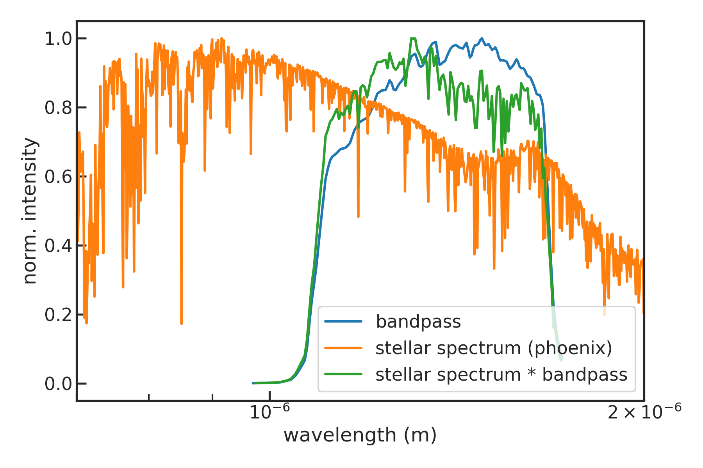
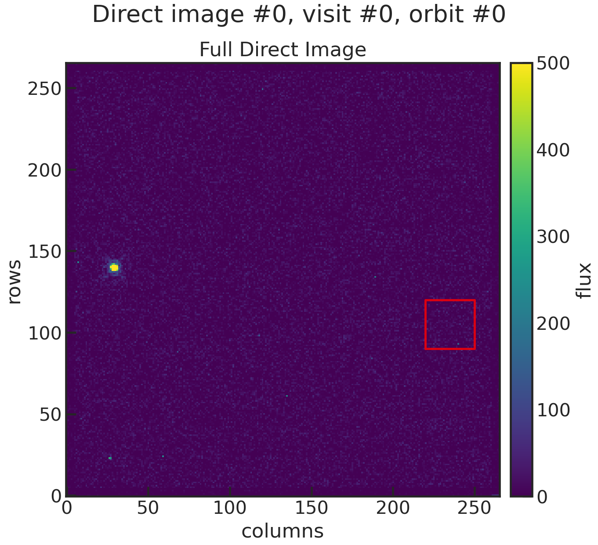
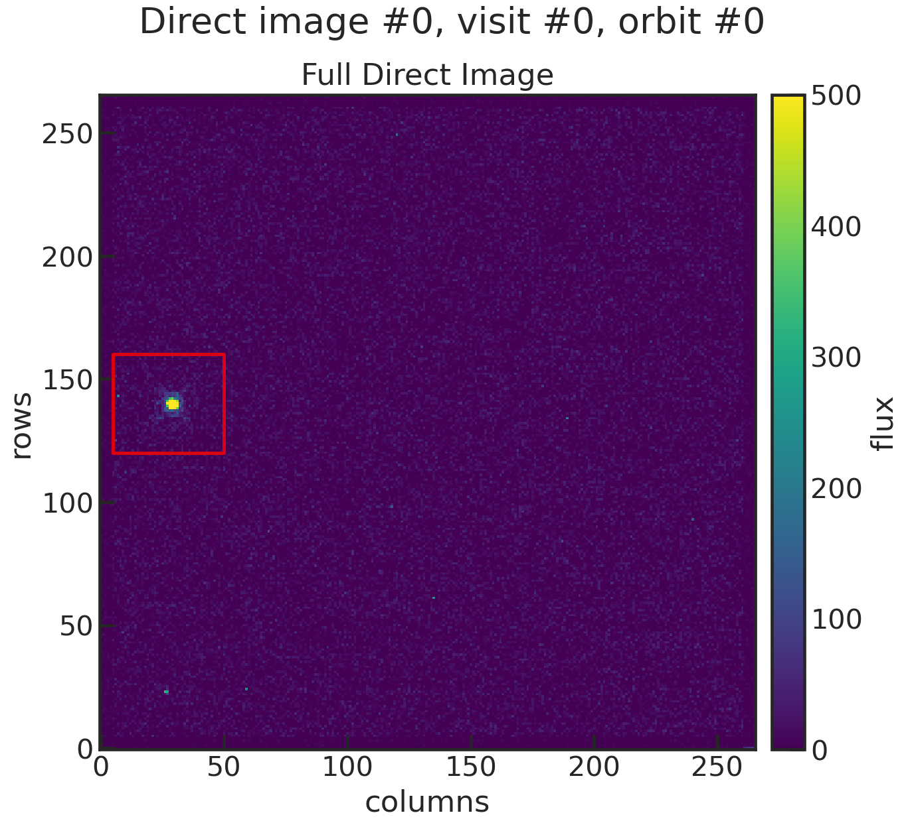
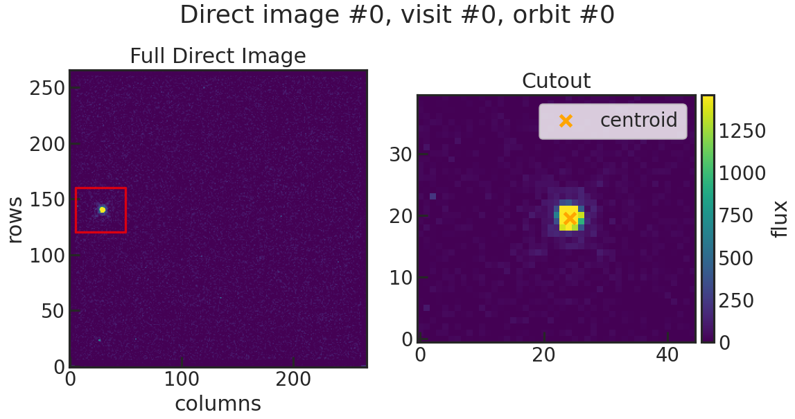

.. _quickstart:

Run PACMAN
============

PACMAN is separated into different stages. Here a quick summary before we look into each of them ińto more detail by
applying PACMAN on real observations:

- Stage 00: Every observation in the data directory is being read in an import information from the header are saved into a new file.

- Stage 01: To prepare for the barycentric correction, we download the location of HST during the observations

- Stage 02: We perform the barycentric correction

- Stage 03: We load in a stellar spectrum. The product of the stellar spectrum and the bandpass of the Grism (G102 or G141) will be used as a reference spectrum in the wavelength calibration.

- Stage 10: The direct images are being read in and the position of the star is being determined.

- Stage 20: We extract the spectra

- Stage 21: TODO! Generate limb darkening parameters

- Stage 22: Bin the spectra to create light curves

- Stage 30: Fit a model to the light curves

Introduction
:::::::::::::::::::::::::::::::::::::::::

Let's apply PACMAN on real observations of GJ1214. The planet was observed in HST GO13021 in 15 visits.
Let's just look at the last two visits (so which_visits = [13,14]) for simplicity.

Directories
:::::::::::::::::::::::::::::::::::::::::
* **run directory**:

Contents:

 - run_pacman.py

 - obs_par.pcf

 - fit_par

Example: ``/home/zieba/Desktop/Projects/Open_source/PACMAN/run``.

    .. note:: | The pcf file in the run directory is ONLY used in Stage 00. It will be copied over to the work directory. The copied pcf file in the work directory will then be the pcf file for all following stages. The same is true for the fit_par.txt file. So, after running Stage 00, PACMAN does not care anymore about the changes made to the pcf file and the fit_par file in the run directory.

* **work directory**:

This directory will be created after running Stage 00.
All the results of the following stages will be stored here.

Example: ``/home/zieba/Desktop/Projects/Open_source/PACMAN/run/run_2022-01-19_16-46-19_GJ1214_Hubble13021``.
It therefore has the following form:

.. code-block:: python

    datetime = time.strftime('%Y-%m-%d_%H-%M-%S')
    meta.workdir = 'run_' + datetime + '_' + meta.eventlabel

* **data directory**:

Example: ``/home/zieba/Desktop/Data/GJ1214_Hubble13021``.

* **pipeline directory**:

This is the heart of PACMAN containing all the code to run the different Stages.

Example: ``/home/zieba/Desktop/Projects/Open_source/PACMAN/pacman``

Download data
:::::::::::::::::::::::::::::::::::::::::

You can find and download HST observations on `MAST <https://mast.stsci.edu/search/hst/ui/#/>`_.
Note that the website only allows you to mark a maximum of 100 observations to download.
You can also download the files by using the `old HST MAST search tool <https://archive.stsci.edu/hst/search.php>`_ which does not have this limitation but might be retired soon.
In this example we will analyse HST/G141 of GJ 1214 b taken in Program 13021.
If you want to download the same data, enter Proposal ID = 13021 and click on search.
You can now select files we want to download by ticking them off and then selecting "Download Data".
PACMAN can currently just work with files with an ``ima`` extension, so you want to select these.
``ima`` is an intermediate data product standing for calibrated intermediate IR multiaccum image.
From the `WFC3 data handbook (Types of WFC3 Files) <https://hst-docs.stsci.edu/wfc3dhb/chapter-2-wfc3-data-structure/2-1-types-of-wfc3-files>`_: "For the IR detector, an intermediate MultiAccum (ima) file is the result after all calibrations are applied (dark subtraction, linearity correction, flat fielding, etc.) to all of the individual readouts of the IR exposure."
Finally, move these fits files into a new directory. You will have to specify the location of this "data directory" then in the pcf file.

Setup the PACMAN control file (.pcf)
:::::::::::::::::::::::::::::::::::::::::

See pcf.rst

Stage 00
:::::::::::::::::::::::::::::::::::::::::

This step first creates a new directory for the analysis which will be used as the work directory ('workdir').
It will be saved in the rundir and have a form like:
``/home/zieba/Desktop/Projects/Open_source/PACMAN/run/run_2022-01-19_16-46-19_GJ1214_Hubble13021``

The fit_par.txt and obs_par.pcf files will be copied there.
After running Stage 00 you should get an output like this:

.. code-block:: console

	    Starting s00
	    Found 1145 data file(s) ending in ima.fits
	    Reading in files and their header information: 100%|██████████| 1145/1145 [00:03<00:00, 368.21it/s]
	    Determining Orbit and Visit: 100%|██████████| 1145/1145 [00:00<00:00, 311606.42it/s]
	    The user does not want to analyse every visit (which_visits != everything). The amount of files analyzed therefore reduced from 1145 to 158.
	    Writing table into filelist.txt
	    Saving Metadata
	    Finished s00

You will also end up with a new file called ``filelist.txt``. It should look like this:

.. include:: media/filelist.txt
   :literal:

It has the following columns:

* filenames

* instr: The specific filter or grism used in the obervation

* ivisit: Current visit of the observation

* iorbit: Current orbit of the observation

* t_mjd: Time in Modified Julian Date (MJD)

* t_visit: Time since the first exposure in the visit in minutes

* t_orbit: Time since the first exposure in the orbit in minutes

* scan: Scan direction:

  * 0: forward scan

  * 1: reverse scan

  * -1: not a spectrum but a direct image

* exp: exposure time in seconds

Stage 01
:::::::::::::::::::::::::::::::::::::::::

Next we download the locations of HST. This will be later used for the barycentric correction.

    .. warning:: This step needs an internet connection!

    .. note:: | At the beginning of every stage we read in again the pcf file located in the work directory.
              | This ensures that any user-made changes to the pcf file will be considered when running a new stage.
              | This means that the pcf file in the run directory is ONLY used in Stage 00. The same is true for the fit_par.txt file. So, after running Stage 00, PACMAN does not care anymore about the changes made to the pcf file and the fit_par file in the run directory.

After running Stage 01 you should get an output like this:

.. code-block:: console

	    Successfully reloaded meta file
	    Starting s01
	    Retrieving Horizons file for every visit: 100%|██████████| 2/2 [00:02<00:00,  1.03s/it]
	    Saving Metadata
	    Finished s01

We now accessed the `HORIZONS system <https://ssd.jpl.nasa.gov/horizons/>`_ by JPL and downloaded a file containing the positions of HST during the observations.
For that a new directory was created in the run directory called "ancil/horizons".
Two new .txt files where saved there; a Horizons file for each visit.
Each file contains the X, Y and Z position of HST relative to the solar system barycenter. The X,Y,Z positions of HST were downloaded for 5 minute intervals starting one hour before the first exposure in the observations and one hour after the observations.

For example, the second file should look like this (due to its length, we just display the first 100 lines of it):

.. include:: media/horizons_results_v1_short.txt
   :literal:

The next Stage uses the information in these files to convert from MJD to BJD.

Stage 02
:::::::::::::::::::::::::::::::::::::::::

This Stage has to perform a barycentric correction because the header only contains MJD.

.. code-block:: console

	    Successfully reloaded meta file
	    Starting s02
	    Converting MJD to BJD: 100%|██████████| 2/2 [00:01<00:00,  1.27it/s]
	    Writing t_bjd into filelist.txt
	    Saving Metadata
	    Finished s02

After the calculation has been performed, the user can check a newly generated plot also saved into "ancil/horizons".
Here we show the plot generated for the second of the two visits:

.. image:: media/bjdcorr_horizons_results_v1.png

The axis are the distance of HST to the Solar System Barycenter in kilometers.
Horizons start and Horizons end show where our Horizon file starts and ends containing X,Y,Z information.
The black crosses in the plot show the times when HST actually observed. One can see that HST observed 4 orbits in this particular visit (which agrees with the ``filetable.txt`` from Stage 00).
One can also see the colored curve is a bit wiggley. This is in fact the rotation of HST around the earth.
The colored curve consists out of a lot of points. Every one of them are a X,Y,Z position of HST downloaded from HORIZONS. The color coding denotes the time direction.

The ``filetable.txt`` has be updated by the end of this stage and contains a new column called ``t_bjd`` with the time of observations in BJD.
E.g. (only showing the first few lines):

.. include:: media/filelist_updated.txt
   :literal:

Stage 03
:::::::::::::::::::::::::::::::::::::::::

This Stage starts by downloading a stellar model or calculating one in case of the black body spectrum.

    .. note:: | PACMAN currently offers the following stellar models:
              | - THE 1993 KURUCZ STELLAR ATMOSPHERES ATLAS (``k93models``)
              | - THE STELLAR ATMOSPHERE MODELS BY CASTELLI AND KURUCZ 2004 (``ck04models``)
              | - THE PHOENIX MODELS BY FRANCE ALLARD AND COLLABORATORS (``phoenix``)
              | - ``blackbody`` spectrum
              | The stellar models (exluding the blackbody one) are retrieved from https://archive.stsci.edu/hlsps/reference-atlases/cdbs/grid/

    .. warning:: If the user decides on any stellar model which has to be downloaded (``k93models``, ``ck04models`` or ``phoenix``), then internet connection is required! The blackbody model does not require a connection however.

The user sets Teff, logg and MH in the pcf file. For ``k93models``, ``ck04models`` and ``phoenix`` the closest available metallicity, then the closest available effective temperature and finally the closest available surface gravity is searched and then used.
To see the workflow see the code block below.

Let's look at an example for GJ 1214:
We use the stellar parameters published in `Cloutier et al. 2021 <https://ui.adsabs.harvard.edu/abs/2021AJ....162..174C/abstract>`_.

| Teff   =  3250
| logg   =  5.026
| MH     =  0.29

.. code-block:: console

	    Successfully reloaded meta file
	    Starting s03
	    Using g141 grism.
	    Using phoenix model.

	    Possible metallicities: [ 0.  -0.5 -1.  -1.5 -2.  -2.5 -3.  -3.5 -4.   0.5  0.3]
	    Using input metallicity of -0.5.

	    Possible effective temperatures: [10000. 10200. 10400. 10600. 10800. 11000. 11200. 11400. 11600. 11800.
	     12000. 12500. 13000. 13500. 14000. 14500. 15000. 15500. 16000. 16500.
	     17000. 17500. 18000. 18500. 19000. 19500.  2000. 20000.  2100. 21000.
	      2200. 22000.  2300. 23000.  2400. 24000.  2500. 25000.  2600. 26000.
	      2700. 27000.  2800. 28000.  2900. 29000.  3000. 30000.  3100. 31000.
	      3200. 32000.  3300. 33000.  3400. 34000.  3500. 35000.  3600. 36000.
	      3700. 37000.  3800. 38000.  3900. 39000.  4000. 40000.  4100. 41000.
	      4200. 42000.  4300. 43000.  4400. 44000.  4500. 45000.  4600. 46000.
	      4700. 47000.  4800. 48000.  4900. 49000.  5000. 50000.  5100. 51000.
	      5200. 52000.  5300. 53000.  5400. 54000.  5500. 55000.  5600. 56000.
	      5700. 57000.  5800. 58000.  5900. 59000.  6000. 60000.  6100. 61000.
	      6200. 62000.  6300. 63000.  6400. 64000.  6500. 65000.  6600. 66000.
	      6700. 67000.  6800. 68000.  6900. 69000.  7000. 70000.  7200.  7400.
	      7600.  7800.  8000.  8200.  8400.  8600.  8800.  9000.  9200.  9400.
	      9600.  9800.]
	    For input effective temperature 3412, closest temperature is 3400.0.

	    Was the stellar model fits file already downloaded?: False

		          + Downloading file phoenixm05_3400.fits from https://archive.stsci.edu/hlsps/reference-atlases/cdbs/grid/phoenix/phoenixm05/phoenixm05_3400.fits.
	    --2022-01-20 02:23:51--  https://archive.stsci.edu/hlsps/reference-atlases/cdbs/grid/phoenix/phoenixm05/phoenixm05_3400.fits
	    Resolving archive.stsci.edu (archive.stsci.edu)... 130.167.201.60
	    Connecting to archive.stsci.edu (archive.stsci.edu)|130.167.201.60|:443... connected.
	    HTTP request sent, awaiting response... 200 OK
	    Length: 532800 (520K) [image/fits]
	    Saving to: ‘phoenixm05_3400.fits’

	         0K .......... .......... .......... .......... ..........  9%  170K 3s
	        50K .......... .......... .......... .......... .......... 19%  374K 2s
	       100K .......... .......... .......... .......... .......... 28% 1.27M 1s
	       150K .......... .......... .......... .......... .......... 38% 1.51M 1s
	       200K .......... .......... .......... .......... .......... 48%  376K 1s
	       250K .......... .......... .......... .......... .......... 57% 5.90M 0s
	       300K .......... .......... .......... .......... .......... 67% 1.86M 0s
	       350K .......... .......... .......... .......... .......... 76%  344K 0s
	       400K .......... .......... .......... .......... .......... 86% 1.25M 0s
	       450K .......... .......... .......... .......... .......... 96% 1003K 0s
	       500K .......... ..........                                 100% 16.8M=0.9s

	    2022-01-20 02:23:53 (577 KB/s) - ‘phoenixm05_3400.fits’ saved [532800/532800]

	    Possible logg: [0.  0.5 1.  1.5 2.  2.5 3.  3.5 4.  4.5 5.  5.5]
	    For input logg 4.94, closest logg is 5.0.

	    Saving Metadata
	    Finished s03

.. note::

	The stellar models will be saved into the run directory. E.g., ``/home/zieba/Desktop/Projects/Open_source/PACMAN/run/run_2022-01-19_19-06-02_GJ1214_Hubble13021/ancil/stellar_models/phoenix/phoenixm05_3400.fits``.
	If the file already exists then it will not be downloaded again.

After downloading or calculating the stellar spectrum, it gets multiplied with the bandpass (if the observations used G102 or G141 is recognized automatically).
The bandpass files are stored in the pipeline directory (e.g., ``/home/zieba/Desktop/Projects/Open_source/PACMAN/pacman/ancil/bandpass``).
The final plot of this Stage shows the stellar spectrum, the bandpass and the product of these two. This product will be then used as the reference spectrum for wavelength calibration.

Stage 10
:::::::::::::::::::::::::::::::::::::::::

This stage determines the position of the star in each direct image.

Let's look at an example using the two GJ1214 visits from earlier:

You can run Stage 10 first without giving any guess on where the star is located.
This will save a plot showing you the direct image which you can then use to refine your guess.

First run
''''''''''''''''''''''''

For demonstration purposures, in this first run I did not change the settings in the pcf file from a previous analysis of a different dataset:

| di_rmin    | 320
| di_rmax    | 360
| di_cmin    | 100
| di_cmax    | 150

The terminal should give you something like this:

.. code-block:: console

	    Successfully reloaded meta file
	    Starting s10
	    Determining Source Positions for Direct Images:  12%|█▎        | 1/8 [00:01<00:07,  1.01s/it]
	    Your guess for di_rmax is outside of the image.

	    Your guess for di_rmax is outside of the image.
	    Determining Source Positions for Direct Images:  38%|███▊      | 3/8 [00:02<00:04,  1.04it/s]
	    Your guess for di_rmax is outside of the image.
	    Determining Source Positions for Direct Images:  50%|█████     | 4/8 [00:03<00:03,  1.04it/s]
	    Your guess for di_rmax is outside of the image.

	    Your guess for di_rmax is outside of the image.
	    Determining Source Positions for Direct Images:  75%|███████▌  | 6/8 [00:05<00:01,  1.09it/s]
	    Your guess for di_rmax is outside of the image.
	    Determining Source Positions for Direct Images:  88%|████████▊ | 7/8 [00:06<00:00,  1.20it/s]
	    Your guess for di_rmax is outside of the image.

	    Your guess for di_rmax is outside of the image.
	    Saving Metadata
	    Finished s10

	    Determining Source Positions for Direct Images: 100%|██████████| 8/8 [00:06<00:00,  1.17it/s]

We see that we got messages while running that our guesses were outside of the image.
In order to determine now where the star actually is, this run saved the images as plots into a new directory: run directory + /figs/images

You will end up with plots like this one:

You can see that our "initial guess" (the red box in the plot) was off by a lot from the star. Lets try again with a better guess, now that we know where the star is.

Second run
''''''''''''''''''''''''

By estimating by eye we can tell the star is approximately at row = 140 and col = 30. So our new guess is:

| di_rmin   | 120
| di_rmax   | 160
| di_cmin   | 5
| di_cmax   | 50

The terminal should give you something like this:

.. code-block:: console

	    Successfully reloaded meta file
	    Starting s10
	    Determining Source Positions for Direct Images: 100%|██████████| 8/8 [00:10<00:00,  1.37s/it]
	    Saving Metadata
	    Finished s10

You will end up with plots like this one:

This time we have the star in our cutout box!
A second plot shows you the best fit to the star by using a 2D gaussian.

The positions of the star in physical pixels are then saved into a new file called ``xrefyref.txt``:

.. include:: media/xrefyref.txt
   :literal:

| First column is the time when the Direct Image was taken
| Second column is the row position of the star in physical pixels
| Third column is the column position of the star in physical pixels

You might notice that the fit resulted to a target location of approximately row = 513 and col = 403 but in the plots the target is closer to being at approximately row = 140 and col = 30 (by estimating by eye).
This is because the table accounted for the offset in X and Y to subsection start. This information can be found in the header:

| LTV1    =  -374.0 / offset in X to subsection start
| LTV2    =  -374.0 / offset in Y to subsection start

Stage 20
:::::::::::::::::::::::::::::::::::::::::

This new step finally extract the spectra.

A new directory will be created in the work directory. It will look similar to this ``workdir + extracted_lc/2022-01-21_18-33-25``.
We will save the flux information into there.

