.. _quickstart:

Run PACMAN
============

Stages
:::::::::::::::::::::::::::::::::::::::::

PACMAN is separated into different stages. Here is a quick summary before we look into each of them into more detail by
applying PACMAN on real observations:

- Stage 00: Every observation in the data directory is being read in and important information from the header are put into a table and saved into a new file.

- Stage 01: To prepare for the barycentric correction, we download the location of HST during the observations.

- Stage 02: We perform the barycentric correction to convert from MJD to BJD.

- Stage 03: We load in a stellar spectrum. The product of the stellar spectrum and the bandpass of the Grism (G102 or G141) will be used as a reference spectrum in the wavelength calibration.

- Stage 10: The direct images are being read in and the position of the star is being determined.

- Stage 20: We extract the spectra.

- Stage 21: We bin the spectra to create spectroscopic light curves (this step can be skipped if the user is only interested to fit the white light curve).

- Stage 22: TODO! Generate limb darkening parameters (this step can be skipped if the user does not want to calculate limb-darkening coefficients for a specified stellar model in order to fix them during fitting).

- Stage 30: Fit a model to the white or spectroscopic light curve(s).

Directories
:::::::::::::::::::::::::::::::::::::::::

On GitHub
''''''''''''''''''''''''''''''

* **PACMAN/run**

 - **PACMAN/run/run_pacman.py**

This python script runs PACMAN. As the installation with setup.py is not tested yet, the user has to modify ``line 2`` inside of this file before being able to run the code:

.. code-block:: python

	sys.path.append('/home/zieba/Desktop/Projects/Open_source/PACMAN/')

The path in ``sys.path.append`` has to be changed to the location of PACMAN on the user's device.

    .. note:: The path should point to ``/PACMAN/`` and not to ``/PACMAN/pacman/``.

The user can now run any stage by adding it as an argument in the terminal. E.g., for running Stage 00:

.. code-block:: console

	python run_pacman.py --s00

To get more information, type:

.. code-block:: console

	python run_pacman.py --help

 - **PACMAN/run/fit_par.txt**

The fit_par file is used in Stage 30 to fit the light curve. The user defines in here which fit parameters should be fixed, shared accross visits, and sets other information like priors.

 - **PACMAN/run/obs_par.pcf**

The PACMAN control file (pcf): the user sets here which plots should be saved, the path to the data and many other parameters. A thorough explanation of all the parameters in the pcf can be found on Read The Docs: :ref:`pcf`.

* **PACMAN/pacman**

All code PACMAN needs to run, is stored here.

 - **PACMAN/pacman/reduction**

This directory contains the main scripts for the individual stages. The scripts here use many files which are saved in ``PACMAN/pacman/lib``.

 - **PACMAN/pacman/lib**

This directory contains auxiliary scripts for the stages. E.g., ``PACMAN/pacman/lib/plots.py`` creates and saves plots.

 - **PACMAN/pacman/ancil**

  + **PACMAN/pacman/ancil/bandpass**

This directory contains the bandpass of the G102 and the G141 grisms. These files will be used in Stage 03 to create the reference spectrum.

  + **PACMAN/pacman/ancil/flats**

The flats (for G102 and G141) are used to find the locations of bad pixels.

  + **PACMAN/pacman/ancil/stellar_models**

This directory contains information for PACMAN which stellar models are available to download.
PACMAN offers the user to download three different stellar models from the internet: Kurucz stellar models 1993, Castelli and Kurucz stellar models 2004 and Phoenix models by Allard and collaborators.
These models will be used in Stage 03 to create the reference spectrum.
More on this `further down <https://pacmandocs.readthedocs.io/en/latest/quickstart.html#stage-03>`_ at the walkthrough of Stage 03.

When running PACMAN
''''''''''''''''''''''''''''''

* **run directory**:

Contents:

 - run_pacman.py

 - obs_par.pcf

 - fit_par

Example: ``/home/zieba/Desktop/Projects/Open_source/PACMAN/run``.

    .. note:: | The pcf file in the run directory is ONLY used in Stage 00. It will be copied over to the work directory. The copied pcf file in the work directory will then be the pcf file for all following stages. The same is true for the fit_par.txt file. So, after running Stage 00, PACMAN does not care anymore about the changes made to the pcf file and the fit_par file in the run directory.

* **work directory**:

This directory will be created when running Stage 00.
All the results of the following stages will be stored here.

Example: ``/home/zieba/Desktop/Projects/Open_source/PACMAN/run/run_2022-01-19_16-46-19_GJ1214_Hubble13021``.
It therefore has the following form:

.. code-block:: python

    datetime = time.strftime('%Y-%m-%d_%H-%M-%S')
    meta.workdir = 'run_' + datetime + '_' + meta.eventlabel

* **data directory**:

Example: ``/home/zieba/Desktop/Data/GJ1214_Hubble13021``.

This directory should contain the .fits files which will be reduced and analyzed.

* **pipeline directory**:

This is the heart of PACMAN containing all the code to run the different Stages.

Example: ``/home/zieba/Desktop/Projects/Open_source/PACMAN/pacman``

Example on GJ 1214 b
:::::::::::::::::::::::::::::::::::::::::

Let's apply PACMAN on real observations of GJ 1214. The planet GJ 1214 b was observed in `HST Program GO 13021  <https://archive.stsci.edu/proposal_search.php?mission=hst&id=13021>`_ in 15 visits.
Let's just look at the last two visits (i.e., the two most recently taken visits) for simplicity.

Download data
:::::::::::::::::::::::::::::::::::::::::

There are different ways to download the data. Let's have a look at them by downloading the data taken in HST Program GO 13021.

    .. note:: PACMAN can currently just work with files with an ``ima`` extension, so you want to select these.
	``ima`` is an intermediate data product standing for calibrated intermediate IR multiaccum image.
	From the `WFC3 data handbook (Types of WFC3 Files) <https://hst-docs.stsci.edu/wfc3dhb/chapter-2-wfc3-data-structure/2-1-types-of-wfc3-files>`_: "For the IR detector, an intermediate MultiAccum (ima) file is the result after all calibrations are applied (dark subtraction, linearity correction, flat fielding, etc.) to all of the individual readouts of the IR exposure."

Using the program's site
''''''''''''''''''''''''''''''''''''''''''''''''''''''''''''

Go to the `new HST MAST search tool <https://mast.stsci.edu/search/hst/ui/#/>`_.

.. image:: media/download/mast1.png

Enter 13021 for Proposal ID and click on search.
All files associated with the program will be then shown in the following table.
One of the columns is called Proposal ID.
You can see that all of them say 13021 because that's what we wanted. Click on any of the numbers saying ``13021``.
You should get to `program site <https://archive.stsci.edu/proposal_search.php?mission=hst&id=13021>`_.
It lists interesting information to the program like papers associated with the program and also (further down on the website) all files taken in this program.

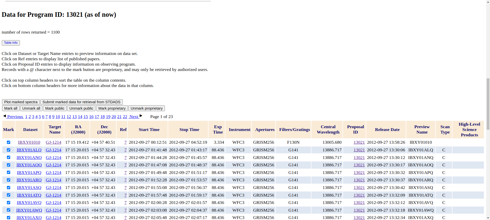

Let's click on ``Mark all`` right above the table. And then on ``Submit marked data for retrieval from STDADS``.
A new page will load where you can finally download your data.

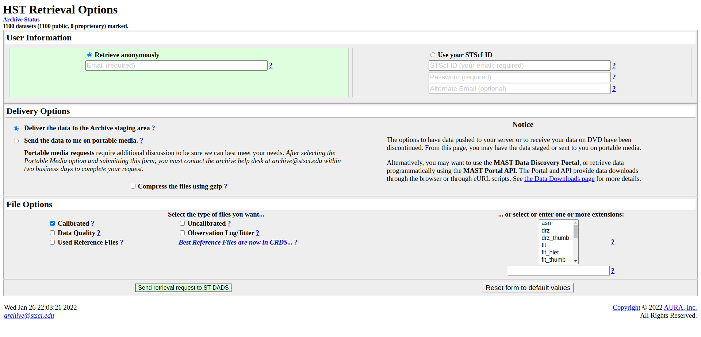

1. Enter your email address or use your STScI log in. (If the data you want to download is still proprietary, you will have to use the log-in)
2. File type: Calibrated data (should be marked already)
3. Extension (bottom right): ima
4. Click Send retrieval request to ST-DADS

You should then get more instructions per email.

You can find more information how to download the files with ftp here:
`Retrieval Options <https://archive.stsci.edu/hst/help/retrieval_help.html>`_,
`Retrieving IUE Data via FTP <https://archive.stsci.edu/iue/ftp_retrieve.html>`_ 
and `MAST FTP Service <https://archive.stsci.edu/ftp.html>`_.

You can access the data using the ``ftplib`` module in python. Here's an example script which you can also find on GitHub. It will save download the data into the current directory.

.. literalinclude:: media/download/data_downloader_ftps.py
   :language: python

If necessary, unpack everything and move these fits files into a new directory.
This data directory should then contain all the downloaded .fits files. You will have to specify the location of this "data directory" then in the pcf file.

If the user has all files of the 15 visits in the data directory, they can use ``which_visits = [13,14]`` in the pcf to only analyze the last two visits.

Using the new MAST search tool
''''''''''''''''''''''''''''''''''''''''''''''''''''''''''''

An alternative is to download it directly after searching for the program files with the `new HST MAST search tool <https://mast.stsci.edu/search/hst/ui/#/>`_.
Note that the website only allows you to mark a maximum of 100 observations to download.
You can also download the files by using the `old HST MAST search tool <https://archive.stsci.edu/hst/search.php>`_ which does not have this limitation but might be retired soon.

Because the program has more than 1000 files, this would take some time.
So let's only download the last two visits which were taken in August of 2013 (2013-08-12 and 2013-08-20).
Set OBS START DATE = 2013-08-12 and as before, enter 13021 for Proposal ID and click on search.

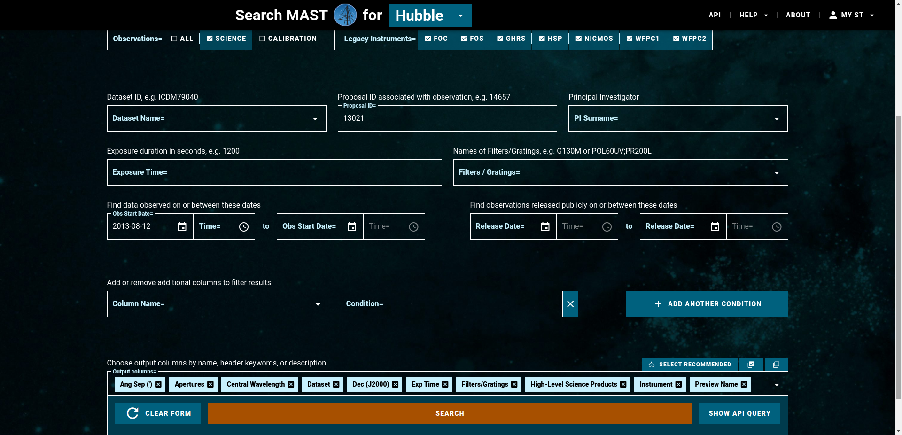

All files associated with the program taken during the last two visits will be then shown in the following table.
Go to the buttom right and seclect Rows per Page = 100, then select the 100 files and click on DOWNLOAD DATA (100 DATASETS).
A small window opens on the website. Go to the EXTENSIONS drop down list and only select ima. Click on Start DOWNLAÒAD

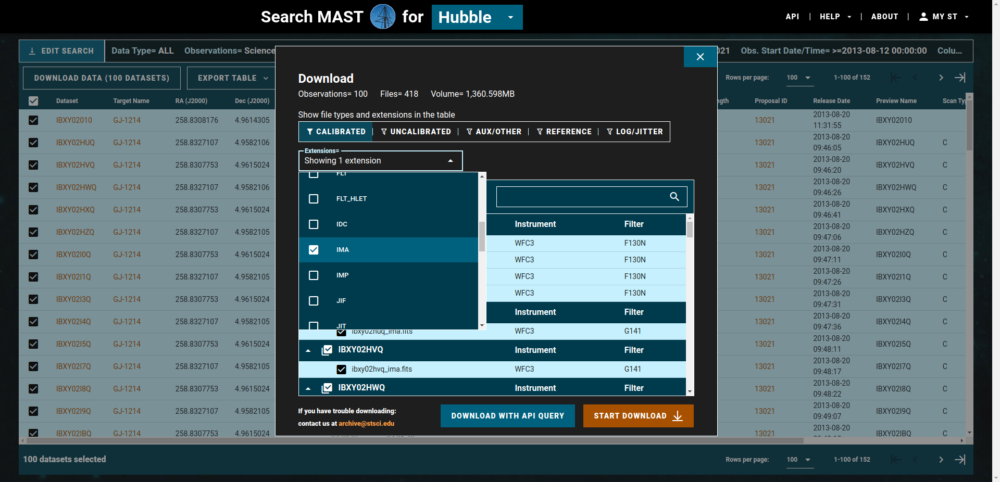

It will download the ima files associated with these 100 datasets as a zip file.
After that, do the same for the remaining 52 DATASETS.

Finally, unpack everything and move these fits files into a new directory. This data directory should then just contain the downloaded .fits files. You will have to specify the location of this "data directory" then in the pcf file.

Setup the PACMAN control file (.pcf)
:::::::::::::::::::::::::::::::::::::::::

The PACMAN control file should be set up before running any stage. Please check out this website on Read The Docs: :ref:`pcf` to see what the different parameters mean.

Stage 00
:::::::::::::::::::::::::::::::::::::::::

This step first creates a new directory for the analysis which will be used as the work directory ('workdir').
It will be saved in the rundir and have a form like:
``/home/zieba/Desktop/Projects/Open_source/PACMAN/run/run_2022-01-19_16-46-19_GJ1214_Hubble13021``

The fit_par.txt and obs_par.pcf files will be copied there.
After running Stage 00 you should get an output like this:

.. code-block:: console

	    Starting s00
	    Found 1145 data file(s) ending in ima.fits
	    Reading in files and their headers: 100%|############| 1145/1145 [00:03<00:00, 325.43it/s]
	    Determining orbit(s) and visit(s): 100%|##########| 1145/1145 [00:00<00:00, 254922.13it/s]
	    The user does not want to analyse every visit (which_visits != everything). The amount of files analyzed therefore reduced from 1145 to 158.
	    Writing table into filelist.txt
	    Saving Metadata
	    Finished s00

You will also end up with a new file called ``filelist.txt``. It should look like this:

.. include:: media/s00/filelist.txt
   :literal:

It has the following columns:

* filenames

* instr: The specific filter or grism used in the obervation

* ivisit: Current visit of the observation

* iorbit: Current orbit of the observation

* t_mjd: Time in Modified Julian Date (MJD)

* t_visit: Time since the first exposure in the visit in minutes

* t_orbit: Time since the first exposure in the orbit in minutes

* scan: Scan direction:

  * 0: forward scan

  * 1: reverse scan

  * -1: not a spectrum but a direct image

* exp: exposure time in seconds

Stage 01
:::::::::::::::::::::::::::::::::::::::::

Next we download the locations of HST. This will be later used for the barycentric correction.

    .. warning:: This step needs an internet connection!

    .. note:: | At the beginning of every stage we read in again the pcf file located in the work directory.
              | This ensures that any user-made changes to the pcf file will be considered when running a new stage.
              | This means that the pcf file in the run directory is ONLY used in Stage 00. The same is true for the fit_par.txt file. So, after running Stage 00, PACMAN does not care anymore about the changes made to the pcf file and the fit_par file in the run directory.

After running Stage 01 you should get an output like this:

.. code-block:: console

	    Successfully reloaded meta file
	    Starting s01
	    Retrieving Horizons file for every visit: 100%|#############| 2/2 [00:02<00:00,  1.03s/it]
	    Saving Metadata
	    Finished s01

We now accessed the `HORIZONS system <https://ssd.jpl.nasa.gov/horizons/>`_ by JPL and downloaded a file containing the positions of HST during the observations.
For that a new directory was created in the run directory called "ancil/horizons".
Two new .txt files where saved there; a Horizons file for each visit.
Each file contains the X, Y and Z position of HST relative to the solar system barycenter. The X,Y,Z positions of HST were downloaded for 5 minute intervals starting one hour before the first exposure in the observations and one hour after the observations.

For example, the second file should look like this (due to its length, we just display the first 100 lines of it):

.. include:: media/s01/horizons_results_v1_short.txt
   :literal:

The next Stage uses the information in these files to convert from MJD to BJD.

Stage 02
:::::::::::::::::::::::::::::::::::::::::

This Stage has to perform a barycentric correction because the header only contains MJD.

.. code-block:: console

	    Successfully reloaded meta file
	    Starting s02
	    Converting MJD to BJD: 100%|################################| 2/2 [00:01<00:00,  1.54it/s]
	    Writing t_bjd into filelist.txt
	    Saving Metadata
	    Finished s02

After the calculation has been performed, the user can check a newly generated plot also saved into "ancil/horizons".
Here we show the plot generated for the second of the two visits:

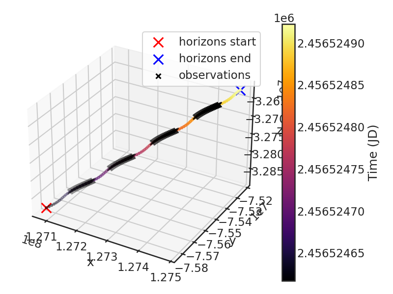

The axis are the distance of HST to the Solar System Barycenter in kilometers.
Horizons start and Horizons end show where our Horizon file starts and ends containing X,Y,Z information.
The black crosses in the plot show the times when HST actually observed. One can see that HST observed 4 orbits in this particular visit (which agrees with the ``filetable.txt`` from Stage 00).
One can also see the colored curve is a bit wiggley. This is in fact the rotation of HST around the earth.
The colored curve consists out of a lot of points. Every one of them are a X,Y,Z position of HST downloaded from HORIZONS. The color coding denotes the time direction.

The ``filetable.txt`` has be updated by the end of this stage and contains a new column called ``t_bjd`` with the time of observations in BJD.
E.g. (only showing the first few lines):

.. include:: media/s02/filelist_updated.txt
   :literal:

Stage 03
:::::::::::::::::::::::::::::::::::::::::

This Stage starts by downloading a stellar model or calculating one in case of the black body spectrum.

    .. note:: | PACMAN currently offers the following stellar models:
              | - THE 1993 KURUCZ STELLAR ATMOSPHERES ATLAS (``k93models``)
              | - THE STELLAR ATMOSPHERE MODELS BY CASTELLI AND KURUCZ 2004 (``ck04models``)
              | - THE PHOENIX MODELS BY FRANCE ALLARD AND COLLABORATORS (``phoenix``)
              | - ``blackbody`` spectrum
              | The stellar models (exluding the blackbody one) are retrieved from https://archive.stsci.edu/hlsps/reference-atlases/cdbs/grid/

    .. warning:: If the user decides on any stellar model which has to be downloaded (``k93models``, ``ck04models`` or ``phoenix``), then internet connection is required! The blackbody model does not require a connection however.

The user sets Teff, logg and MH in the pcf file. For ``k93models``, ``ck04models`` and ``phoenix`` the closest available metallicity, then the closest available effective temperature and finally the closest available surface gravity is searched and then used.
To see the workflow see the code block below.

Let's look at an example for GJ 1214:
We use the stellar parameters published in `Cloutier et al. 2021 <https://ui.adsabs.harvard.edu/abs/2021AJ....162..174C/abstract>`_.

| Teff   =  3250
| logg   =  5.026
| MH     =  0.29

.. code-block:: console

	    Successfully reloaded meta file
	    Starting s03
	    Using k93models model.

	    Possible metallicities: [ 1.   0.5  0.3  0.2  0.1  0.  -0.1 -0.2 -0.3 -0.5 -1.  -1.5 -2.  -2.5
	     -3.  -3.5 -4.  -4.5 -5. ]
	    For input metallicity 0.29, closest metallicity is 0.3.

	    Possible effective temperatures: [10000. 10500. 11000. 11500. 12000. 12500. 13000. 14000. 15000. 16000.
	     17000. 18000. 19000. 20000. 21000. 22000. 23000. 24000. 25000. 26000.
	     27000. 28000. 29000. 30000. 31000. 32000. 33000. 34000.  3500. 35000.
	      3750. 37500.  4000. 40000.  4250. 42500.  4500. 45000.  4750. 47500.
	      5000. 50000.  5250.  5500.  5750.  6000.  6250.  6500.  6750.  7000.
	      7250.  7500.  7750.  8000.  8250.  8500.  8750.  9000.  9250.  9500.
	      9750.]
	    For input effective temperature 3250, closest temperature is 3500.0.

	    Was the stellar model fits file already downloaded?: False

		          + Downloading file kp03_3500.fits from https://archive.stsci.edu/hlsps/reference-atlases/cdbs/grid/k93models/kp03/kp03_3500.fits.
	    --2022-01-25 19:13:30--  https://archive.stsci.edu/hlsps/reference-atlases/cdbs/grid/k93models/kp03/kp03_3500.fits
	    Resolving archive.stsci.edu (archive.stsci.edu)... 130.167.201.60
	    Connecting to archive.stsci.edu (archive.stsci.edu)|130.167.201.60|:443... connected.
	    HTTP request sent, awaiting response... 200 OK
	    Length: 69120 (68K) [image/fits]
	    Saving to: ‘kp03_3500.fits’

	    kp03_3500.fits         100%[=========================>]  67.50K   323KB/s    in 0.2s

	    2022-01-25 19:13:30 (323 KB/s) - ‘kp03_3500.fits’ saved [69120/69120]

	    Possible logg: [0.  0.5 1.  1.5 2.  2.5 3.  3.5 4.  4.5 5. ]
	    For input logg 5.026, closest logg is 5.0.

	    Using g141 grism.
	    Saving Metadata
	    Finished s03

.. note::

	The stellar models will be saved into the run directory. E.g., ``/home/zieba/Desktop/Projects/Open_source/PACMAN/run/run_2022-01-19_19-06-02_GJ1214_Hubble13021/ancil/stellar_models/phoenix/phoenixm05_3400.fits``.
	If the file already exists then it will not be downloaded again.

After downloading or calculating the stellar spectrum, it gets multiplied with the bandpass (if the observations used G102 or G141 is recognized automatically).
The bandpass files are stored in the pipeline directory (e.g., ``/home/zieba/Desktop/Projects/Open_source/PACMAN/pacman/ancil/bandpass``).
The final plot of this Stage shows the stellar spectrum, the bandpass and the product of these two. This product will be then used as the reference spectrum for wavelength calibration.

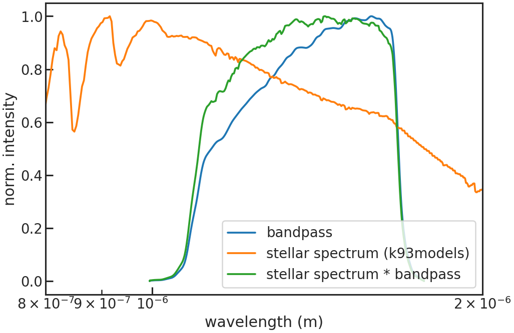

Stage 10
:::::::::::::::::::::::::::::::::::::::::

This stage determines the position of the star in each direct image.

Let's look at an example using the two GJ1214 visits from earlier:

You can run Stage 10 first without giving any guess on where the star is located.
This will save a plot showing you the direct image which you can then use to refine your guess.

First run
''''''''''''''''''''''''

For demonstration purposures, in this first run I did not change the settings in the pcf file from a previous analysis of a different dataset:

| di_rmin    | 320
| di_rmax    | 360
| di_cmin    | 100
| di_cmax    | 150

The terminal should give you something like this:

.. code-block:: console

	    Successfully reloaded meta file
	    Starting s10
	    Determining Source Positions for Direct Images:  12%|█▎        | 1/8 [00:01<00:07,  1.01s/it]
	    Your guess for di_rmax is outside of the image.

	    Your guess for di_rmax is outside of the image.
	    Determining Source Positions for Direct Images:  38%|███▊      | 3/8 [00:02<00:04,  1.04it/s]
	    Your guess for di_rmax is outside of the image.
	    Determining Source Positions for Direct Images:  50%|█████     | 4/8 [00:03<00:03,  1.04it/s]
	    Your guess for di_rmax is outside of the image.

	    Your guess for di_rmax is outside of the image.
	    Determining Source Positions for Direct Images:  75%|███████▌  | 6/8 [00:05<00:01,  1.09it/s]
	    Your guess for di_rmax is outside of the image.
	    Determining Source Positions for Direct Images:  88%|████████▊ | 7/8 [00:06<00:00,  1.20it/s]
	    Your guess for di_rmax is outside of the image.

	    Your guess for di_rmax is outside of the image.
	    Saving Metadata
	    Finished s10

	    Determining Source Positions for Direct Images: 100%|██████████| 8/8 [00:06<00:00,  1.17it/s]

We see that we got messages while running that our guesses were outside of the image.
In order to determine now where the star actually is, this run saved the images as plots into a new directory: run directory + /figs/images

You will end up with plots like this one:

.. image:: media/s10/quick_di0_wrong.png

You can see that our "initial guess" (the red box in the plot) was off by a lot from the star. Lets try again with a better guess, now that we know where the star is.

Second run
''''''''''''''''''''''''

By estimating by eye we can tell the star is approximately at row = 140 and col = 30. So our new guess is:

| di_rmin   | 120
| di_rmax   | 160
| di_cmin   | 5
| di_cmax   | 50

The terminal should give you something like this:

.. code-block:: console

	    Successfully reloaded meta file
	    Starting s10
	    Determining Source Positions for Direct Images: 100%|██████████| 8/8 [00:10<00:00,  1.37s/it]
	    Saving Metadata
	    Finished s10

You will end up with plots like this one:

.. image:: media/s10/quick_di0.png

This time we have the star in our cutout box!
A second plot shows you the best fit to the star by using a 2D gaussian.

.. image:: media/s10/di_0.png

The positions of the star in physical pixels are then saved into a new file called ``xrefyref.txt``:

.. include:: media/s10/xrefyref.txt
   :literal:

| First column is the time when the Direct Image was taken
| Second column is the row position of the star in physical pixels
| Third column is the column position of the star in physical pixels

You might notice that the fit resulted to a target location of approximately row = 513 and col = 403 but in the plots the target is closer to being at approximately row = 140 and col = 30 (by estimating by eye).
This is because the table accounted for the offset in X and Y to subsection start. This information can be found in the header:

| LTV1    =  -374.0 / offset in X to subsection start
| LTV2    =  -374.0 / offset in Y to subsection start

Stage 20
:::::::::::::::::::::::::::::::::::::::::

This new step finally extract the spectra.

A new directory will be created in the work directory. It will look similar to this ``workdir + extracted_lc/2022-01-21_18-33-25``.
We will save the flux information into there.

The user can decide if they want to use `optimal extraction <https://ui.adsabs.harvard.edu/abs/1986PASP...98..609H>`_ to extract the spectra.

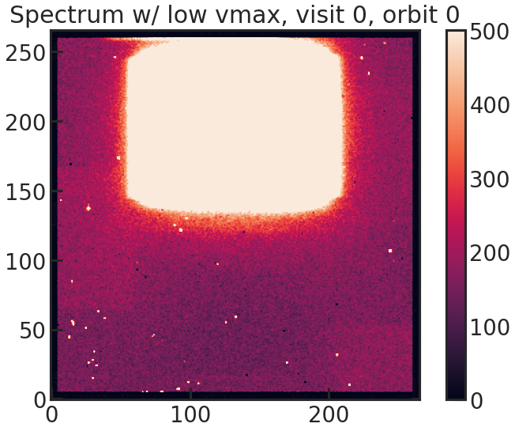

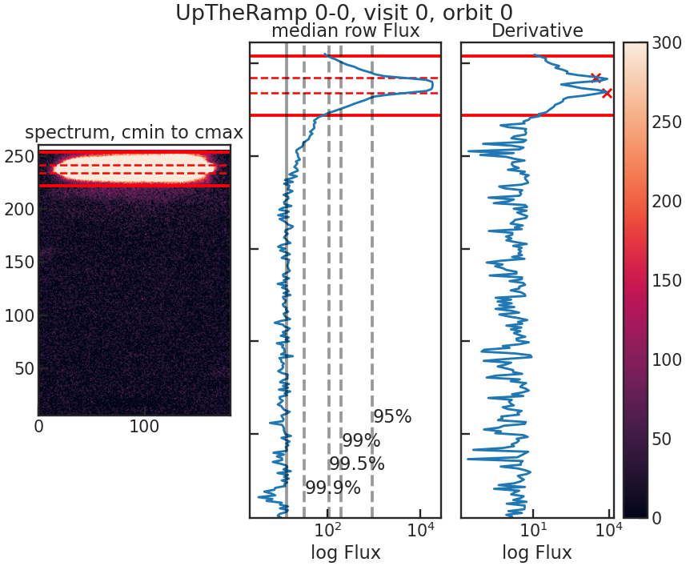

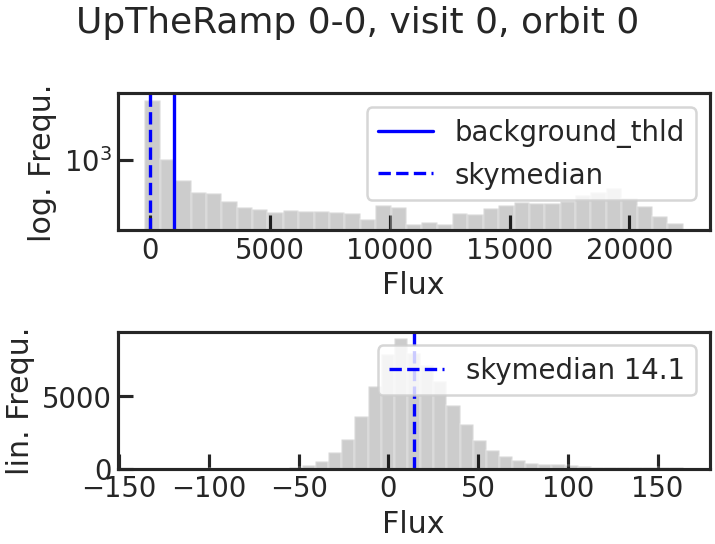

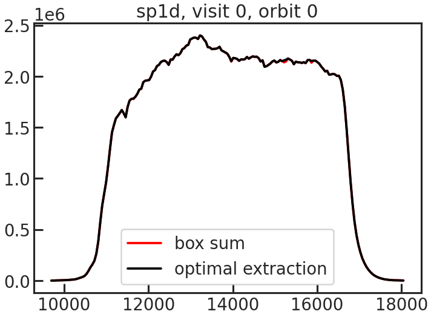

Successfully reloaded meta file
Starting s20
in total #visits, #orbits: (2, 8)

*************** Looping over files:   0%|            | 0/150 [00:00<?, ?it/s]
Filename: /home/zieba/Desktop/Data/GJ1214_Hubble13021/ibxy15c3q_ima.fits
current visit, orbit:  (0, 0)
--- Looping over up-the-ramp-samples: 100%|████████████| 14/14 [00:38<00:00,  2.74s/it]

*************** Looping over files:   1%|▉             | 1/150 [00:40<1:40:50, 40.61s/it]
Filename: /home/zieba/Desktop/Data/GJ1214_Hubble13021/ibxy15c4q_ima.fits
current visit, orbit:  (0, 0)
--- Looping over up-the-ramp-samples: 100%|████████████| 14/14 [00:36<00:00,  2.59s/it]

*************** Looping over files:   1%|█▊             | 2/150 [01:18<1:38:25, 39.90s/it]
Filename: /home/zieba/Desktop/Data/GJ1214_Hubble13021/ibxy15c5q_ima.fits
current visit, orbit:  (0, 0)
--- Looping over up-the-ramp-samples: 100%|████████████| 14/14 [00:35<00:00,  2.57s/it]

*************** Looping over files:   2%|██▋          | 3/150 [01:56<1:36:22, 39.34s/it]
Filename: /home/zieba/Desktop/Data/GJ1214_Hubble13021/ibxy15c6q_ima.fits
current visit, orbit:  (0, 0)
--- Looping over up-the-ramp-samples: 100%|████████████| 14/14 [00:35<00:00,  2.55s/it]

Stage 21
:::::::::::::::::::::::::::::::::::::::::

.. code-block:: console

	    Successfully reloaded meta file
	    Starting s21

	    Number of bin edges: 12
	    Chosen directory with the spectroscopic flux file: 2022-01-23_17-50-56
	    ***************** Looping over Bins: 100%|████████████| 11/11 [00:02<00:00,  3.71it/s]
	    Finished s21

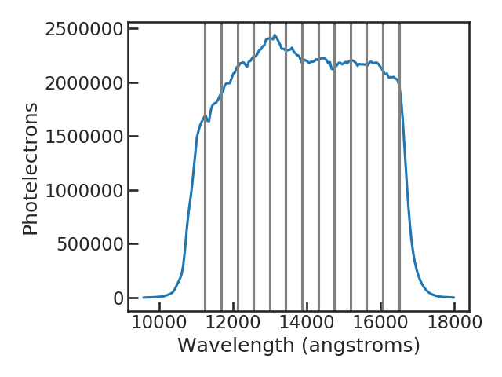
