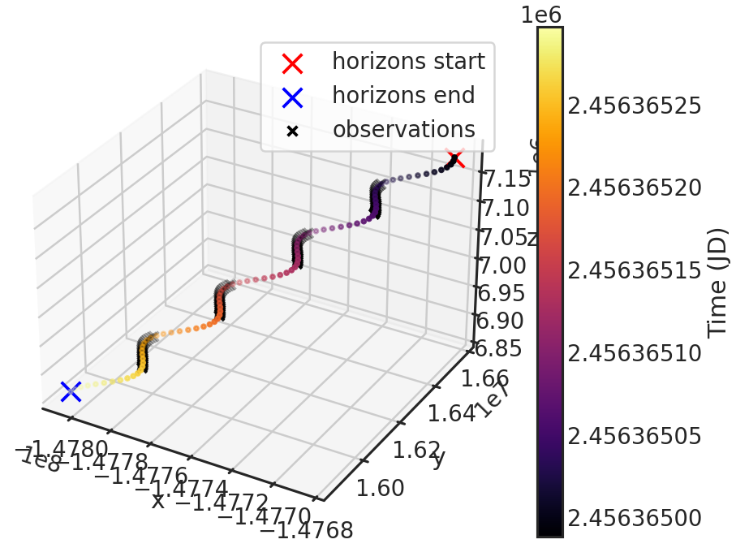

.. _stage02:

Stage 02
============

.. topic:: Quick Summary

    - Navigate to ``pacman_run_files``, comment out Stage 01, uncomment Stage 02, and execute ``run_pacman.py``.
    - Continue with s03

1) **Stage summary**
This stage performs a barycentric correction because the time stamps for the observations do not account for HST's orbital motion.

2) **Run PACMAN**
Navigate to ``pacman_run_files`` and open ``run_pacman.py``.
Comment out Stage 01 and uncomment Stage 02:

.. code-block:: python

    # meta = s01.run01(pcf_path=pcf_path)

    meta = s02.run02(pcf_path=pcf_path)

Then run:

.. code-block:: console

    python run_pacman.py

3) **What happens?**

PACMAN reads the most recent ``stage01/s01_run_*`` directory and creates a new Stage 02 workdir:

``stage02/s02_run_YYYY-MM-DD_HH-MM-SS``

.. code-block:: console

    Starting s02
    Using Stage 01 input directory: ...
    Location of the new Stage 02 run directory: ...
	Converting MJD to BJD: 100%|##########| 2/2 [00:02<00:00,  1.35it/s]
	Writing t_bjd into filelist.txt
	Saving Metadata
	Finished s02

After the calculation has been performed, the user can check the newly generated plots saved in:

``stage02/s02_run_*/ancil/horizons``

Here we show the plot generated for the first of the two visits:

The axis are the distance of HST to the Solar System Barycenter in kilometers.
Horizons start and Horizons end show where our Horizon file starts and ends containing X,Y,Z information.
The black crosses in the plot show the times when HST actually observed. One can see that HST observed 4 orbits in this particular visit (which agrees with the ``filelist.txt`` from Stage 00).
One can also see the colored curve is a bit wiggly. This is in fact the rotation of HST around the earth.
The colored curve consists of a lot of points. Each one is an X,Y,Z position of HST downloaded from HORIZONS. The color coding denotes the time direction.

The ``filelist.txt`` copied from Stage 01 is updated in this stage and contains a new column called ``t_bjd`` with the time of observations in BJD.
E.g. (only showing the first few lines):

.. include:: media/s02/filelist_updated.txt
   :literal:
