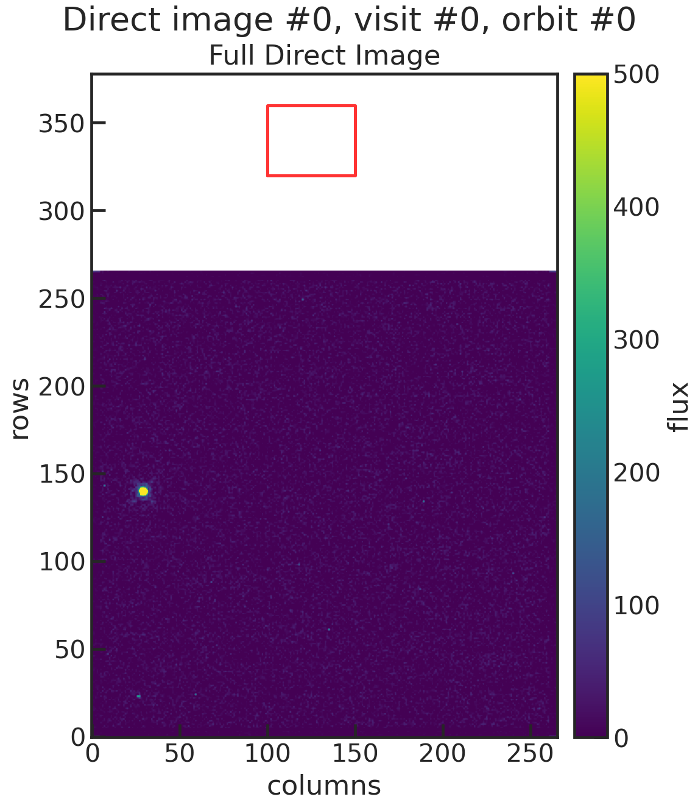

.. _stage10:

Stage 10
============

This stage determines the position of the star in each direct image.

Let's look at an example using the two GJ1214 visits from earlier:

You can run Stage 10 first without giving any guess on where the star is located.
This will save a plot showing you the direct image which you can then use to refine your guess.

First run
''''''''''''''''''''''''

For demonstration purposes, in this first run I did not change the settings in the pcf file from a previous analysis of a different dataset:

| di_rmin    | 320
| di_rmax    | 360
| di_cmin    | 100
| di_cmax    | 150

The terminal should give you something like this:

.. code-block:: console

	    Successfully reloaded meta file
	    Starting s10
	    Determining Source Positions for Direct Images:   8%|8         | 1/12 [00:01<00:15,  1.45s/it]
	    Your guess for di_rmax is outside of the image.
	    Determining Source Positions for Direct Images:  17%|#6        | 2/12 [00:02<00:13,  1.36s/it]
	    Your guess for di_rmax is outside of the image.
	    Determining Source Positions for Direct Images:  25%|##5       | 3/12 [00:03<00:11,  1.26s/it]
	    Your guess for di_rmax is outside of the image.

	    Your guess for di_rmax is outside of the image.
	    Determining Source Positions for Direct Images:  42%|####1     | 5/12 [00:05<00:07,  1.14s/it]
	    Your guess for di_rmax is outside of the image.

	    Your guess for di_rmax is outside of the image.
	    Determining Source Positions for Direct Images:  58%|#####8    | 7/12 [00:07<00:05,  1.10s/it]
	    Your guess for di_rmax is outside of the image.
	    Determining Source Positions for Direct Images:  67%|######6   | 8/12 [00:08<00:04,  1.11s/it]
	    Your guess for di_rmax is outside of the image.
	    Determining Source Positions for Direct Images:  75%|#######5  | 9/12 [00:10<00:03,  1.12s/it]
	    Your guess for di_rmax is outside of the image.
	    Determining Source Positions for Direct Images:  83%|########3 | 10/12 [00:11<00:02,  1.09s/it]
	    Your guess for di_rmax is outside of the image.

	    Your guess for di_rmax is outside of the image.
	    Determining Source Positions for Direct Images: 100%|##########| 12/12 [00:13<00:00,  1.10s/it]

	    Your guess for di_rmax is outside of the image.
	    Saving Metadata
	    Finished s10

We see that we got error messages that our guesses were outside of the image.
To determine where the star actually is, this run saved the images as plots into a new directory: run directory + /figs/images

You will end up with plots like this one:

You can see that our "initial guess" (the red box in the plot) was off by a lot from the star. Let's try again with a better guess, now that we know where the star is.

Second run
''''''''''''''''''''''''

By estimating by eye we can tell the star is approximately at row = 140 and col = 30. So our new guess is:

| di_rmin   | 120
| di_rmax   | 160
| di_cmin   | 5
| di_cmax   | 50

The terminal should give you something like this:

.. code-block:: console

	    Successfully reloaded meta file
	    Starting s10
	    Determining Source Positions for Direct Images: 100%|##########| 12/12 [00:36<00:00,  3.02s/it]
	    Saving Metadata
	    Finished s10

You will end up with plots like this one:

.. image:: media/s10/quick_di0.png

This time we have the star in our cutout box!
A second plot shows you the best fit to the star by using a 2D gaussian.

.. image:: media/s10/di_0.png

The positions of the star in physical pixels are then saved into a new file called ``xrefyref.txt``:

.. include:: media/s10/xrefyref.txt
   :literal:

| 1. column is the time when the direct image was taken in BJD
| 2. column is the visit number
| 3. column is the orbit number
| 4. column is the cumulative orbit number
| 5. column is the row position of the star in physical pixels
| 6. column is the column position of the star in physical pixels

You might notice that the fit resulted in a target location of approximately row = 513 and col = 403 but in the plots the target is closer to row = 140 and col = 30 (estimating by eye).
This is because the table accounted for the offset in X and Y to subarray start. This information can be found in the header:

| LTV1    =  -374.0 / offset in X to subsection start
| LTV2    =  -374.0 / offset in Y to subsection start
