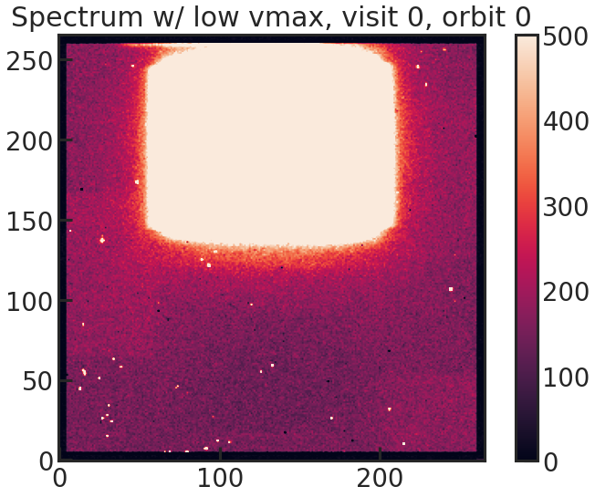
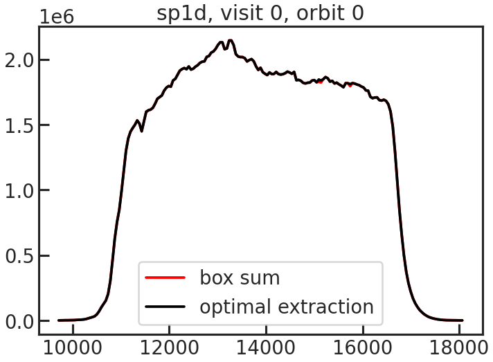
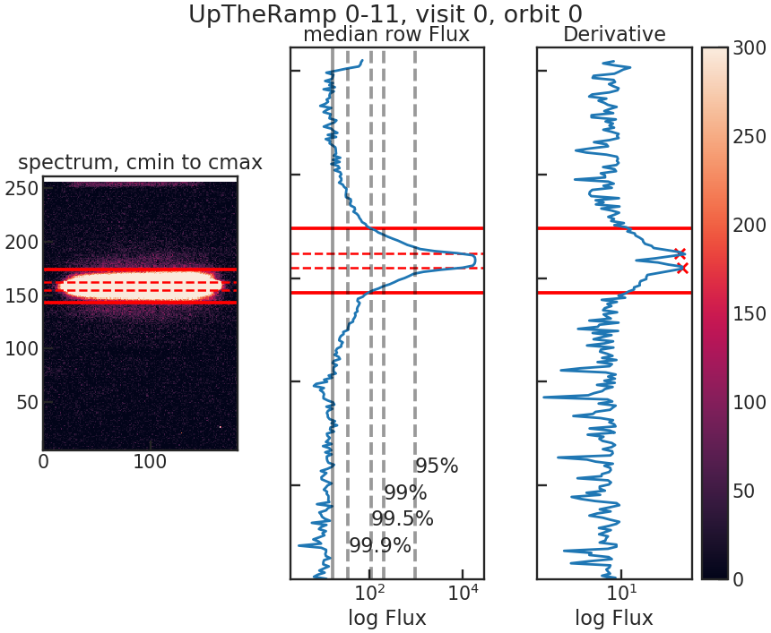

.. _stage20:

Stage 20
============

.. topic:: Summary

    - Navigate to the run directory and execute the run_pacman.py file using the --s20 flag
    - Continue with s21 if you want to create spectroscopic light curves and fit them
    - (Continue with s30 if you are ONLY interested in the white light curve)

This step finally extracts the spectra!

A new Stage 20 workdir is created:

``stage20/s20_run_YYYY-MM-DD_HH-MM-SS``

The extracted light curves and spectra are saved in:

``stage20/s20_run_*/extracted_lc``

PACMAN uses `optimal extraction <https://ui.adsabs.harvard.edu/abs/1986PASP...98..609H>`_ to extract the spectra.

This effectively converts these 2D spectra:

Into 1D spectra:

The way PACMAN determines the rows which should be used in optimal extraction can be seen in the following plot:

The first panel (left) shows the 2D spectrum. The column limits are determined using the trace.

The second panel (middle) shows the median flux in every column.

The third panel (right) shows the absolute difference between the median flux in the adjacent columns.
We use these two rows where the flux changes the most as reference rows.
The pcf file contains a window parameter.
If the two determined peaks are at row=155 & row = 162 and window was set to 12, the data between rows 155-12 and 162+12 will be used in the optimal extraction.

When running Stage 20 you will see an output similar to the following:

.. code-block:: console

	    Starting s20
		Using Stage 10 input directory: ...
    	Location of the new Stage 20 run directory: ...
	    in total #visits, #orbits: (3, 12)

	    ***************** Looping over files:   0%|          | 0/225 [00:00<?, ?it/s]
	    Filename: /home/zieba/Desktop/Data/GJ1214_Hubble13021/ibxy07paq_ima.fits
	    current visit, orbit:  (0, 0)
	    --- Looping over up-the-ramp-samples: 100%|██████████| 14/14 [00:00<00:00, 28.74it/s]

	    ***************** Looping over files:   0%|          | 1/225 [00:00<02:53,  1.29it/s]
	    Filename: /home/zieba/Desktop/Data/GJ1214_Hubble13021/ibxy07pbq_ima.fits
	    current visit, orbit:  (0, 0)
	    --- Looping over up-the-ramp-samples: 100%|██████████| 14/14 [00:00<00:00, 21.12it/s]

	    ***************** Looping over files:   1%|          | 2/225 [00:01<03:05,  1.20it/s]
	    Filename: /home/zieba/Desktop/Data/GJ1214_Hubble13021/ibxy07pcq_ima.fits
	    current visit, orbit:  (0, 0)
	    --- Looping over up-the-ramp-samples: 100%|██████████| 14/14 [00:00<00:00, 21.96it/s]

	    ***************** Looping over files: 100%|█████████▉| 224/225 [03:43<00:00,  1.05it/s]
	    Filename: /home/zieba/Desktop/Data/GJ1214_Hubble13021/ibxy10pmq_ima.fits
	    current visit, orbit:  (2, 11)
	    --- Looping over up-the-ramp-samples: 100%|██████████| 14/14 [00:00<00:00, 25.90it/s]

	    ***************** Looping over files: 100%|██████████| 225/225 [03:44<00:00,  1.00it/s]
	    Saving Metadata
	    Finished s20

Stage 20 creates several output files inside:

``stage20/s20_run_*/extracted_lc``

Important files include:

- ``lc_white.txt``:
  broadband ("white") light curve

- ``lc_spec.txt``:
  extracted spectrum for every exposure and detector column

- ``diagnostics.txt``:
  extraction diagnostics such as number of rejected outliers

- ``background.txt``:
  estimated background levels

Stage 20 also creates white-light-curve plots with uncertainties in:

``stage20/s20_run_*/figs/s20_lightcurves``

If multiple visits are present, PACMAN automatically generates:

- one combined white light curve
- one white light curve per visit

After Stage 20 we can either:

- Continue with Stage 21 if the user wants to fit spectroscopic light curves.

- Continue with Stage 30 to fit the broadband ("white") light curve.
