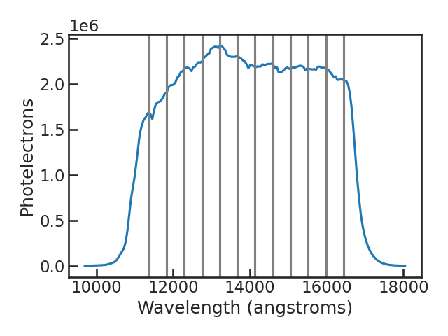

.. _stage21:

Stage 21
============

.. topic:: TL;DR

    - Navigate to the run directory and execute the pacman_script.py file using the --s21 flag
    - Continue with s30 to fit the white and spectroscopic light curves

This stage bins the data into spectroscopic light curves. 

PACMAN can either use the most recent S20 run for the S21 step or specify a path to a previous run.

The user can set the wavelength bins in the pcf by giving a wavelength range and a number of bins, or alternatively provide user-defined bin edges.

When running S21 the user should get an output similar to this one:

.. code-block:: console

    workdir:  run_2022-07-16_00-42-27_docs/
    eventlabel:  docs
    Successfully reloaded meta file
    Starting s21

    Number of bins: 11
    chosen bin edges: [11370.         11830.90909091 12291.81818182 12752.72727273
     13213.63636364 13674.54545455 14135.45454545 14596.36363636
     15057.27272727 15518.18181818 15979.09090909 16440.        ]
    Chosen directory with the spectroscopic flux files: 2022-07-16_00-45-03
    ***************** Looping over Bins: 100%|########################################| 11/11 [00:01<00:00,  9.15it/s]
    Saved light curve(s) in run_2022-07-16_00-42-27_docs//extracted_sp/bins11_2022-07-17_00-44-59
    Saving Wavelength bin file
    Saving Metadata
    Finished s21

Below is a plot of a 1D spectrum with the bin edges from a user-chosen binning.

