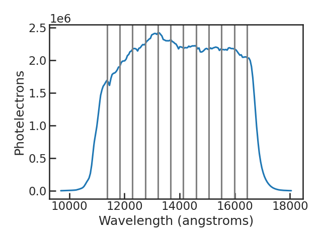

.. _stage21:

Stage 21
============

.. topic:: Summary

    - Navigate to ``pacman_run_files``, comment out Stage 20, uncomment Stage 21, and execute ``run_pacman.py``.
    - Continue with s30 to fit the white and spectroscopic light curves

This stage bins the data into spectroscopic light curves. 

PACMAN automatically uses the most recent Stage 20 run.

The user can set the wavelength bins in the pcf by giving a wavelength range and a number of bins, or alternatively provide user-defined bin edges.

When running S21 the user should get an output similar to this one:

.. code-block:: console

  Starting s21
  Using Stage 20 input directory: /Users/sebastianzieba/Desktop/Projects/Observations/Hubble/GJ1214_13021_2026/stage20/s20_run_2026-06-15_10-28-16
  Location of the new Stage 21 run directory: /Users/sebastianzieba/Desktop/Projects/Observations/Hubble/GJ1214_13021_2026/stage21/s21_run_2026-06-15_10-39-50
  Number of bins: 11
  chosen bin edges: [11350.         11810.90909091 12271.81818182 12732.72727273
  13193.63636364 13654.54545455 14115.45454545 14576.36363636
  15037.27272727 15498.18181818 15959.09090909 16420.        ]
  Using spectroscopic flux files from: /Users/sebastianzieba/Desktop/Projects/Observations/Hubble/GJ1214_13021_2026/stage21/s21_run_2026-06-15_10-39-50/extracted_lc
  Chosen directory with the spectroscopic flux files: /Users/sebastianzieba/Desktop/Projects/Observations/Hubble/GJ1214_13021_2026/stage21/s21_run_2026-06-15_10-39-50/extracted_lc
  ***************** Looping over Bins: 100%|####################| 11/11 [00:05<00:00,  2.03it/s]
  Saved light curve(s) in /Users/sebastianzieba/Desktop/Projects/Observations/Hubble/GJ1214_13021_2026/stage21/s21_run_2026-06-15_10-39-50/extracted_sp
  Saving Wavelength bin file
  Saving Metadata
  Finished s21 

Below is a plot of a 1D spectrum with the bin edges from a user-chosen binning.

The spectroscopic light curves are saved in:

``stage21/s21_run_*/extracted_sp``

For each wavelength bin, PACMAN saves:

- a spectroscopic light curve (``speclc*.txt``)
- light-curve plots with uncertainties
- individual visit light curves (if multiple visits exist)

The ``extracted_sp`` directory also contains:

- ``wvl_table.dat``:
  wavelength-bin information including:
  
  - bin number
  - central wavelength
  - half-width
  - lower wavelength edge
  - upper wavelength edge

- ``figs/s21_lightcurves/spec_binsXX.png``:
  overview plot showing the wavelength bins on the spectrum

The wavelength-bin figures are saved in:

``stage21/s21_run_*/figs/s21_lightcurves``
