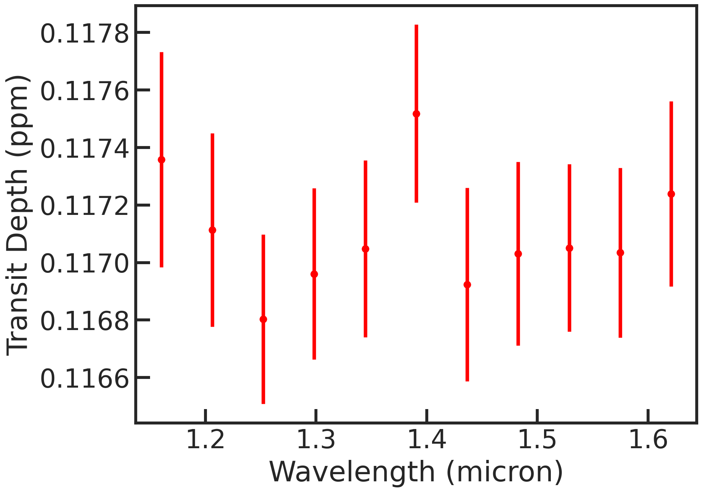

.. _stage31:

Stage 30
============

Here we can fit the white light curve (which is being created after S20) or spectroscopic light curves (which is being created after S21).

Let's remove the first orbit from every visit and the first exposure from every orbit as they are strongly affected from systematics:

| remove_first_exp             True
| remove_first_orb             True

We can choose if we also want to run an MCMC using the emcee package next to the least square routine:

| run_lsq                      True
| run_mcmc                     True

For the MCMC, let's do a quick, small amount of samples with an amount of walkers which is greater than twice the numbers of free parameters.

| run_nsteps                   4000
| run_nwalkers	                35
| run_nburn                    2000

Let's use the following model:

| s30_myfuncs                  ['constant','upstream_downstream','model_ramp','polynomial1','transit']

- 'constant': a normalization constant
- 'upstream_downstream': accounts for the forward and reverse scanning effect which creates different fluxes
- 'model_ramp': a ramp for every orbit
- 'polynomial1': a slope over the visit
- 'transit': a BATMAN transit model

Let's have the following free parameters:

t0_0, rp_0, u1_0, c_0, c_1, c_2, v_0, v_1, v_2, r1_0, r1_1, r1_2, r2_0, r2_1, r2_2, r3_0, r3_1, r3_2, scale_0, scale_1, scale_2

While we fixed the other important parameters (per, a inc) to the literature values.

The user can set in the pcf if the reduced chi2 which will be calculated from the least squared should be rescaled to be equal to unity or not.

White light curve fit
'''''''''''''''''''''''''''''''''

Let's run the white light curve fit now:

.. code-block:: console

	    Successfully reloaded meta file
	    Starting s30
	    White light curve fit will be performed
	    Identified file(s) for fitting: ['run_2022-02-15_21-52-46_GJ1214_Hubble13021//extracted_lc/2022-02-15_22-08-24/lc_white.txt']

	    ****** File: 1/1

                   Removed 12 exposures because they were the first exposures in the orbit.
                   Removed 51 exposures because they were the first orbit in the visit.
                   median log10 raw flux: 8.429980180844982
                   nfree_param:  21

                   Runs MPFIT...
                   t0_0 	 1.0975e+00 	 1.6918e-05
                   rp_0 	 1.1736e-01 	 8.1997e-05
                   u1_0 	 2.2591e-01 	 4.6567e-03
                   c_0 	 8.4303e+00 	 1.9220e-05
                   c_1 	 8.4301e+00 	 2.0485e-05
                   c_2 	 8.4303e+00 	 2.0532e-05
                   v_0 	 -2.3318e-06 	 1.6360e-07
                   v_1 	 -1.0917e-06 	 1.6593e-07
                   v_2 	 -2.4031e-06 	 1.6684e-07
                   r1_0 	 6.9107e-02 	 5.4489e-03
                   r1_1 	 6.6784e-02 	 5.3343e-03
                   r1_2 	 6.4197e-02 	 5.4488e-03
                   r2_0 	 6.8531e+00 	 3.8619e-02
                   r2_1 	 6.7552e+00 	 3.6839e-02
                   r2_2 	 6.8286e+00 	 3.9332e-02
                   r3_0 	 -4.5340e-01 	 4.2668e-02
                   r3_1 	 -3.2515e-01 	 4.2486e-02
                   r3_2 	 -3.7047e-01 	 4.3736e-02
                   scale_0 	 4.1960e-03 	 1.7513e-05
                   scale_1 	 4.1951e-03 	 1.7511e-05
                   scale_2 	 4.2134e-03 	 1.7518e-05
                   rms, chi2red =  92.92717454259711 2.440776208129172

                   Runs MPFIT...
                   t0_0 	 1.0975e+00 	 2.6430e-05
                   rp_0 	 1.1736e-01 	 1.2810e-04
                   u1_0 	 2.2591e-01 	 7.2751e-03
                   c_0 	 8.4303e+00 	 3.0028e-05
                   c_1 	 8.4301e+00 	 3.2004e-05
                   c_2 	 8.4303e+00 	 3.2077e-05
                   v_0 	 -2.3318e-06 	 2.5560e-07
                   v_1 	 -1.0917e-06 	 2.5924e-07
                   v_2 	 -2.4031e-06 	 2.6065e-07
                   r1_0 	 6.9107e-02 	 8.5128e-03
                   r1_1 	 6.6784e-02 	 8.3338e-03
                   r1_2 	 6.4197e-02 	 8.5126e-03
                   r2_0 	 6.8531e+00 	 6.0334e-02
                   r2_1 	 6.7552e+00 	 5.7553e-02
                   r2_2 	 6.8286e+00 	 6.1448e-02
                   r3_0 	 -4.5340e-01 	 6.6660e-02
                   r3_1 	 -3.2515e-01 	 6.6376e-02
                   r3_2 	 -3.7047e-01 	 6.8329e-02
                   scale_0 	 4.1960e-03 	 2.7360e-05
                   scale_1 	 4.1951e-03 	 2.7357e-05
                   scale_2 	 4.2134e-03 	 2.7369e-05
                   rms, chi2red =  92.92717454258137 0.9999999999997319
                   Run emcee...
                   100%|██████████| 3000/3000 [08:56<00:00,  5.59it/s]
                   Finished s30

There are several plots created then:

The raw light curve:

.. image:: media/s30/white/raw_lc_0.png

The fitted light curve without the systematics:

.. image:: media/s30/white/fit_lc_0_2022-02-15_22-20-09.png

The Allan deviation plot:

.. image:: media/s30/white/corr_plot_0.png

MCMC chains with burn-in:

.. image:: media/s30/white/mcmc_chains_bin0_wvl1.400.png

MCMC chains without burn-in

.. image:: media/s30/white/mcmc_chains_noburn_bin0_wvl1.400.png

Corner plot from the MCMC:

.. image:: media/s30/white/mcmc_pairs_bin0_wvl1.400.png

Spectroscopic light curve fit
'''''''''''''''''''''''''''''''''

.. code-block:: console

	    Successfully reloaded meta file
	    Starting s30
	    Spectroscopic light curve fit(s) will be performed
	    Identified file(s) for fitting: ['run_2022-02-15_21-52-46_GJ1214_Hubble13021//extracted_sp/bins12_2022-02-15_22-14-31/speclc1.147.txt', 'run_2022-02-15_21-52-46_GJ1214_Hubble13021//extracted_sp/bins12_2022-02-15_22-14-31/speclc1.191.txt', 'run_2022-02-15_21-52-46_GJ1214_Hubble13021//extracted_sp/bins12_2022-02-15_22-14-31/speclc1.234.txt', 'run_2022-02-15_21-52-46_GJ1214_Hubble13021//extracted_sp/bins12_2022-02-15_22-14-31/speclc1.278.txt', 'run_2022-02-15_21-52-46_GJ1214_Hubble13021//extracted_sp/bins12_2022-02-15_22-14-31/speclc1.322.txt', 'run_2022-02-15_21-52-46_GJ1214_Hubble13021//extracted_sp/bins12_2022-02-15_22-14-31/speclc1.366.txt', 'run_2022-02-15_21-52-46_GJ1214_Hubble13021//extracted_sp/bins12_2022-02-15_22-14-31/speclc1.409.txt', 'run_2022-02-15_21-52-46_GJ1214_Hubble13021//extracted_sp/bins12_2022-02-15_22-14-31/speclc1.453.txt', 'run_2022-02-15_21-52-46_GJ1214_Hubble13021//extracted_sp/bins12_2022-02-15_22-14-31/speclc1.497.txt', 'run_2022-02-15_21-52-46_GJ1214_Hubble13021//extracted_sp/bins12_2022-02-15_22-14-31/speclc1.541.txt', 'run_2022-02-15_21-52-46_GJ1214_Hubble13021//extracted_sp/bins12_2022-02-15_22-14-31/speclc1.584.txt', 'run_2022-02-15_21-52-46_GJ1214_Hubble13021//extracted_sp/bins12_2022-02-15_22-14-31/speclc1.628.txt']

	    ****** File: 1/12

	    Removed 12 exposures because they were the first exposures in the orbit.
	    Removed 51 exposures because they were the first orbit in the visit.
	    median log10 raw flux: 6.24594181397685
	    nfree_param:  21

	    Runs MPFIT...
	    t0_0 	 1.0976e+00 	 6.6823e-05
	    rp_0 	 1.1773e-01 	 3.3132e-04
	    u1_0 	 2.2862e-01 	 1.8513e-02
	    c_0 	 6.2463e+00 	 8.5894e-05
	    c_1 	 6.2460e+00 	 6.7386e-05
	    c_2 	 6.2463e+00 	 1.0750e-04
	    v_0 	 -2.8405e-06 	 7.3694e-07
	    v_1 	 -1.3414e-06 	 6.2946e-07
	    v_2 	 -1.4327e-06 	 7.1842e-07
	    r1_0 	 6.4117e-02 	 2.0192e-02
	    r1_1 	 8.4837e-02 	 3.0693e-02
	    r1_2 	 5.0121e-02 	 1.7677e-02
	    r2_0 	 7.0912e+00 	 2.0611e-01
	    r2_1 	 7.1516e+00 	 2.0651e-01
	    r2_2 	 6.5965e+00 	 1.5266e-01
	    r3_0 	 -8.0064e-01 	 1.9698e-01
	    r3_1 	 -5.4754e-01 	 2.3299e-01
	    r3_2 	 -2.4612e-01 	 1.4723e-01
	    scale_0 	 4.2054e-03 	 6.9934e-05
	    scale_1 	 4.0929e-03 	 6.9991e-05
	    scale_2 	 4.1545e-03 	 6.9948e-05
	    rms, chi2red =  256.4040860826778 1.167789264851872

	    Runs MPFIT...
	    t0_0 	 1.0976e+00 	 7.2212e-05
	    rp_0 	 1.1773e-01 	 3.5804e-04
	    u1_0 	 2.2862e-01 	 2.0006e-02
	    c_0 	 6.2463e+00 	 9.2821e-05
	    c_1 	 6.2460e+00 	 7.2821e-05
	    c_2 	 6.2463e+00 	 1.1617e-04
	    v_0 	 -2.8405e-06 	 7.9637e-07
	    v_1 	 -1.3414e-06 	 6.8022e-07
	    v_2 	 -1.4327e-06 	 7.7635e-07
	    r1_0 	 6.4117e-02 	 2.1820e-02
	    r1_1 	 8.4837e-02 	 3.3168e-02
	    r1_2 	 5.0121e-02 	 1.9103e-02
	    r2_0 	 7.0912e+00 	 2.2273e-01
	    r2_1 	 7.1516e+00 	 2.2317e-01
	    r2_2 	 6.5965e+00 	 1.6498e-01
	    r3_0 	 -8.0064e-01 	 2.1286e-01
	    r3_1 	 -5.4754e-01 	 2.5178e-01
	    r3_2 	 -2.4612e-01 	 1.5911e-01
	    scale_0 	 4.2054e-03 	 7.5574e-05
	    scale_1 	 4.0929e-03 	 7.5635e-05
	    scale_2 	 4.1545e-03 	 7.5589e-05
	    rms, chi2red =  256.4040860826968 1.0000000000000833
	    Run emcee...
	    100%|██████████| 3000/3000 [10:04<00:00,  4.96it/s]

	    Finished s30

The fitted spectroscopic light curve without the systematics:

.. image:: media/s30/spectroscopic/fit_lc_0_2022-02-15_22-34-53.png

All fitted parameters as a function of wavelength:

.. image:: media/s30/spectroscopic/lsq_params_vs_wvl.png

The spectrum (rprs vs wavelength):

