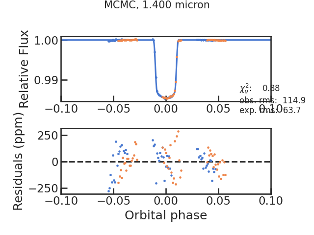
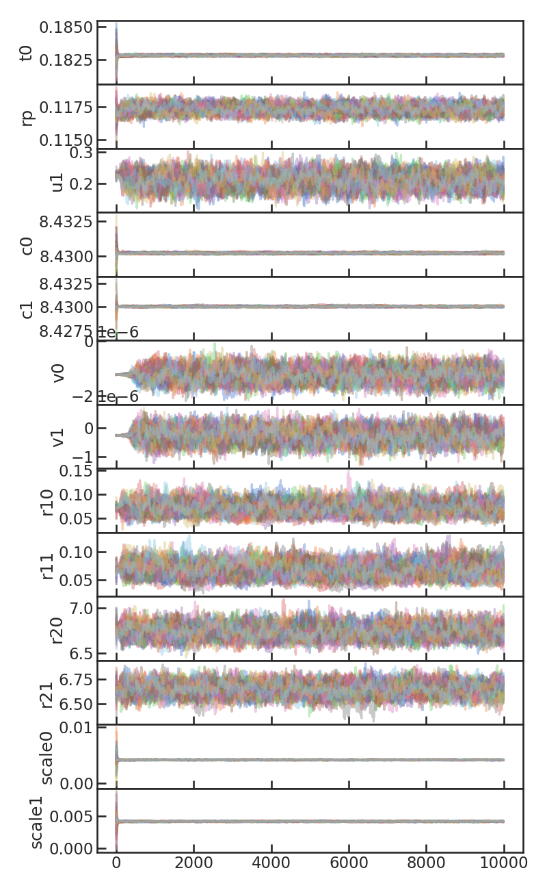
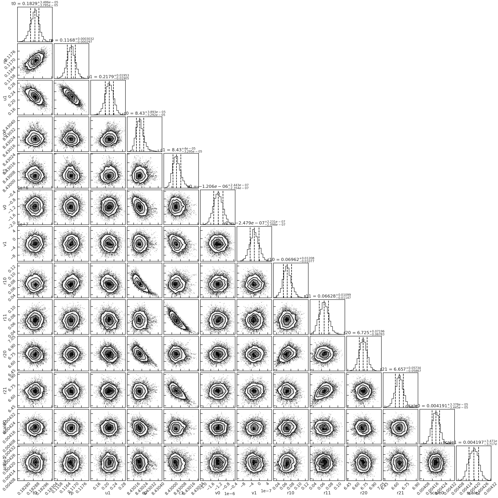
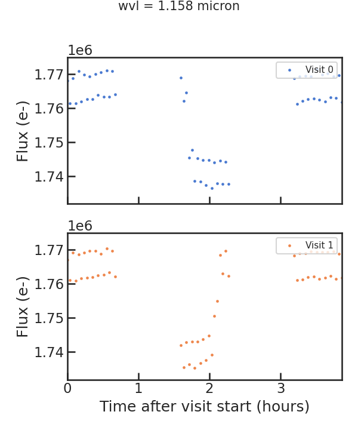
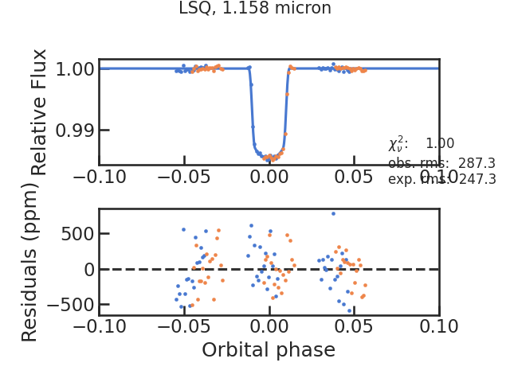
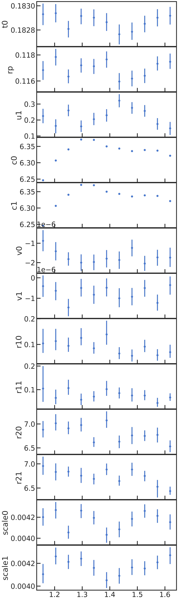
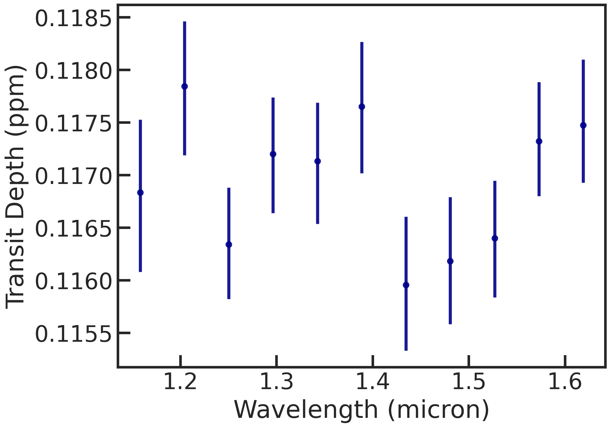

.. _stage30:

Stage 30
============

.. topic:: Summary

    - 1) White light curve fit:
    - Open your pcf file (the one in the work directory!).
    - Check that s30_fit_white and s30_most_recent_s20 are both **True**.
    - Check that s30_fit_spec and s30_most_recent_s21 are both **False**.
    - Navigate to the run directory and execute the pacman_script.py file using the --s30 flag
    - This should take approximately a minute using the default settings.
    - The results are then saved in /rundir/fit_white
    - 2) Spectroscopic light curves fit:
    - Open your pcf file (the one in the work directory!).
    - Check that s30_fit_white and s30_most_recent_s20 are both **False**.
    - Check that s30_fit_spec and s30_most_recent_s21 are both **True**.
    - Navigate to the run directory and execute the pacman_script.py file using the --s30 flag
    - This should take approximately a few minutes using the default settings.
    - The results are then saved in /rundir/fit_spec

Here we can fit the broadband ("white") light curve (which was created in S20) or spectroscopic light curves (which were created in S21).

Let's remove the first orbit from every visit and the first exposure from every orbit as they are typically strongly affected by instrument systematics:

| remove_first_exp             True
| remove_first_orb             True
| remove_which_orb             [0]

We can choose if we also want to run an MCMC using the emcee package after running the least squares routine:

| run_lsq                      True
| run_mcmc                     True

For the MCMC, let's do a quick, small number of samples with an number of walkers at least greater than twice the numbers of free parameters.

| #emcee
| run_nsteps                   4000
| run_nwalkers	               30
| run_nburn                    2000

Note: The user can also use dynesty, a nested sampler, instead of emcee.

Let's use the following model:

| s30_myfuncs                  ['constant','upstream_downstream','model_ramp','polynomial1','transit']

- 'constant': a normalization constant
- 'upstream_downstream': accounts for the forward and reverse scanning effect which creates an offset in the measured flux
- 'model_ramp': a ramp for every orbit
- 'polynomial1': a slope over the visit
- 'transit': a BATMAN transit model

Additional functions are listed on the `models page <https://pacmandocs.readthedocs.io/en/latest/models.html#id1>`_.

Let's have the following free parameters:

t0_0, rp_0, u1_0, c_0, c_1, v_0, v_1, r1_0, r1_1, r2_0, r2_1, scale_0, scale_1

Other important parameters (per, ars, inc) are fixed to the literature values.

The user can set in the pcf whether the uncertainties should be rescaled to achieve a reduced chi2 of unity.
An alternative method is using an additional free parameter which rescales the uncertainties at every step of the sampler.
This model is called `uncmulti <https://pacmandocs.readthedocs.io/en/latest/_modules/pacman/lib/models/uncmulti.html#uncmulti>`_.

White light curve fit
'''''''''''''''''''''''''''''''''

Here's the fit_par.txt file which was used in this example to fit the white light curve:

.. include:: media/s30/fit_par.txt
   :literal:

If a parameter is free and not jointly shared across visits, the user has to repeat the parameter in the fit_par.txt file as shown above.
Furthermore, the visit number must be added in the "tied" column.
tied = -1 means that the parameters is shared across all visits, which makes sense for orbital parameters but less for systematics like the normalization constant.

Let's run the white light curve fit now:

.. code-block:: console

    Successfully reloaded meta file
    Starting s30
    White light curve fit will be performed
    using most recent s20 run: 2022-10-20_13-36-21
    Identified file(s) for fitting: ['./run_2022-10-20_13-09-52_GJ1214_Hubble13021//extracted_lc/2022-10-20_13-36-21/lc_white.txt']

    ****** File: 1/1

    Removed 8 exposures because they were the first exposures in the orbit.
    Removed 34 exposures because they were the first orbit in the visit.
    median log10 raw flux: 8.429980180844982
    The highest amount of exposures in an orbit is 18
    Number of free parameters:  13
    Names of free parameters:  ['t0', 'rp', 'u1', 'c', 'c', 'v', 'v', 'r1', 'r1', 'r2', 'r2', 'scale', 'scale']
    The predicted rms is 63.68

    *STARTS LEAST SQUARED*
    Runs MPFIT...
    /home/zieba/Desktop/Projects/Open_source/PACMAN/src/pacman/lib/model.py:82: RuntimeWarning: divide by zero encountered in true_divide
      self.data_nosys = data.flux/self.model_sys
    /home/zieba/Desktop/Projects/Open_source/PACMAN/src/pacman/lib/model.py:83: RuntimeWarning: divide by zero encountered in true_divide
      self.norm_flux = data.flux/self.model
    t0_0 	 1.8276e-01 	 1.0250e-05
    rp_0 	 1.1615e-01 	 8.2543e-05
    u1_0 	 2.6010e-01 	 5.0892e-03
    c_0 	 8.4302e+00 	 1.6253e-05
    c_1 	 8.4300e+00 	 1.6509e-05
    v_0 	 -1.2284e-06 	 1.1059e-07
    v_1 	 -2.5289e-07 	 1.1064e-07
    r1_0 	 6.7861e-02 	 6.1244e-03
    r1_1 	 6.5916e-02 	 5.4471e-03
    r2_0 	 6.7533e+00 	 3.2065e-02
    r2_1 	 6.6605e+00 	 2.9597e-02
    scale_0 	 4.1908e-03 	 1.7515e-05
    scale_1 	 4.1977e-03 	 1.7513e-05
    rms, chi2red =  122.480430626872 4.206812618533217
    Saved white_systematics.txt file
    ['t0', 'rp', 'u1', 'c0', 'c1', 'v0', 'v1', 'r10', 'r11', 'r20', 'r21', 'scale0', 'scale1']

    *STARTS MCMC*
    Runs MPFIT...
    /home/zieba/Desktop/Projects/Open_source/PACMAN/src/pacman/lib/model.py:82: RuntimeWarning: divide by zero encountered in true_divide
      self.data_nosys = data.flux/self.model_sys
    /home/zieba/Desktop/Projects/Open_source/PACMAN/src/pacman/lib/model.py:83: RuntimeWarning: divide by zero encountered in true_divide
      self.norm_flux = data.flux/self.model
    t0_0 	 1.8276e-01 	 2.1023e-05
    rp_0 	 1.1615e-01 	 1.6930e-04
    u1_0 	 2.6010e-01 	 1.0438e-02
    c_0 	 8.4302e+00 	 3.3335e-05
    c_1 	 8.4300e+00 	 3.3861e-05
    v_0 	 -1.2284e-06 	 2.2682e-07
    v_1 	 -2.5289e-07 	 2.2692e-07
    r1_0 	 6.7861e-02 	 1.2561e-02
    r1_1 	 6.5916e-02 	 1.1172e-02
    r2_0 	 6.7533e+00 	 6.5767e-02
    r2_1 	 6.6605e+00 	 6.0704e-02
    scale_0 	 4.1908e-03 	 3.5925e-05
    scale_1 	 4.1977e-03 	 3.5919e-05
    rms, chi2red =  122.48043062689561 1.0000000000003877
    Run emcee...
    100%|#######################| 4000/4000 [00:44<00:00, 90.09it/s]
    Saved white_systematics.txt file for mcmc run
    Saved fit_results.txt file
    Finished s30

There are several plots created then:

The raw light curve:

.. image:: media/s30/white/raw_lc_bin0_wvl1.400.png

** From the least squares routine **

The fitted light curve without the systematics:

.. image:: media/s30/white/lsq_lc_bin0_wvl1.400.png

The Allan deviation plot:

.. image:: media/s30/white/corr_plot_bin0_wvl1.400.png

** Using emcee **

The fitted light curve without the systematics:

MCMC chains with burn-in:

MCMC chains without burn-in

.. image:: media/s30/white/mcmc_chains_noburn_bin0_wvl1.400.png

Corner plot from the MCMC:

Spectroscopic light curve fit
'''''''''''''''''''''''''''''''''

Here's the fit_par.txt file which was used in this example to fit the spectroscopic light curves:

.. include:: media/s30/fit_par.txt
   :literal:

.. code-block:: console

    Successfully reloaded meta file
    Starting s30
    Spectroscopic light curve fit(s) will be performed
    using most recent s21 run: ./run_2022-10-20_13-09-52_GJ1214_Hubble13021//extracted_sp/bins11_2022-10-20_13-39-31
    Identified file(s) for fitting: ['./run_2022-10-20_13-09-52_GJ1214_Hubble13021//extracted_sp/bins11_2022-10-20_13-39-31/speclc1.158.txt', './run_2022-10-20_13-09-52_GJ1214_Hubble13021//extracted_sp/bins11_2022-10-20_13-39-31/speclc1.204.txt', './run_2022-10-20_13-09-52_GJ1214_Hubble13021//extracted_sp/bins11_2022-10-20_13-39-31/speclc1.250.txt', './run_2022-10-20_13-09-52_GJ1214_Hubble13021//extracted_sp/bins11_2022-10-20_13-39-31/speclc1.296.txt', './run_2022-10-20_13-09-52_GJ1214_Hubble13021//extracted_sp/bins11_2022-10-20_13-39-31/speclc1.342.txt', './run_2022-10-20_13-09-52_GJ1214_Hubble13021//extracted_sp/bins11_2022-10-20_13-39-31/speclc1.389.txt', './run_2022-10-20_13-09-52_GJ1214_Hubble13021//extracted_sp/bins11_2022-10-20_13-39-31/speclc1.435.txt', './run_2022-10-20_13-09-52_GJ1214_Hubble13021//extracted_sp/bins11_2022-10-20_13-39-31/speclc1.481.txt', './run_2022-10-20_13-09-52_GJ1214_Hubble13021//extracted_sp/bins11_2022-10-20_13-39-31/speclc1.527.txt', './run_2022-10-20_13-09-52_GJ1214_Hubble13021//extracted_sp/bins11_2022-10-20_13-39-31/speclc1.573.txt', './run_2022-10-20_13-09-52_GJ1214_Hubble13021//extracted_sp/bins11_2022-10-20_13-39-31/speclc1.619.txt']

    ****** File: 1/11

    Removed 8 exposures because they were the first exposures in the orbit.
    Removed 34 exposures because they were the first orbit in the visit.
    median log10 raw flux: 6.246127147951612
    The highest amount of exposures in an orbit is 18
    Number of free parameters:  13
    Names of free parameters:  ['t0', 'rp', 'u1', 'c', 'c', 'v', 'v', 'r1', 'r1', 'r2', 'r2', 'scale', 'scale']
    The predicted rms is 247.28

    *STARTS LEAST SQUARED*
    Runs MPFIT...
    /home/zieba/Desktop/Projects/Open_source/PACMAN/src/pacman/lib/model.py:82: RuntimeWarning: divide by zero encountered in true_divide
      self.data_nosys = data.flux/self.model_sys
    /home/zieba/Desktop/Projects/Open_source/PACMAN/src/pacman/lib/model.py:83: RuntimeWarning: divide by zero encountered in true_divide
      self.norm_flux = data.flux/self.model
    t0_0 	 1.8281e-01 	 3.9907e-05
    rp_0 	 1.1644e-01 	 3.2115e-04
    u1_0 	 2.6678e-01 	 1.9851e-02
    c_0 	 6.2463e+00 	 4.7835e-05
    c_1 	 6.2461e+00 	 4.8850e-05
    v_0 	 -8.9100e-07 	 4.2938e-07
    v_1 	 -4.6203e-07 	 4.2955e-07
    r1_0 	 9.3385e-02 	 3.1389e-02
    r1_1 	 8.8542e-02 	 3.2951e-02
    r2_0 	 6.8805e+00 	 1.2962e-01
    r2_1 	 6.9881e+00 	 1.4549e-01
    scale_0 	 4.1980e-03 	 6.8081e-05
    scale_1 	 4.0987e-03 	 6.8061e-05
    rms, chi2red =  287.29232332160944 1.5360471033190013
    ['t0', 'rp', 'u1', 'c0', 'c1', 'v0', 'v1', 'r10', 'r11', 'r20', 'r21', 'scale0', 'scale1']

    *STARTS MCMC*
    Runs MPFIT...
    /home/zieba/Desktop/Projects/Open_source/PACMAN/src/pacman/lib/model.py:82: RuntimeWarning: divide by zero encountered in true_divide
      self.data_nosys = data.flux/self.model_sys
    /home/zieba/Desktop/Projects/Open_source/PACMAN/src/pacman/lib/model.py:83: RuntimeWarning: divide by zero encountered in true_divide
      self.norm_flux = data.flux/self.model
    t0_0 	 1.8281e-01 	 4.9460e-05
    rp_0 	 1.1644e-01 	 3.9802e-04
    u1_0 	 2.6678e-01 	 2.4603e-02
    c_0 	 6.2463e+00 	 5.9285e-05
    c_1 	 6.2461e+00 	 6.0543e-05
    v_0 	 -8.9100e-07 	 5.3217e-07
    v_1 	 -4.6203e-07 	 5.3237e-07
    r1_0 	 9.3385e-02 	 3.8903e-02
    r1_1 	 8.8542e-02 	 4.0838e-02
    r2_0 	 6.8805e+00 	 1.6065e-01
    r2_1 	 6.9881e+00 	 1.8032e-01
    scale_0 	 4.1980e-03 	 8.4377e-05
    scale_1 	 4.0987e-03 	 8.4353e-05
    rms, chi2red =  287.29232332158693 0.9999999999998428
    Run emcee...
    100%|███████████████████████████████████████████████████████████████████████████████████████████████████| 4000/4000 [00:43<00:00, 92.36it/s]

    ****** File: 2/11

    Finished s30

Most plots which are created during the white light curve fit will be also created after running the spectroscopic fits.
Let's look at some examples:

The first raw spectroscopic light curve:

** Using least squared **

The fitted spectroscopic light curve without the systematics:

All fitted parameters as a function of wavelength:

** Using emcee **

The spectrum (rprs vs wavelength):

