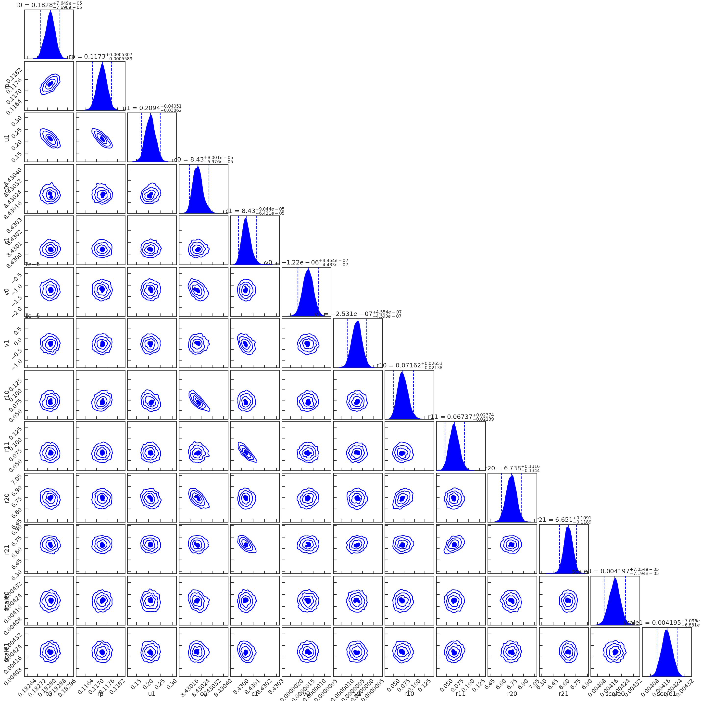
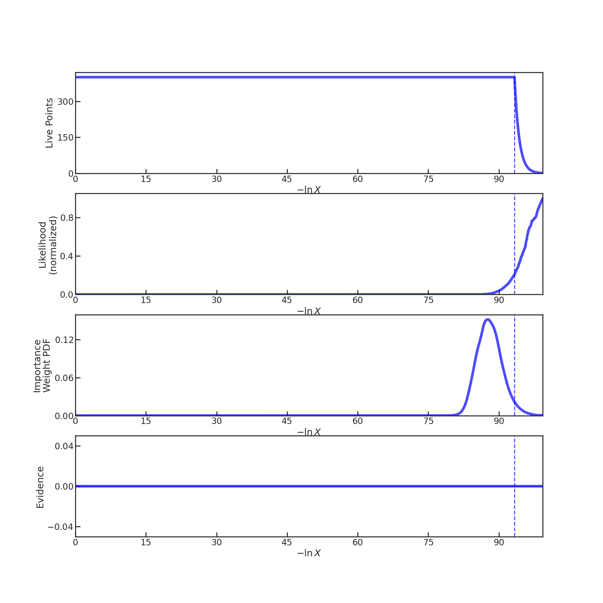
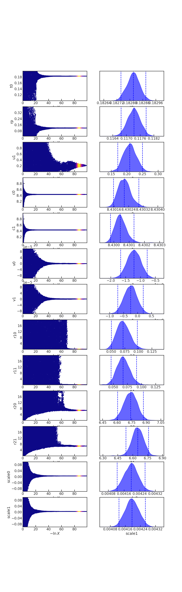
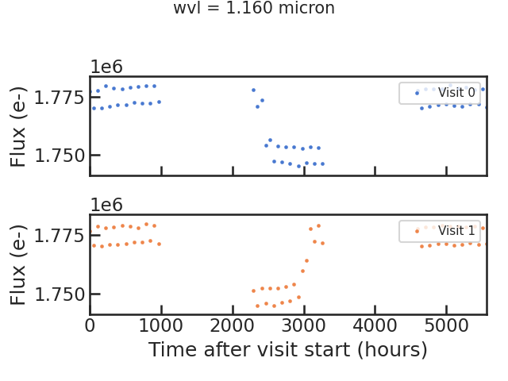
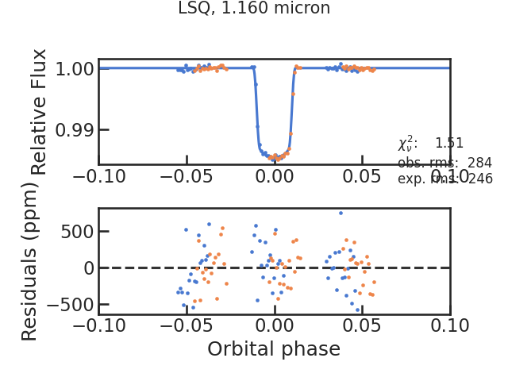
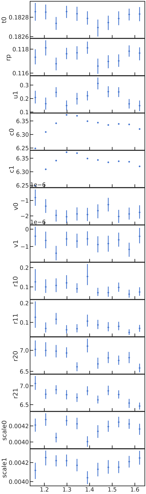
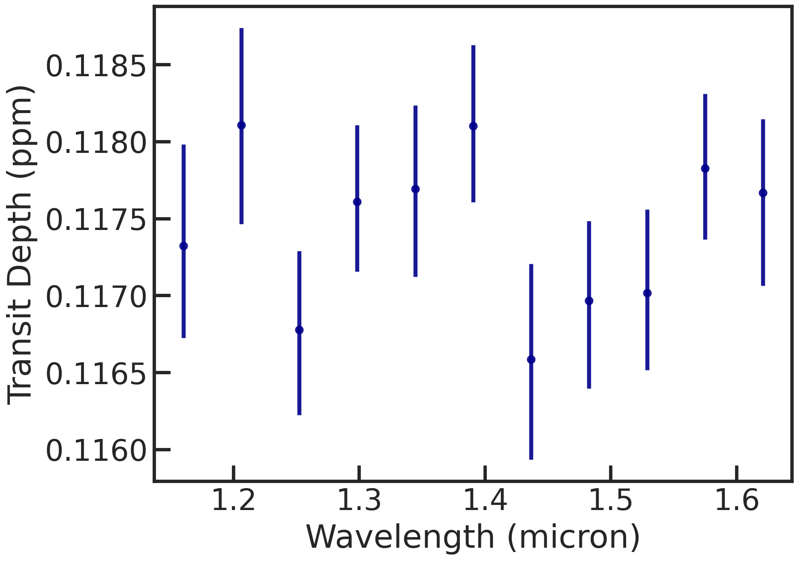

.. _stage31:

Stage 30
============

Here we can fit the broadband ("white") light curve (which is created in S20) or spectroscopic light curves (which are created in S21).

Let's remove the first orbit from every visit and the first exposure from every orbit as they are typically strongly affected by instrument systematics:

| remove_first_exp             True
| remove_first_orb             True

We can choose if we also want to run an MCMC using the emcee package next to the least squares routine:

| run_lsq                      True
| run_mcmc                     True

For the MCMC, let's do a quick, small number of samples with an number of walkers at least greater than twice the numbers of free parameters.

| #emcee
| run_nsteps                   10000
| run_nwalkers	             50
| run_nburn                    2000

For completeness, let's also use dynesty, a nested sampler.

| #dynesty
| run_dynamic                  False
| run_dlogz                    0.1
| run_nlive                    200
| run_bound                    single
| run_sample                   rwalk

Let's use the following model:

| s30_myfuncs                  ['constant','upstream_downstream','model_ramp','polynomial1','transit']

- 'constant': a normalization constant
- 'upstream_downstream': accounts for the forward and reverse scanning effect which creates an offset in the measured flux
- 'model_ramp': a ramp for every orbit
- 'polynomial1': a slope over the visit
- 'transit': a BATMAN transit model

Additional functions are listed on the `models page <https://pacmandocs.readthedocs.io/en/latest/models.html#id1>`_.

Let's have the following free parameters:

t0_0, rp_0, u1_0, c_0, c_1, v_0, v_1, r1_0, r1_1, r2_0, r2_1, scale_0, scale_1

Other important parameters (per, ars, inc) are fixed to the literature values.

The user can set in the pcf whether the uncertainties should be rescaled to achieve a reduced chi2 of unity. 

White light curve fit
'''''''''''''''''''''''''''''''''

Let's run the white light curve fit now:

.. code-block:: console

    workdir:  run_2022-07-16_00-42-27_docs/
    eventlabel:  docs
    Successfully reloaded meta file
    Starting s30
    White light curve fit will be performed
    using most recent s20 run: 2022-07-16_00-45-03
    Identified file(s) for fitting: ['run_2022-07-16_00-42-27_docs//extracted_lc/2022-07-16_00-45-03/lc_white.txt']

    ****** File: 1/1

    Removed 8 exposures because they were the first exposures in the orbit.
    Removed 34 exposures because they were the first orbit in the visit.
    median log10 raw flux: 8.429980180844982
    Number of free parameters:  13
    Names of free parameters:  ['t0', 'rp', 'u1', 'c', 'c', 'v', 'v', 'r1', 'r1', 'r2', 'r2', 'scale', 'scale']
    *STARTS LEAST SQUARED*

    Runs MPFIT...
    t0_0 	 1.8276e-01 	 1.0338e-05
    rp_0 	 1.1700e-01 	 7.8584e-05
    u1_0 	 2.2838e-01 	 5.3076e-03
    c_0 	 8.4302e+00 	 1.5765e-05
    c_1 	 8.4300e+00 	 1.6144e-05
    v_0 	 -1.2274e-06 	 1.1059e-07
    v_1 	 -2.5404e-07 	 1.1064e-07
    r1_0 	 6.9905e-02 	 6.2046e-03
    r1_1 	 6.7274e-02 	 5.4401e-03
    r2_0 	 6.7560e+00 	 3.1647e-02
    r2_1 	 6.6537e+00 	 2.9058e-02
    scale_0 	 4.1949e-03 	 1.7516e-05
    scale_1 	 4.1946e-03 	 1.7515e-05
    rms, chi2red =  124.7551899476388 4.362550569674299
    Saved white_systematics.txt file
    *STARTS MCMC*

    Runs MPFIT...
    t0_0 	 1.8276e-01 	 2.1593e-05
    rp_0 	 1.1700e-01 	 1.6414e-04
    u1_0 	 2.2838e-01 	 1.1086e-02
    c_0 	 8.4302e+00 	 3.2922e-05
    c_1 	 8.4300e+00 	 3.3719e-05
    v_0 	 -1.2281e-06 	 2.3098e-07
    v_1 	 -2.5387e-07 	 2.3108e-07
    r1_0 	 6.9918e-02 	 1.2966e-02
    r1_1 	 6.7275e-02 	 1.1363e-02
    r2_0 	 6.7564e+00 	 6.6122e-02
    r2_1 	 6.6538e+00 	 6.0696e-02
    scale_0 	 4.1948e-03 	 3.6585e-05
    scale_1 	 4.1946e-03 	 3.6582e-05
    rms, chi2red =  124.75583432717458 1.0000112122066938
    Run emcee...
    100%|########################################| 5000/5000 [01:26<00:00, 57.52it/s]

    Runs MPFIT...
    t0_0 	 1.8276e-01 	 2.1593e-05
    rp_0 	 1.1700e-01 	 1.6414e-04
    u1_0 	 2.2838e-01 	 1.1086e-02
    c_0 	 8.4302e+00 	 3.2922e-05
    c_1 	 8.4300e+00 	 3.3719e-05
    v_0 	 -1.2281e-06 	 2.3098e-07
    v_1 	 -2.5387e-07 	 2.3108e-07
    r1_0 	 6.9918e-02 	 1.2966e-02
    r1_1 	 6.7275e-02 	 1.1363e-02
    r2_0 	 6.7564e+00 	 6.6122e-02
    r2_1 	 6.6538e+00 	 6.0696e-02
    scale_0 	 4.1948e-03 	 3.6585e-05
    scale_1 	 4.1946e-03 	 3.6582e-05
    rms, chi2red =  124.75583432717458 1.0000112122066938
    Run dynesty...
    18143it [03:49, 79.13it/s, +200 | bound: 221 | nc: 1 | ncall: 582248 | eff(%):  3.151 | loglstar:   -inf < -1278.641 <    inf | logz: -1366.843 +/-  0.647 | dlogz:  0.001 >  0.100]
    Summary
    =======
    nlive: 200
    niter: 18143
    ncall: 582048
    eff(%):  3.151
    logz: -1366.843 +/-  0.731
    /home/zieba/anaconda3/envs/pacman/lib/python3.9/site-packages/dynesty/plotting.py:315: UserWarning: Attempting to set identical bottom == top == 0.0 results in singular transformations; automatically expanding.
      axes[i].set_ylim([ymin, ymax])
    Finished s30

There are several plots created then:

The raw light curve:

.. image:: media/s30/white/raw_lc_bin0_wvl1.400

** From the least squares routine **

The fitted light curve without the systematics:

.. image:: media/s30/white/lsq_lc_bin0_wvl1.400

The Allan deviation plot:

.. image:: media/s30/white/corr_plot_bin0_wvl1.400

** Using emcee **

MCMC chains with burn-in:

.. image:: media/s30/white/mcmc_chains_bin0_wvl1.400.png

MCMC chains without burn-in

.. image:: media/s30/white/mcmc_chains_noburn_bin0_wvl1.400.png

Corner plot from the MCMC:

.. image:: media/s30/white/mcmc_pairs_bin0_wvl1.400.png

** Using dynesty **

Spectroscopic light curve fit
'''''''''''''''''''''''''''''''''

.. code-block:: console

    (pacman) zieba@lnx-d-0044:~/Desktop/Projects/Observations/Hubble/GJ1214_13021$ python pacman_script.py --s30 --workdir='run_2022-07-16_00-42-27_docs'
    workdir:  run_2022-07-16_00-42-27_docs/
    eventlabel:  docs
    Successfully reloaded meta file
    Starting s30
    Spectroscopic light curve fit(s) will be performed
    using most recent s21 run: run_2022-07-16_00-42-27_docs//extracted_sp/bins11_2022-07-17_00-44-59
    Identified file(s) for fitting: ['run_2022-07-16_00-42-27_docs//extracted_sp/bins11_2022-07-17_00-44-59/speclc1.160.txt', 'run_2022-07-16_00-42-27_docs//extracted_sp/bins11_2022-07-17_00-44-59/speclc1.206.txt', 'run_2022-07-16_00-42-27_docs//extracted_sp/bins11_2022-07-17_00-44-59/speclc1.252.txt', 'run_2022-07-16_00-42-27_docs//extracted_sp/bins11_2022-07-17_00-44-59/speclc1.298.txt', 'run_2022-07-16_00-42-27_docs//extracted_sp/bins11_2022-07-17_00-44-59/speclc1.344.txt', 'run_2022-07-16_00-42-27_docs//extracted_sp/bins11_2022-07-17_00-44-59/speclc1.391.txt', 'run_2022-07-16_00-42-27_docs//extracted_sp/bins11_2022-07-17_00-44-59/speclc1.437.txt', 'run_2022-07-16_00-42-27_docs//extracted_sp/bins11_2022-07-17_00-44-59/speclc1.483.txt', 'run_2022-07-16_00-42-27_docs//extracted_sp/bins11_2022-07-17_00-44-59/speclc1.529.txt', 'run_2022-07-16_00-42-27_docs//extracted_sp/bins11_2022-07-17_00-44-59/speclc1.575.txt', 'run_2022-07-16_00-42-27_docs//extracted_sp/bins11_2022-07-17_00-44-59/speclc1.621.txt']

    ****** File: 1/11

    Removed 8 exposures because they were the first exposures in the orbit.
    Removed 34 exposures because they were the first orbit in the visit.
    median log10 raw flux: 6.248378557926973
    Number of free parameters:  13
    Names of free parameters:  ['t0', 'rp', 'u1', 'c', 'c', 'v', 'v', 'r1', 'r1', 'r2', 'r2', 'scale', 'scale']
    *STARTS LEAST SQUARED*

    Runs MPFIT...
    t0_0 	 1.8281e-01 	 4.0165e-05
    rp_0 	 1.1736e-01 	 3.0414e-04
    u1_0 	 2.2814e-01 	 2.0727e-02
    c_0 	 6.2485e+00 	 4.5097e-05
    c_1 	 6.2484e+00 	 4.6864e-05
    v_0 	 -8.7149e-07 	 4.2823e-07
    v_1 	 -5.1194e-07 	 4.2835e-07
    r1_0 	 1.0628e-01 	 3.6729e-02
    r1_1 	 9.7742e-02 	 3.5765e-02
    r2_0 	 6.9842e+00 	 1.4318e-01
    r2_1 	 7.0447e+00 	 1.5298e-01
    scale_0 	 4.2047e-03 	 6.7929e-05
    scale_1 	 4.1116e-03 	 6.7894e-05
    rms, chi2red =  284.46985356162634 1.5139159180030606

    Runs MPFIT...
    t0_0 	 1.8281e-01 	 4.9420e-05
    rp_0 	 1.1736e-01 	 3.7422e-04
    u1_0 	 2.2814e-01 	 2.5502e-02
    c_0 	 6.2485e+00 	 5.5488e-05
    c_1 	 6.2484e+00 	 5.7661e-05
    v_0 	 -8.7149e-07 	 5.2690e-07
    v_1 	 -5.1194e-07 	 5.2705e-07
    r1_0 	 1.0628e-01 	 4.5192e-02
    r1_1 	 9.7742e-02 	 4.4006e-02
    r2_0 	 6.9842e+00 	 1.7617e-01
    r2_1 	 7.0447e+00 	 1.8823e-01
    scale_0 	 4.2047e-03 	 8.3580e-05
    scale_1 	 4.1116e-03 	 8.3537e-05
    rms, chi2red =  284.469853561625 0.9999999999999784
    Run dynesty...
    7583it [01:34, 79.95it/s, +120 | bound: 150 | nc: 1 | ncall: 240602 | eff(%):  3.203 | loglstar:   -inf < -826.777 <    inf | logz: -887.410 +/-    nan | dlogz:  0.001 >  0.100]
    Summary
    =======
    nlive: 120
    niter: 7583
    ncall: 240482
    eff(%):  3.203
    logz: -887.410 +/-  0.773
    /home/zieba/anaconda3/envs/pacman/lib/python3.9/site-packages/dynesty/plotting.py:315: UserWarning: Attempting to set identical bottom == top == 0.0 results in singular transformations; automatically expanding.
      axes[i].set_ylim([ymin, ymax])

    ****** File: 2/11

    Finished s30

** Using least squared **

The fitted spectroscopic light curve without the systematics:

All fitted parameters as a function of wavelength:

.. image:: media/s30/spectroscopic/lsq_params_vs_wvl.png

The spectrum (rprs vs wavelength):

.. image:: media/s30/spectroscopic/lsq_rprs.png

** Using dynesty **

All fitted parameters as a function of wavelength:

The spectrum (rprs vs wavelength):

