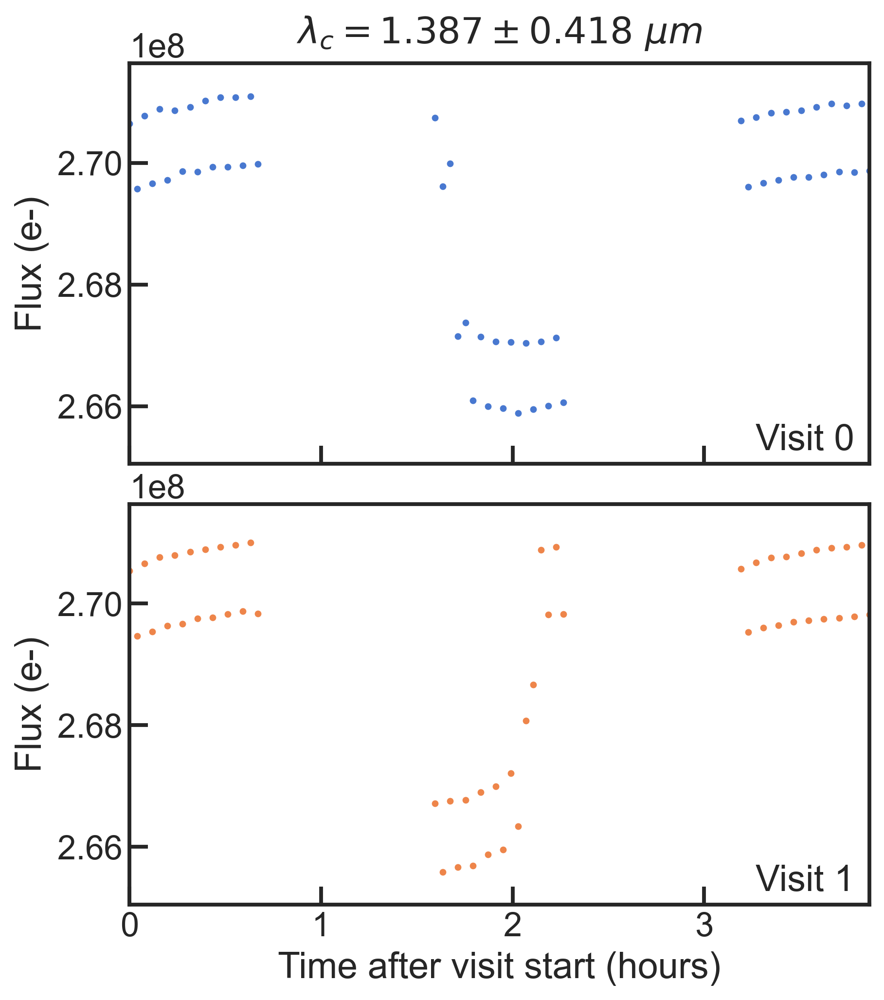
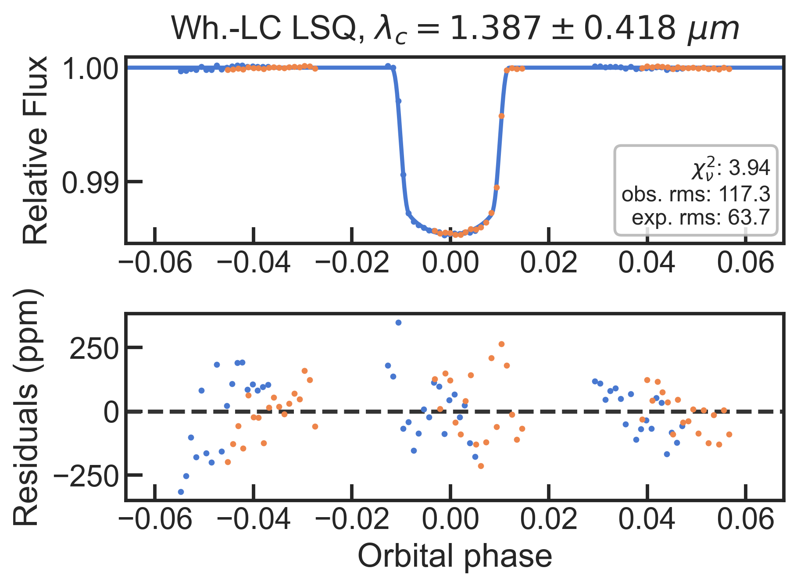
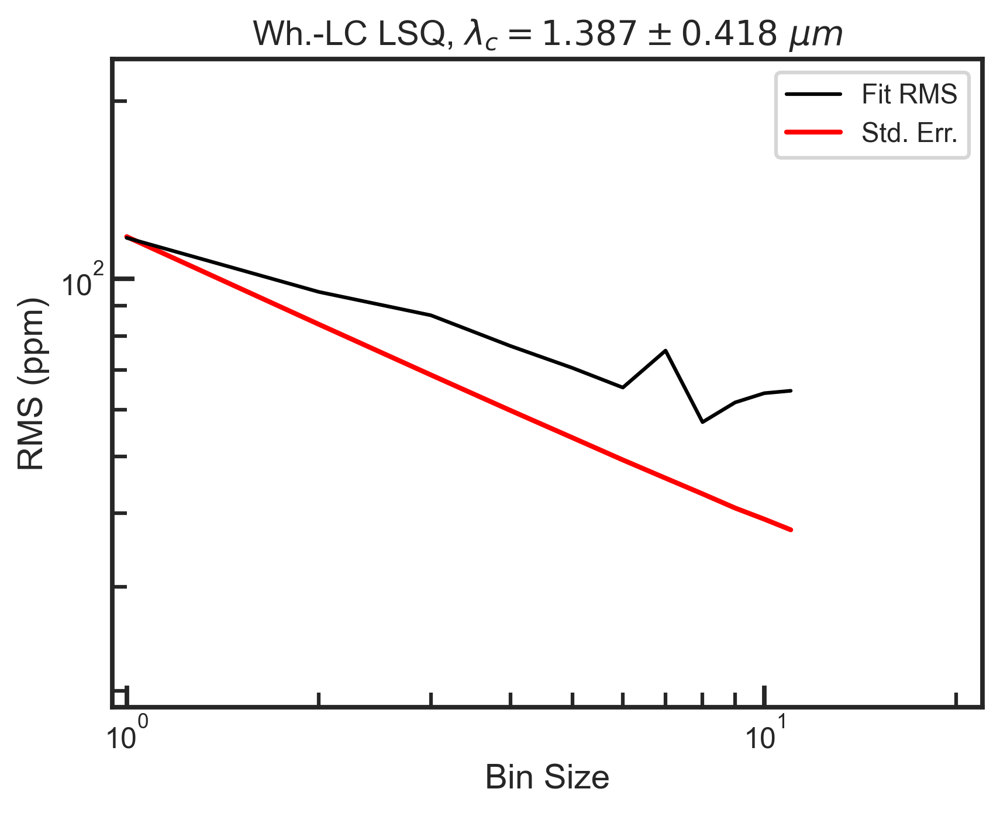
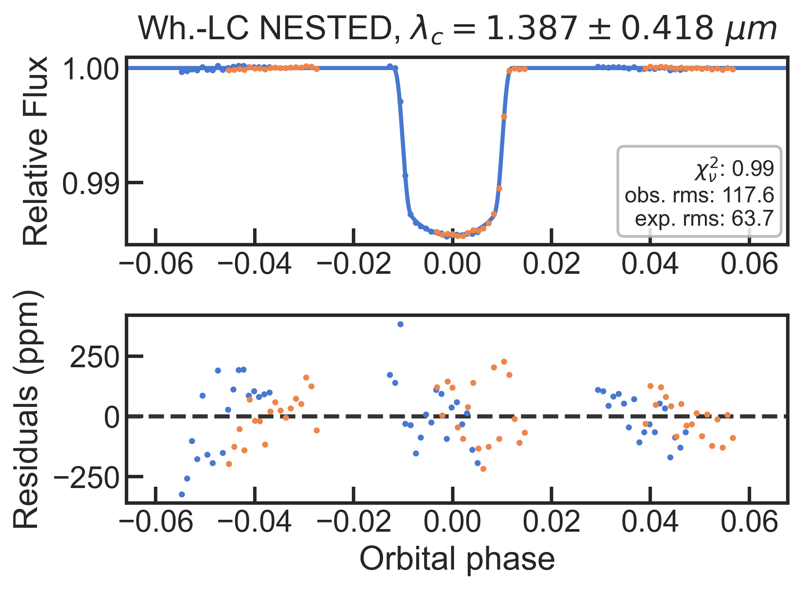
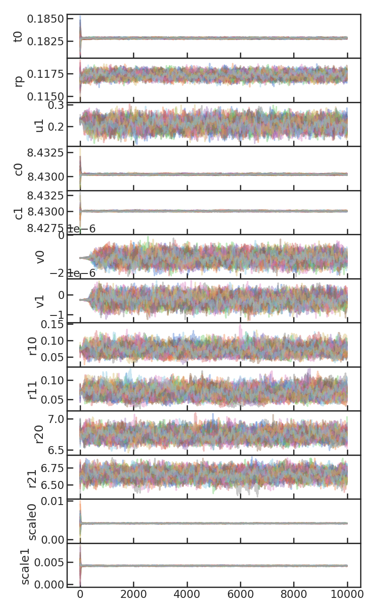
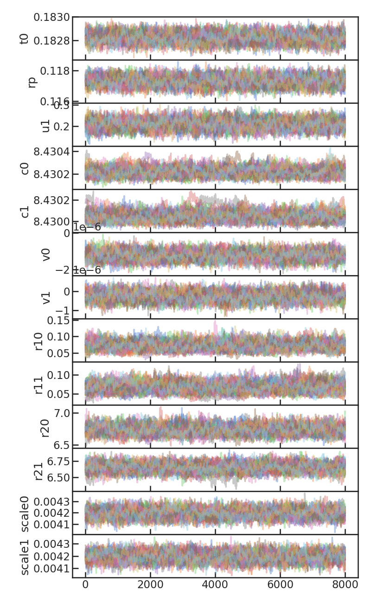
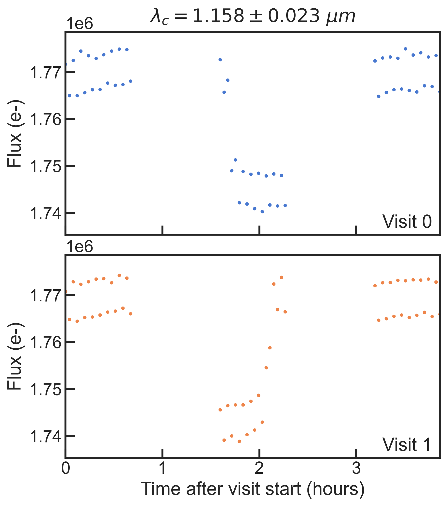
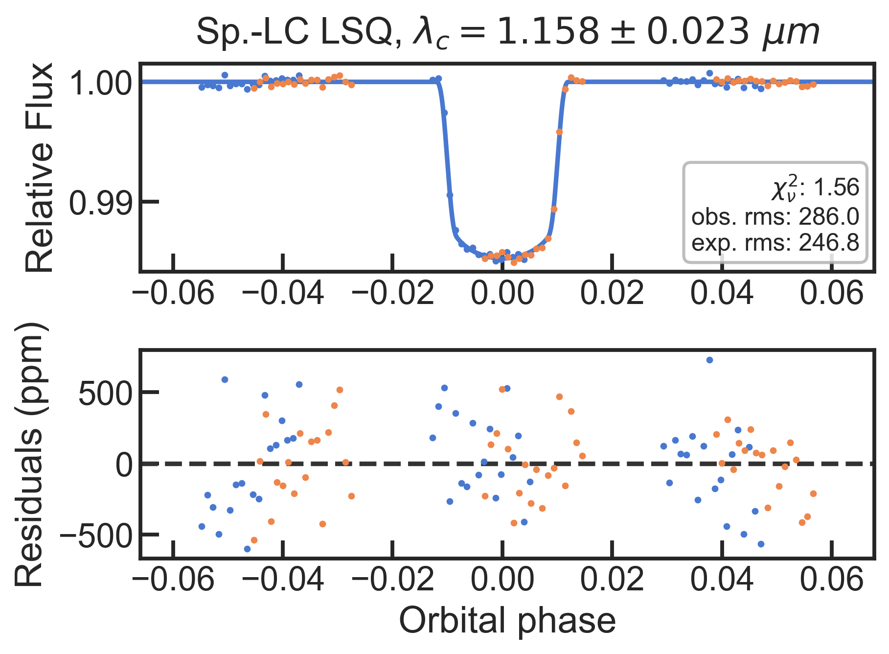
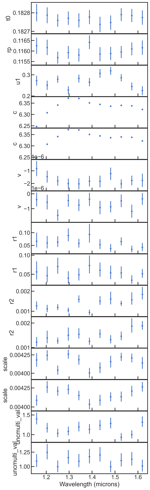
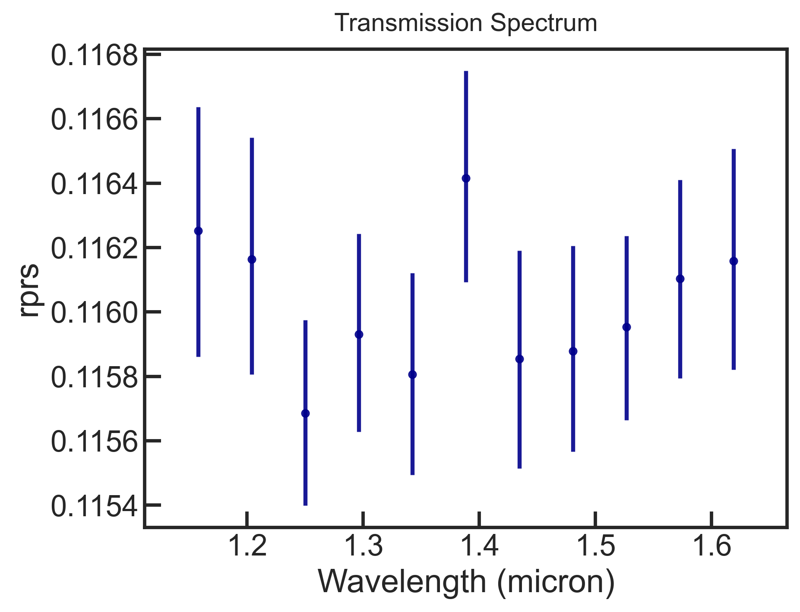

.. _stage30:

Stage 30
============

.. topic:: Quick Summary

    - Navigate to ``pacman_run_files``, comment out Stage 21, uncomment Stage 30, and execute ``run_pacman.py``.
    - Configure the desired fit mode in ``obs_par.pcf``
    - Run ``python run_pacman.py``

Stage 30 fits either:

- the white light curve generated in Stage 20
- or the spectroscopic light curves generated in Stage 21

PACMAN automatically determines which previous stage products to use based on the settings in ``obs_par.pcf``.

The relevant settings are:

.. code-block:: text

    s30_fit_white    True/False
    s30_fit_spec     True/False

If ``s30_fit_white`` is ``True``, PACMAN automatically uses the most recent:

.. code-block:: text

    stage20/s20_run_*

If ``s30_fit_spec`` is ``True``, PACMAN automatically uses the most recent:

.. code-block:: text

    stage21/s21_run_*

A new Stage 30 run directory is then created.

The Stage 30 directory structure is:

.. code-block:: text

  stage30/
  ├── white_lc/
  │   └── s30_run_YYYY-MM-DD_HH-MM-SS/
  │       ├── extracted_lc/
  │       └── fit_white/
  │           ├── raw_lc/
  │           ├── fit_lc/
  │           ├── lsq_res/
  │           ├── mcmc_res/
  │           └── nested_res/
  └── spec_lc/
      └── s30_run_YYYY-MM-DD_HH-MM-SS/
          ├── extracted_sp/
          └── fit_spec/
              ├── raw_lc/
              ├── fit_lc/
              ├── lsq_res/
              ├── mcmc_res/
              └── nested_res/

At the beginning of the stage, the current ``obs_par.pcf`` and ``fit_par.txt``
from ``pacman_run_files`` are copied into the new Stage 30 run directory.

The copied ``obs_par.pcf`` is then used to update the metadata for the run.
This ensures every Stage 30 run preserves the exact fitting settings used.

1) **Preparation**
'''''''''''''''''''''''''''''''''

Here we can fit the broadband ("white") light curve (which was created in S20) or spectroscopic light curves (which were created in S21).

Let's remove the first orbit from every visit and the first exposure from every orbit as they are typically strongly affected by instrument systematics:

| remove_first_exp             True
| remove_first_orb             True
| remove_which_orb             [0]

We can choose if we also want to run an MCMC using the emcee package after running the least squares routine. Alternatively, the user can run a nested sampling routine using the dynesty package. 
Here, we run the least squares routine and then dynesty:

| run_lsq                      True
| run_mcmc                     False
| run_dynesty                  True

For the nested sampling, let's use the dynamic approach:

| #dynesty dynamic
| run_dynamic                  True
| run_dlogz_init               0.01
| run_nlive_init               200
| run_nlive_batch              400
| run_maxbatch                 100
| run_bound                    multi
| run_sample                   rwalk

Note: The user can also use an MCMC approach with emcee.

Let's use the following model:

| s30_myfuncs                  ['constant','upstream_downstream','model_ramp','polynomial1','transit','uncmulti']

- 'constant': a normalization constant
- 'upstream_downstream': accounts for the forward and reverse scanning effect which creates an offset in the measured flux
- 'model_ramp': a ramp for every orbit
- 'polynomial1': a slope over the visit
- 'transit': a BATMAN transit model
- 'uncmulti': a free parameter which rescales the uncertainties at every step of the sampler

Additional functions are listed on the `models page <https://pacmandocs.readthedocs.io/en/latest/models.html#id1>`_.

Let's have the following free parameters:

t0_0, rp_0, u1_0, c_0, c_1, v_0, v_1, r1_0, r1_1, r2_0, r2_1, scale_0, scale_1, uncmulti_val_0, uncmulti_val_1

Other important parameters (per, ars, inc) are fixed to the literature values.

The user can set in the pcf whether the uncertainties should be rescaled to achieve a reduced chi2 of unity, using 'rescale_uncert'.
An alternative method which we are using here is using an additional free parameter which rescales the uncertainties at every step of the sampler.
This model is called `uncmulti <https://pacmandocs.readthedocs.io/en/latest/_modules/pacman/lib/models/uncmulti.html#uncmulti>`_.

2) **Run PACMAN: White light curve fit**
''''''''''''''''''''''''''''''''''''''''''

In the obs_par.pcf file, we set:

.. code-block:: text

    s30_fit_white    True
    s30_fit_spec     False

Here's the fit_par.txt file which was used in this example to fit the white light curve:

.. include:: media/s30/white/fit_par.txt
   :literal:

If a parameter is free and not jointly shared across visits, the user has to repeat the parameter in the fit_par.txt file as shown above (this might be fixed in a later version as it is not ideal, sepacially when the user wants to analyze many visits).
Furthermore, the visit number must be added in the "tied" column.
tied = -1 means that the parameters is shared across all visits, which makes sense for orbital parameters but less for systematics like the normalization constant.

Let's run the white light curve fit now:

.. code-block:: console

  Starting s30
  Using Stage 20 input directory: /Users/sebastianzieba/Desktop/Projects/Observations/Hubble/GJ1214_13021_2026/stage20/s20_run_2026-06-15_10-28-16
  Location of the new Stage 30 run directory: /Users/sebastianzieba/Desktop/Projects/Observations/Hubble/GJ1214_13021_2026/stage30/white_lc/s30_run_2026-06-15_10-42-38
  White light curve fit will be performed
  Identified file(s) for fitting: [PosixPath('/Users/sebastianzieba/Desktop/Projects/Observations/Hubble/GJ1214_13021_2026/stage30/white_lc/s30_run_2026-06-15_10-42-38/extracted_lc/lc_white.txt')]

  ****** File: 1/1

  Removed 8 exposures because they were the first exposures in the orbit.
  Removed 34 exposures because they were the first orbit in the visit.
  Current wavelength:  1.4  microns
  Read in fit_par.pcf file: 
    parameter   fixed tied   value   prior    p1     p2 
  ------------ ----- ---- --------- ----- ------- -----
          per  True   -1 1.5804046     X 2.25314 2e-05
            t0 False   -1      0.18     U    0.18  0.19
  t_secondary  True   -1       0.0     X     0.0   0.0
            w  True   -1      90.0     X     0.0   0.0
            a  True   -1     15.23     X    4.98  0.05
          inc  True   -1      89.1     X    85.3   0.2
            rp False   -1     0.116     U    0.01   0.2
            fp  True   -1       0.0     X     0.0   1.0
            u1 False   -1      0.29     U     0.0   1.0
            u2  True   -1       0.0     X     0.0   0.0
          ecc  True   -1       0.0     X     0.0   0.0
            c False    0      8.45     U     8.2   8.5
            c False    1      8.45     U     8.2   8.5
            v False    0       0.0     U  -1e-05 1e-05
            v False    1       0.0     U  -1e-05 1e-05
            v2  True   -1       0.0     X     0.0   0.0
            r1 False    0       0.1     U     0.0   1.0
            r1 False    1       0.1     U     0.0   1.0
            r2 False    0       0.1     U     0.0   0.1
            r2 False    1       0.1     U     0.0   0.1
            r3  True   -1       0.0     U   -10.0  10.0
        scale False    0       0.0     U    -0.1   0.1
        scale False    1       0.0     U    -0.1   0.1
  uncmulti_val False    0       2.0     U     0.1   8.0
  uncmulti_val False    1       2.0     U     0.1   8.0
  Median log10 raw flux of full light curve:  8.431066421116899
  The highest amount of exposures in an orbit is 18
  Number of free parameters:  15
  Names of free parameters:  ['t0', 'rp', 'u1', 'c', 'c', 'v', 'v', 'r1', 'r1', 'r2', 'r2', 'scale', 'scale', 'uncmulti_val', 'uncmulti_val']
  c sanity check passed:
    Visit 0: log10(flux) mean=8.430215, std=0.002850, sanity range=[8.139674, 8.718145], c_0=8.450000
    Visit 1: log10(flux) mean=8.430278, std=0.002774, sanity range=[8.146780, 8.710389], c_1=8.450000
  The predicted rms is 63.69 ppm

  *STARTS LEAST SQUARED*
  Runs MPFIT... 
  t0_0                       1.82781881e-01       9.61920459e-06
  rp_0                       1.15840824e-01       8.24474371e-05
  u1_0                       2.70979110e-01       5.00735301e-03
  c_0                        8.43146869e+00       4.38106609e-05
  c_1                        8.43126990e+00       3.82298955e-05
  v_0                       -1.23012909e-06       1.10621165e-07
  v_1                       -1.58628863e-07       1.10685866e-07
  r1_0                       3.75542137e-02       4.21618627e-03
  r1_1                       4.04501573e-02       3.95761217e-03
  r2_0                       1.71143133e-03       8.87915185e-05
  r2_1                       1.78757967e-03       7.64847900e-05
  scale_0                    4.16736148e-03       1.75043899e-05
  scale_1                    4.18389841e-03       1.75006456e-05
  rms, chi2red =  117.32411228761931 3.9407785958955266
  Saved white_systematics.txt file

  *STARTS NESTED SAMPLING*
  Using multiprocessing...
  Run dynesty...
  1it [00:01,  1.54s/it, batch: 0 | bound: 0 | nc: 1 | ncall: 1 | eff(%):  0.498 | loglstar:   -inf <   -inf <    inf | lo
  4457it [00:11, 345.85it/s, batch: 0 | bound: 44 | nc: 35 | ncall: 137556 | eff(%):  3.235 | loglstar:   -inf < -5009.859 <    inf | logz: -5037.519 +/-  0.365 | dlogz: 26
  25487it [01:10, 359.00it/s, batch: 6 | bound: 2 | nc: 1 | ncall: 857511 | eff(%):  2.926 | loglstar: -1284.668 < -1277.056 < -1283.932 | logz: -1353.017 +/-  0.344 | stop:  0.967] 
  Saved white_systematics.txt file for nested sampling run
  Saved fit_results.txt file
  Saving Metadata
  Finished s30

There are several plots created then:

The raw light curve:

** From the least squares routine **

The fitted light curve without the systematics:

The time averaging plot (formally known as Allan deviation plot):

** Using dynesty ** 

The fitted light curve without the systematics:

Corner plot from the nested sampling:

.. image:: media/s30/white/nested_pairs_bin0_wvl1.400.png

** Using emcee **

MCMC chains with burn-in:

MCMC chains without burn-in

3) **Run PACMAN: Spectroscopic light curve fit**
'''''''''''''''''''''''''''''''''''''''''''''''''''''

In the obs_par.pcf file, we set:

.. code-block:: text

    s30_fit_white    False
    s30_fit_spec     True

Here's the fit_par.txt file which was used in this example to fit the spectroscopic light curves:

.. include:: media/s30/spectroscopic/fit_par.txt
   :literal:

It is worth noting that PACMAN returns and error if it detects that the constants in the fit_par.txt file are not within a sanity check range which is determined from the data. This is to prevent the user from running a fit with unphysical parameters which can lead to very long runtimes and/or non-convergence of the fit.
This might lead a raised error message like this one:

.. code-block:: console

  Suspicious c values in fit_par.txt:
    - Visit 0, c_0: initial value 7.450000 is outside the log10(flux) sanity range [5.954690, 6.535117]. Flux stats: mean=1.763025e+06, min=1.740295e+06, max=1.774943e+06; log10(flux) stats: mean=6.246249, std=0.002859.
    - Visit 0, c_0: lower prior bound 7.200000 is outside the log10(flux) sanity range [5.954690, 6.535117]. Flux stats: mean=1.763025e+06, min=1.740295e+06, max=1.774943e+06; log10(flux) stats: mean=6.246249, std=0.002859.
    - Visit 0, c_0: upper prior bound 7.500000 is outside the log10(flux) sanity range [5.954690, 6.535117]. Flux stats: mean=1.763025e+06, min=1.740295e+06, max=1.774943e+06; log10(flux) stats: mean=6.246249, std=0.002859.

If you have set the fit_par.txt correctly and run the fit, you should get an output similar to this one:

.. code-block:: console
  Starting s30
  Using Stage 21 input directory: /Users/sebastianzieba/Desktop/Projects/Observations/Hubble/GJ1214_13021_2026/stage21/s21_run_2026-06-15_10-39-50
  Location of the new Stage 30 run directory: /Users/sebastianzieba/Desktop/Projects/Observations/Hubble/GJ1214_13021_2026/stage30/spec_lc/s30_run_2026-06-15_15-32-07
  Spectroscopic light curve fit(s) will be performed
  Using spectroscopic directory: /Users/sebastianzieba/Desktop/Projects/Observations/Hubble/GJ1214_13021_2026/stage30/spec_lc/s30_run_2026-06-15_15-32-07/extracted_sp
  Identified file(s) for fitting: [PosixPath('/Users/sebastianzieba/Desktop/Projects/Observations/Hubble/GJ1214_13021_2026/stage30/spec_lc/s30_run_2026-06-15_15-32-07/extracted_sp/speclc1.158.txt'), PosixPath('/Users/sebastianzieba/Desktop/Projects/Observations/Hubble/GJ1214_13021_2026/stage30/spec_lc/s30_run_2026-06-15_15-32-07/extracted_sp/speclc1.204.txt'), PosixPath('/Users/sebastianzieba/Desktop/Projects/Observations/Hubble/GJ1214_13021_2026/stage30/spec_lc/s30_run_2026-06-15_15-32-07/extracted_sp/speclc1.250.txt'), PosixPath('/Users/sebastianzieba/Desktop/Projects/Observations/Hubble/GJ1214_13021_2026/stage30/spec_lc/s30_run_2026-06-15_15-32-07/extracted_sp/speclc1.296.txt'), PosixPath('/Users/sebastianzieba/Desktop/Projects/Observations/Hubble/GJ1214_13021_2026/stage30/spec_lc/s30_run_2026-06-15_15-32-07/extracted_sp/speclc1.342.txt'), PosixPath('/Users/sebastianzieba/Desktop/Projects/Observations/Hubble/GJ1214_13021_2026/stage30/spec_lc/s30_run_2026-06-15_15-32-07/extracted_sp/speclc1.389.txt'), PosixPath('/Users/sebastianzieba/Desktop/Projects/Observations/Hubble/GJ1214_13021_2026/stage30/spec_lc/s30_run_2026-06-15_15-32-07/extracted_sp/speclc1.435.txt'), PosixPath('/Users/sebastianzieba/Desktop/Projects/Observations/Hubble/GJ1214_13021_2026/stage30/spec_lc/s30_run_2026-06-15_15-32-07/extracted_sp/speclc1.481.txt'), PosixPath('/Users/sebastianzieba/Desktop/Projects/Observations/Hubble/GJ1214_13021_2026/stage30/spec_lc/s30_run_2026-06-15_15-32-07/extracted_sp/speclc1.527.txt'), PosixPath('/Users/sebastianzieba/Desktop/Projects/Observations/Hubble/GJ1214_13021_2026/stage30/spec_lc/s30_run_2026-06-15_15-32-07/extracted_sp/speclc1.573.txt'), PosixPath('/Users/sebastianzieba/Desktop/Projects/Observations/Hubble/GJ1214_13021_2026/stage30/spec_lc/s30_run_2026-06-15_15-32-07/extracted_sp/speclc1.619.txt')]

  ****** File: 1/11

  Removed 8 exposures because they were the first exposures in the orbit.
  Removed 34 exposures because they were the first orbit in the visit.
  Current wavelength:  1.1580454545454546  microns
  Read in fit_par.pcf file: 
    parameter   fixed tied   value   prior    p1     p2 
  ------------ ----- ---- --------- ----- ------- -----
          per  True   -1 1.5804046     X 2.25314 2e-05
            t0 False   -1      0.18     U    0.18  0.19
  t_secondary  True   -1       0.0     X     0.0   0.0
            w  True   -1      90.0     X     0.0   0.0
            a  True   -1     15.23     X    4.98  0.05
          inc  True   -1      89.1     X    85.3   0.2
            rp False   -1     0.116     U    0.01   0.2
            fp  True   -1       0.0     X     0.0   1.0
            u1 False   -1      0.29     U     0.0   1.0
            u2  True   -1       0.0     X     0.0   0.0
          ecc  True   -1       0.0     X     0.0   0.0
            c False    0      6.25     U     6.1   6.4
            c False    1      6.25     U     6.1   6.4
            v False    0       0.0     U  -1e-05 1e-05
            v False    1       0.0     U  -1e-05 1e-05
            v2  True   -1       0.0     X     0.0   0.0
            r1 False    0       0.1     U     0.0   1.0
            r1 False    1       0.1     U     0.0   1.0
            r2 False    0       0.1     U     0.0   0.1
            r2 False    1       0.1     U     0.0   0.1
            r3  True   -1       0.0     U   -10.0  10.0
        scale False    0       0.0     U    -0.1   0.1
        scale False    1       0.0     U    -0.1   0.1
  uncmulti_val False    0       2.0     U     0.1   8.0
  uncmulti_val False    1       2.0     U     0.1   8.0
  Median log10 raw flux of full light curve:  6.2470532847587315
  The highest amount of exposures in an orbit is 18
  Number of free parameters:  15
  Names of free parameters:  ['t0', 'rp', 'u1', 'c', 'c', 'v', 'v', 'r1', 'r1', 'r2', 'r2', 'scale', 'scale', 'uncmulti_val', 'uncmulti_val']
  c sanity check passed:
    Visit 0: log10(flux) mean=6.246249, std=0.002859, sanity range=[5.954690, 6.535117], c_0=6.250000
    Visit 1: log10(flux) mean=6.246274, std=0.002786, sanity range=[5.961686, 6.527569], c_1=6.250000
  The predicted rms is 246.80 ppm

  *STARTS LEAST SQUARED*
  Runs MPFIT... 
  t0_0                       1.82823788e-01       3.72383823e-05
  rp_0                       1.16130153e-01       3.19760847e-04
  u1_0                       2.77724269e-01       1.93428183e-02
  c_0                        6.24733390e+00       8.76061837e-05
  c_1                        6.24716678e+00       1.10300401e-04
  v_0                       -9.00381811e-07       4.28662739e-07
  v_1                       -3.91382592e-07       4.28813807e-07
  r1_0                       5.63518037e-02       2.03860696e-02
  r1_1                       4.81353828e-02       2.12762332e-02
  r2_0                       1.30716900e-03       1.75497544e-04
  r2_1                       1.24937409e-03       2.17764606e-04
  scale_0                    4.17883234e-03       6.78520407e-05
  scale_1                    4.08834946e-03       6.78212930e-05
  rms, chi2red =  285.9894474562777 1.5607557649475903

  *STARTS NESTED SAMPLING*
  Using multiprocessing...
  Run dynesty...
  373it [00:01, 354.18it/s, batch: 0 | bound: 0 | nc: 5 | ncall: 1092 | eff(%): 28.870 | loglstar:   -inf < -727697.380 <    inf | logz: -727705.232 +/-  0.198 | dlogz: 711176.059 >  0.010
  474it [00:01, 432.14it/s, batch: 0 | bound: 0 | nc: 8 | ncall: 1922 | eff(%): 22.337 | loglstar:   -inf < -467114.923 <    inf | logz: -467123.279 +/-  0.204 | dlogz: 452516.966 >  0.010

  22797it [01:04, 351.25it/s, batch: 5 | bound: 19 | nc: 1 | ncall: 763532 | eff(%):  2.933 | loglstar: -837.170 < -825.991 < -828.766 | logz: -895.795 +/-  0.383 | stop:  1.000]         

  ****** File: 2/11

  ...
  24299it [01:10, 345.78it/s, batch: 6 | bound: 22 | nc: 1 | ncall: 816509 | eff(%):  2.927 | loglstar: -839.133 < -827.919 < -830.298 | logz: -901.756 +/-  0.392 | stop:  0.973]

  Saved fit_results.txt file
  Saving Metadata
  Finished s30

Most plots which are created during the white light curve fit will be also created during and after running the spectroscopic fits.
Let's look at some examples:

The first raw spectroscopic light curve:

** Using least squared **

The fitted spectroscopic light curve without the systematics:

All fitted parameters as a function of wavelength:

** Using dynesty **

The spectrum (rprs vs wavelength):

There is also a fit that stores the transmission spectrum:

.. include:: media/s30/spectroscopic/nested_rprs.txt
   :literal:

And finally a file that summarizes the fit results for the light curves:
.. include:: media/s30/spectroscopic/fit_results.txt
   :literal: