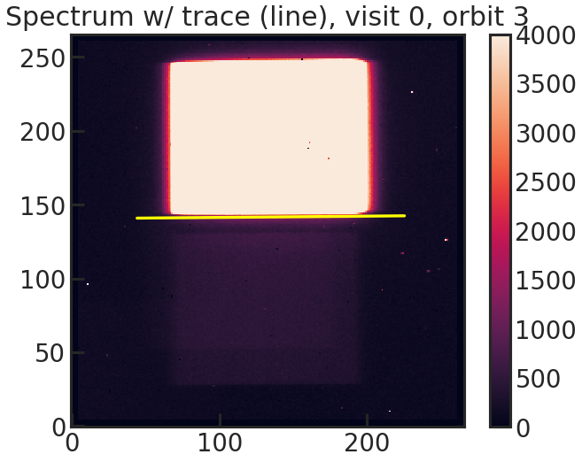
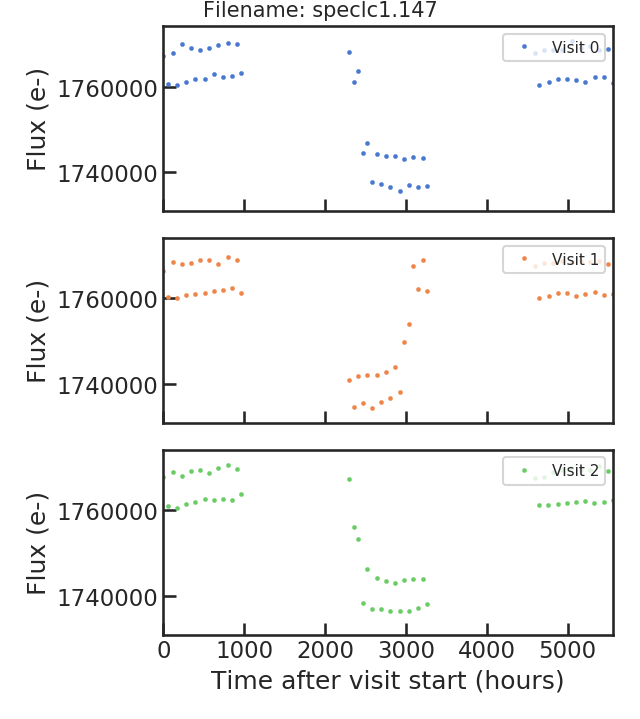
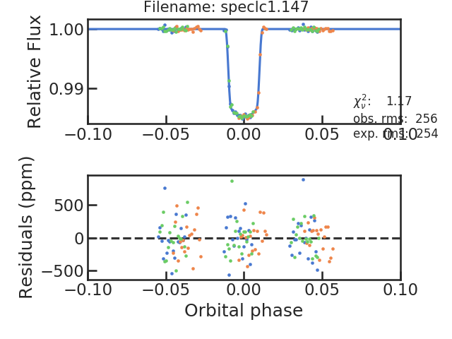

# Summary

The Hubble Space Telescope (HST) has become the preeminent workhorse facility for the characterization of extrasolar planets.
Launched in 1990 and never designed for the observations of exoplanets, the STIS spectrograph on HST was in fact used in 2002 to detect the first atmosphere ever discovered on a planet outside of our solar system [@Charbonneau2002].
With the deactivation of the Spitzer Space Telescope in 2020, HST has the two most powerful tools in space to characterize exoplanets over a broad spectral range:
(1) The Space Telescope Imaging Spectrograph (STIS; installed in 1997) in the UV and the Wide Field Camera 3 (WFC3; installed in 2009) in the Near Infrared (NIR).
With the introduction of a spatial scan mode on WFC3 [@McCullough2012] where the star is being moved perpendicular to the dispersion direction during an exposure, WFC3 observations have become very efficient due to the reduction of overhead time and the possibility of longer exposures without saturation.

For exoplanet characterization, WFC3 is used for transit and secondary eclipse spectroscopy and phase curves observations.
The instrument has two different grisms: G102 with a useful spectral range from 800 nm to up to 1150 nm and G141 encompassing 1075 nm to about 1700 nm.
The spectral range of WFC3/G141 contains several molecular species with the strongest being water (H2O) at approximately 1.4 microns leading to the successful detection of H2O in the atmosphere of over a dozen of exoplanets [@Deming2013; @Huitson2013; @Birkby2013; @Fraine2014; @Kreidberg2014b; @Evans2016].

The bluer part of WFC3, the G102 grism, can be for example used to detect Helium in the atmosphere of exoplanets (xxx)

HST will stay the most powerful space based tool for the characterization of exoplanets until the first data of the recently launched James Webb Space Telescope (JWST) reaches the machines of the observers.
Even after then, HST is expected to produce more impactful science results due to its exquisite data.

(Maybe discuss advantage of space based data? no systematics because no atmosphere, no atmosphere so no absorption in uv and water bands and no strong IR background)

# Statement of need

pipeline explained: @Kreidberg2014a @Kreidberg2018 

complicated... 
scanning @McCullough2012
optimal extraction @Horne1986
charge trapping @Zhou2017

\autoref{fig:example}

{ width=43% } { width=52% } 

{ width=42% } { width=56% }

# Dependencies

`numpy` [@numpy2020]
`matplotlib` [@matplotlib2007]
`scipy` [@scipy2020]
`astropy` [@astropy2013; @astropy2018]

optional:
`batman` [@Kreidberg2015]
`emcee` [@Foreman-Mackey2013]
`dynesty` [@Speagle2020]
`corner` [@corner2016]

# Documentation

The documentation for PACMAN can be found [here](https://pacmandocs.readthedocs.io/en/latest/) hosted on Read The Docs.
It includes most notably, a full explanation of every parameter in the pacman control file (pcf), the API and an example on how to download, reduce and analyse observations of GJ 1214 b taken with HST/WFC3/G141.

# Similar tools

`Iraclis` [@Tsiaras2016]

# Future work

# Acknowledgements

We acknowledge contributions from ....

# References
